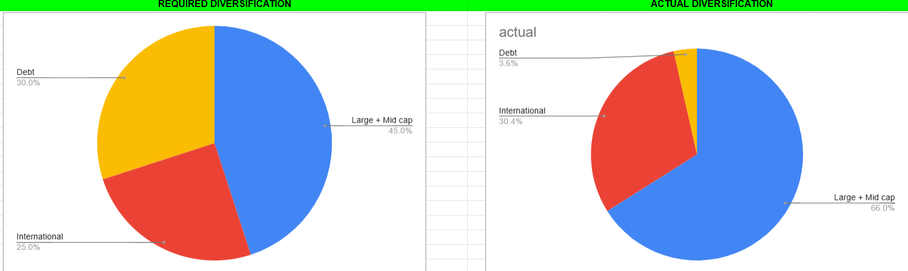
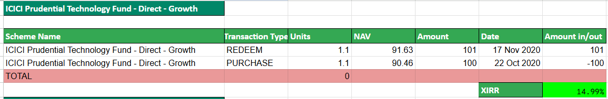
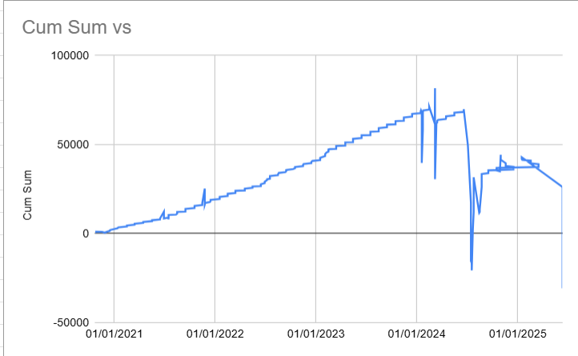

# 📈 Mutual Fund Analysis & Advisory Web App

## 🔍 Overview

This will be a full-stack web application that provides:

* Mutual fund analysis
* Fund comparison tools
* AI-based fund recommendations using questionnaire inputs
* Custom portfolio analysis
* Open-source codebase hosted on GitHub

---

## 🧠 Key Features

* **Mutual Fund Analysis:** Using APIs and/or web scraping to show complete information about a mutual fund scheme that is needed in order to make investment decision.
* **Common Mutual Fund Calculators and Tools** (NAV, XIRR, SIP vs Lumpsum, rolling returns, etc.)
* **Comparison Tools:** Compare between two or more funds to choose the best availaable option according to your need.
* **Personalized Recommendations:** User-questionnaire + AI for suggesting suitable funds according to user's risk profile and return expectations.
* **Custom Portfolio Analysis:** Analyze uploaded or entered user portfolios and suggest changes like removing a mutual fund from portfolio, portfolio rebalancing, etc.
* **Interactive UI:** Simple, readable, mobile-responsive front-end.
* **Open Source Deployment:** On GitHub for visibility and feedback.

---

## 🛠 Tech Stack

### 1. **Backend Framework Options** (you know Python and want full control)

| Framework     | Pros                                    | Cons                                               | Suggested For                     |
| ------------- | --------------------------------------- | -------------------------------------------------- | --------------------------------- |
| **Django**    | Full-featured, admin panel, ORM, secure | Steeper learning curve, heavyweight for small apps | ✅ Best fit for your case          |
| **Flask**     | Lightweight, flexible                   | No built-in admin panel, more config needed        | Good for small APIs               |
| **FastAPI**   | Fast, async support, great for APIs     | Lacks full web framework tools                     | Good if separating frontend       |
| **Streamlit** | Super easy for data apps                | Not customizable, not production-grade             | Good for prototype                |
| **Dash**      | Great for analytics dashboards          | Less web control                                   | For internal data dashboards only |

> 💡 **Go with Django** — you're familiar with Python, want full customization, database integration, user management, etc.

---

### 2. **Frontend**

* Start with basic **HTML + CSS**
* Use Django templating engine (no JS needed for now)
* Later consider **HTMX** (for interactivity without full JS)

---

### 3. **Database**

* ✅ **SQLite** (Default in Django, easy for small projects)
* If scaling later → switch to **MySQL** (you already know it)

---

### 4. **Mutual Fund Data Sources**

#### Options

| Source                     | Type                | Notes                                           |
| -------------------------- | ------------------- | ----------------------------------------------- |
| **mftool**                 | API-like            | Easy, free, limited to Indian funds             |
| **yfinance**               | API                 | Good for ETFs, not great for mutual funds       |
| **mstarpy**                | Morningstar scraper | Good for international data, harder to maintain |
| **BeautifulSoup/Selenium** | Manual scraping     | Legal concerns, brittle, needs maintenance      |
| **AI-based scraping**      | Not mature          | Overkill now, use APIs first                    |

> ✅ **Suggestion: Use `mftool` + `mstarpy`** for reliability, avoid direct scraping of websites like MoneyControl or Morningstar unless API data is unavailable and terms allow scraping.
>
> another api: [indianapi](https://indianapi.in/indian-stock-market) (for indian stocks data and basic mutual fund details)
>
> Good arguments regarding web scraping:
> [How Secure Web Scraping Enhances Cybersecurity for Online Services](https://www.promptcloud.com/blog/how-secure-web-scraping-enhances-cybersecurity-for-online-services/)
> [Ethical Scraping with AI](https://www.promptcloud.com/blog/ethical-web-scraping-with-ai/)

---

### 5. Ideas

Our project is designed to empower investors with the tools and insights needed to make informed decisions about mutual funds. By leveraging data from APIs and web scraping, we provide comprehensive analysis and comparison capabilities. Below are the key aspects of our approach:

#### Analyzing Mutual Funds

Check [this google sheet](Quant_small_cap_analysis.xlsx) for sample mutual fund analysis.

To thoroughly analyze a mutual fund, we focus on three main areas:

- **Basic Information:**
  - Fund name
  - Fund objective
  - Fund journey and history
  - Fund manager(s)
  - AUM size and growth
  - Inception date

- **Performance Consistency:**
  - Annual return
  - Up capture ratio
  - Downside capture ratio
  - Comparison with benchmarks and peers
  - SIP vs lumpsum XIRR return
  - Annual returns comparison within the fund and with benchmark, especially during quarters with negative benchmark returns

- **Portfolio Composition:**
  - Categories (e.g., mid cap, small cap, large cap)
  - Industry types (e.g., pharma, electricity, FMCG)
  - Diversification against category average
  - Number of stocks and holding percentages
  - Top holdings
  - Asset allocation and portfolio rebalancing
  - Portfolio turnover
  - Cash percentage
  - Recent portfolio changes over time

This comprehensive analysis allows investors to gauge a fund's historical performance, management strategy, and alignment with their investment goals.

#### Comparing Mutual Funds

When comparing mutual funds, we provide a detailed breakdown across several critical dimensions:

- **About:**
  - Asset Management Company (AMC)
  - Fund manager
  - Expense ratio

- **Return Analysis:**
  - Trailing returns for 3, 5, 7, 10 years, and since inception
  - Rolling returns for 2, 5, 7, and 10 years (maximum, minimum, mean)
  - Comparison with category average and benchmark
  - SIP returns
  - Outperformance in calendar year returns

- **Risk Analysis:**
  - Standard deviation of rolling returns for 2, 5, 7, and 10 years
  - Percentage of times the fund outperformed in rolling returns for 5, 7, and 10 years
  - Comparison with category average and benchmark
  - Annual return comparison: number of negative years, underperformance relative to benchmark, and range of yearly return differences
  - Quarterly returns comparison, especially during quarters with negative benchmark returns
  - Portfolio concentration: company, industry, theme with time analysis
  - P/E ratio of the fund over time

- **Portfolio Allocation:**
  - Equity, debt, and cash holdings
  - Small, mid, and large cap holdings
  - Overseas vs. domestic investment holdings, compared with category average over time
  - Portfolio turnover ratio
  - Industry and sector diversification
  - Top holdings allocation and their performance
  - Portfolio overlap
  - Portfolio concentration analysis

These comparison tools enable investors to evaluate multiple funds side-by-side, assessing their relative strengths and weaknesses across performance, risk, and portfolio management strategies.

By providing these in-depth analysis and comparison capabilities, our project aims to be a one-stop solution for mutual fund investors, offering the insights needed to make confident and informed investment choices.

### 6. **AI-Powered Recommendation System**

* Create a questionnaire (risk appetite, goals, investment horizon)
* Use responses + fund data to suggest suitable funds
* You can use:

  * `scikit-learn` for basic ML models
  * `Pandas` and `NumPy` for data processing
  * Consider Gemini API or OpenAI API for LLM-backed advice

> 💡 **Challenges**:

* Designing a high-quality questionnaire
* Data labeling and preprocessing
* Avoiding biases in recommendations
* Evaluate AI output reliability

🟡 **Optional for V1**, add in V2 after initial release

---

### 7. **Custom Portfolio Analysis**

#### Steps


1. **Ask user to upload portfolio as CSV or manually input:**
   - Scheme name
   - Purchase date
   - Units / Amount
   - (Optional) Sale transactions for churn rate calculation

2. **Match with mutual fund database (ISIN, scheme code, etc.) and fetch additional data:**
   - Historical NAVs
   - Benchmark data
   - Fund holdings (for diversification and overlap)
   - Expense ratios
   - Other relevant financial data

3. **Calculate the following metrics and analyses:**
   - **Return Metrics:**
     - XIRR
     - Absolute return
     - Rolling return
     - Comparison of actual investment strategy with SIP, lump sum, and combination approaches
     - Performance relative to category average, peers, benchmark, and Nifty/Sensex
   - **Risk Metrics:**
     - Standard deviation
     - Beta
     - Sharpe ratio
   - **Diversification:**
     - Diversification score
     - Asset allocation
     - Sector allocation
     - Geographical allocation
     - Portfolio overlap (stock-level overlap between funds)
   - **Cost Analysis:**
     - Impact of expense ratios on returns
     - Brokerage fees
     - Securities Transaction Tax (STT)
     - Other transaction costs
   - **Advanced Analyses:**
     - Alpha generation
     - Sector rotation analysis
     - Portfolio evolution over time in relation to market conditions
     - Optimal SIP or lump sum investment dates and amounts
     - Investor's behavioral analysis and strategy decoding (identifying mistakes and suggesting corrections)
     - Portfolio optimization recommendations
     - Tax efficiency analysis

4. **Display analytics using charts and visualizations (Matplotlib/Plotly)** for easy interpretation.

> ❗ **Challenges**:
> - Complex data mapping and integration from multiple sources
> - Ensuring calculation accuracy for advanced financial metrics
> - Creating intuitive visualizations and user experience
> - Handling cases where users lack exact transaction data
> - Obtaining detailed fund holdings and historical data
> - Performing computationally intensive calculations efficiently
> - Interpreting behavioral insights and providing actionable recommendations
> - Maintaining data privacy and security

🟡 **Optional for V1 and V2**, add in V3 after initial release

#### Example

Check [this google sheet](Portfolio_Analysis.xlsx) for a sample portfolio analysis.

Input csv format:

1) details of each transaction
Scheme Name Transaction Type Units NAV Date Amount in/out

2) current portfolio
Scheme Name GOOGLE FINANCE CODE AMC Category Sub-category Folio No. NAV Source Units Invested Value Current Value XIRR

then we will generate following analytics:

1) Diversification analysis: 
2) net xirr
3) fund wise xirr: 
4) top performing and lagging funds
5) portfolio over time: 
6) ai generated recommendations based on portfolio

---

### 8. **Deployment**

* GitHub Pages is static only → not for Django
* Use:

  * **Render.com**
  * **Railway**
  * **Vercel (with static frontend + API separately)**
  * **Heroku (limited free tier)**

> ✅ Suggest using **Render** or **Railway** (easy for Django apps)

---

## Resources and Inspiration

Following are useful mutual fund research websites:

1. <https://www.advisorkhoj.com/>
2. <https://www.moneycontrol.com/mutualfundindia/>
3. <https://www.etmoney.com/mutual-funds/>
4. <https://www.rupeevest.com/>
5. <https://www.morningstar.in/tools/mutual-fund-detailed-portfolio.aspx>

---

The following could be ideas to implement in the project to enhance it with more features:

### 1. **mfutility**

<https://github.com/devanshdalal/mfutility>

This project scraps data for various mutual funds and creates a portfolio, depending on the weights provided. Using this, anyone can create a average of a portfolio of stocks of a class of mutual funds to be invested in markets without paying the extra expense ratio.

### 2. <https://medium.com/@TejasEkawade/getting-and-analyzing-mutual-funds-in-python-c2d0feb09881>

<https://medium.com/@TejasEkawade/analyzing-mutual-funds-using-python-benchmarking-and-comparing-funds-215350bf58b7>
[Here is the second blog (paid in medium, free for new users)](tejasblog2.md)

Getting and analyzing Indian Mutual Funds data in Python (uses yfinance and mftool, also suggest way to compare mutual fund performance with peers and index both in tabular and graphical representation, then give a way to compare mutual funds on basis of returns along with their benchmarks)

### 3. <https://medium.com/@TejasEkawade/getting-indian-stock-prices-using-python-19f8c83d2015>

Getting Indian Stock Prices Using Python (show the use of `yfinance`, `jugaad_data`, `nselib` to fetch stocks, etf and indices data)

### 4. <https://github.com/NayakwadiS/Forecasting_Mutual_Funds>

This Project gives you an overall idea for Forecasting Mutual Funds (linear, auto regression, ARIMA, exponential, LSTM, time series forecasting applied o mutual fund NAV data).

### <https://amaltyagi.medium.com/fetching-news-sentiment-with-python-5c2a0888e681>

MSN Money offers news sentiment for many assets, not just the broader market along with other financial data. In this article we explore how we can scrape MSN Money to perform news sentiment data analysis using Selenium, Python.

---

The following are publically available apis/libraries that can be used to get mutual fund information for the website:

### Google Finance with Google Sheets

Documentation: <https://support.google.com/docs/answer/3093281?hl=en>

Not a good way, since we cannot easily access this data from the sheets to python and No public Google Finance API is available, so we can't fall back to direct API access either. Also, Google Sheets supports GOOGLEFINANCE() only for stock and ETF data, not mutual funds in most markets (especially Indian MFs).

### mf.captenemo.in

<https://github.com/captn3m0/mf.captnemo.in>

Get information about Indian Mutual Funds from their ISIN numbers. Based on available information, mf.captnemo.in does not support fetching mutual fund portfolio holdings.

```python
import requests

def get_mutual_fund_portfolio(isin):
    url = f"https://mf.captnemo.in/kuvera/{isin}"
    response = requests.get(url)
    if response.status_code == 200:
        return response.json()
    else:
        print(f"Error: Unable to fetch portfolio for ISIN {isin}. Status code: {response.status_code}")
        return None

# Example usage
isin = "INF843K01FC8"
portfolio = get_mutual_fund_portfolio(isin)
if portfolio:
    print("Portfolio Details:")
    print(portfolio)
```

#### 🧾 Fund Summary

| Attribute                | Value                                                                                   |
| ------------------------ | --------------------------------------------------------------------------------------- |
| **Code**                 | EDPSD1-GR                                                                               |
| **Name**                 | Edelweiss Banking & PSU Debt Growth Direct Plan                                         |
| **Short Name**           | Edelweiss Banking & PSU Debt                                                            |
| **Fund House**           | Edelweiss Mutual Fund                                                                   |
| **Fund Category**        | Banking and PSU Fund                                                                    |
| **Fund Type**            | Debt                                                                                    |
| **Plan**                 | Growth                                                                                  |
| **Fund Manager(s)**      | Dhawal Dalal; Rahul Dedhia                                                              |
| **CRISIL Rating**        | Moderate Risk                                                                           |
| **Start Date**           | 2013-09-13                                                                              |
| **Expense Ratio**        | 0.39% (as of 2025-04-30)                                                                |
| **AUM (₹ Cr)**           | 2,683                                                                                   |
| **NAV**                  | ₹25.6779 (as of 2025-05-28)                                                             |
| **Last NAV**             | ₹25.6539 (as of 2025-05-27)                                                             |
| **Lock-in Period**       | 0 days                                                                                  |
| **Category**             | Debt - Bonds                                                                            |
| **Maturity Type**        | Open Ended                                                                              |
| **Direct Plan**          | Yes                                                                                     |
| **Instant Redemption**   | No                                                                                      |
| **Reinvestment**         | Yes (Z type)                                                                            |
| **Investment Objective** | Generate returns by investing in debt and money market instruments from banks and PSUs. |

---

#### 💹 Investment Options

| Type         | Available | Min Investment | Max Investment      | Multiplier |
| ------------ | --------- | -------------- | ------------------- | ---------- |
| **Lump Sum** | Yes       | ₹100           | ₹10,00,00,00,00,000 | ₹1         |
| **SIP**      | Yes       | ₹100           | ₹99,99,99,999       | ₹1         |

#### SIP Frequencies

| Frequency | Dates         | Max Gap (Days) |
| --------- | ------------- | -------------- |
| Monthly   | 1–28          | 60             |
| Quarterly | 1–28          | 100            |
| Daily     | Not Available | 60             |

---

#### 🔁 Redemption & Switching

| Feature                      | Value       |
| ---------------------------- | ----------- |
| Redemption Allowed           | Yes         |
| Redemption Amount Minimum    | ₹1          |
| Redemption Amount Multiple   | ₹1          |
| Redemption Quantity Minimum  | 0.001 units |
| Redemption Quantity Multiple | 0.001 units |
| Switch Allowed               | Yes         |
| STP Flag                     | Yes         |
| SWP Flag                     | Yes         |

---

#### 📊 Returns & Performance

| Period          | Returns (%) |
| --------------- | ----------- |
| 1 Week          | 0.30        |
| 1 Year          | 10.52       |
| 3 Years         | 8.44        |
| 5 Years         | 6.88        |
| Since Inception | 8.38        |

| Attribute              | Value         |
| ---------------------- | ------------- |
| **Volatility**         | 2.43          |
| **Portfolio Turnover** | Not available |
| **Info Ratio**         | 3.45          |

---

#### 🧾 Comparison with Similar Funds

| Fund Name                               | 1Y (%) | 3Y (%) | 5Y (%) | Inception (%) | Volatility | Expense Ratio (%) | AUM (₹ Cr) | Info Ratio |
| --------------------------------------- | ------ | ------ | ------ | ------------- | ---------- | ----------------- | ---------- | ---------- |
| **Edelweiss Banking & PSU Debt (G)**    | 10.52  | 8.44   | 6.88   | 8.38          | 2.43       | 0.39              | 2,683      | 3.45       |
| **DSP Banking & PSU Debt (G)**          | 10.36  | 8.06   | 6.54   | 8.17          | 1.59       | 0.33              | 38,688     | 5.15       |
| **Nippon India Banking & PSU Debt (G)** | 10.27  | 8.12   | 6.87   | 7.99          | 1.70       | 0.38              | 58,517     | 4.70       |
| **Kotak Banking & PSU (G)**             | 10.20  | 8.22   | 7.00   | 8.34          | 1.59       | 0.40              | 62,141     | 5.24       |
| **ICICI Pru Banking & PSU Debt (G)**    | 9.65   | 8.24   | 7.10   | 8.31          | 1.73       | 0.39              | 1,03,839   | 4.79       |

---

#### 🔗 Additional Information

| Attribute             | Link                                                                                                   |
| --------------------- | ------------------------------------------------------------------------------------------------------ |
| **Detail Info (SID)** | [Scheme Information Document](https://www.edelweissmf.com/downloads/scheme-information-document-funds) |
| **Slug**              | `edelweiss-banking-psu-debt-growth--EDPSD1-GR`                                                         |
| **ISIN**              | INF843K01FC8                                                                                           |

---

Similarly we can get NAV details from mutual fund ISIN numbers:

```python
import requests

def get_mutual_fund_nav(isin):
    url = f"https://mf.captnemo.in/nav/{isin}"
    response = requests.get(url)
    if response.status_code == 200:
        return response.json()
    else:
        print(f"Error: Unable to fetch NAV for ISIN {isin}. Status code: {response.status_code}")
        return None

# Example usage
isin = "INF843K01FC8"
nav = get_mutual_fund_nav(isin)
if nav:
    print("\nNAV Details:")
    print(nav)
```

### Yahoo Finance

<https://github.com/ranaroussi/yfinance>

The `yfinance` library, developed by Ran Aroussi and available on GitHub, is an open-source tool that uses Yahoo Finance's publicly available APIs to fetch financial and market data. It is primarily known for retrieving data for stocks, ETFs, and other securities, but its applicability to mutual funds, especially Indian mutual funds, requires further investigation.

<https://github.com/dpguthrie/yahooquery>

The `yahooquery` library, developed by Doug Guthrie and available on GitHub and PyPI, is a Python wrapper for unofficial Yahoo Finance API endpoints, capable of retrieving nearly all data visible on the Yahoo Finance front-end, including mutual fund data especially mutual fund holding details which was missing in `yfinance`.

```python
import yfinance as yf
import yahooquery as yq
import pandas as pd
from datetime import datetime

# Define the ticker symbol for Quantum Small Cap Fund Direct Growth
# Verify on Yahoo Finance (https://finance.yahoo.com) or use resources like https://github.com/NayakwadiS/Forecasting_Mutual_Funds/blob/master/codes.json
ticker = '0P0001RQ6R.BO'

# --- Fetch data using yfinance ---
fund_yf = yf.Ticker(ticker)

# Get basic fund information from yfinance
print("\n=== Fund Information (from yfinance) ===")
try:
    info = fund_yf.info
    print(f"Fund Name: {info.get('longName', 'N/A')}")
    print(f"Category: {info.get('category', 'N/A')}")
    print(f"Fund Family: {info.get('fundFamily', 'N/A')}")
    
    # Total Assets
    assets = info.get('totalAssets', 'N/A')
    if isinstance(assets, (int, float)):
        print(f"Total Assets: {assets:,}")
    else:
        print(f"Total Assets: {assets}")
    
    # Expense Ratio
    expense = info.get('annualReportExpenseRatio', 'N/A')
    if isinstance(expense, (int, float)):
        print(f"Expense Ratio: {expense:.2%}")
    else:
        print(f"Expense Ratio: {expense}")
    
    # Morningstar Ratings
    print(f"Morningstar Overall Rating: {info.get('morningStarOverallRating', 'N/A')}")
    print(f"Morningstar Risk Rating: {info.get('morningStarRiskRating', 'N/A')}")
    
    # Inception Date
    inception = info.get('fundInceptionDate', 'N/A')
    if isinstance(inception, int):
        print(f"Inception Date: {datetime.fromtimestamp(inception).strftime('%Y-%m-%d')}")
    else:
        print(f"Inception Date: {inception}")
    
    # Yield
    yield_ = info.get('yield', 'N/A')
    if isinstance(yield_, (int, float)):
        print(f"Yield: {yield_:.2%}")
    else:
        print(f"Yield: {yield_}")
    
    # Last Dividend
    last_dividend = info.get('lastDividendValue', 'N/A')
    last_dividend_date = info.get('lastDividendDate', 'N/A')
    if isinstance(last_dividend_date, int):
        last_dividend_date = datetime.fromtimestamp(last_dividend_date).strftime('%Y-%m-%d')
    print(f"Last Dividend: {last_dividend} (Date: {last_dividend_date})")
except Exception as e:
    print(f"Error fetching fund information from yfinance: {e}")

# Get historical NAV data from yfinance
print("\n=== Historical NAV (Last 5 Entries from yfinance) ===")
try:
    hist = fund_yf.history(period="max")
    if not hist.empty:
        price_col = next((col for col in hist.columns if col.lower() in ['close', 'price', 'nav']), None)
        if price_col:
            print(hist[[price_col]].tail())
        else:
            print("No price-related column found in historical data.")
    else:
        print("No historical NAV data available.")
except Exception as e:
    print(f"Error fetching historical NAV from yfinance: {e}")

# --- Fetch data using yahooquery ---
fund_yq = yq.Ticker(ticker)

# Get additional fund information from yahooquery
print("\n=== Additional Information (from yahooquery) ===")
try:
    summary_detail = fund_yq.summary_detail.get(ticker, {})
    fund_perf = fund_yq.fund_performance.get(ticker, {})
    print(f"Yield: {summary_detail.get('yield', 'N/A')}")
    print(f"52 Week High: {summary_detail.get('fiftyTwoWeekHigh', 'N/A')}")
    print(f"52 Week Low: {summary_detail.get('fiftyTwoWeekLow', 'N/A')}")
    print(f"Beta: {fund_perf.get('beta', 'N/A')}")
    print(f"Returns (1-Year): {fund_perf.get('annualTotalReturns', {}).get('returns', {}).get('oneYear', 'N/A')}")
    print(f"Returns (3-Year): {fund_perf.get('annualTotalReturns', {}).get('returns', {}).get('threeYear', 'N/A')}")
    print(f"Returns (5-Year): {fund_perf.get('annualTotalReturns', {}).get('returns', {}).get('fiveYear', 'N/A')}")
except Exception as e:
    print(f"Error fetching additional information from yahooquery: {e}")

# Get portfolio holdings from yahooquery
print("\n=== Portfolio Holdings (from yahooquery) ===")
try:
    holdings_df = fund_yq.fund_top_holdings
    if not holdings_df.empty:
        print("Available Columns:", list(holdings_df.columns))
        print(holdings_df)
    else:
        print("No portfolio holdings data available.")
except Exception as e:
    print(f"Error fetching portfolio holdings from yahooquery: {e}")

# Get sector weightings from yahooquery (relevant for equity funds)
print("\n=== Sector Weightings (from yahooquery) ===")
try:
    sector_df = fund_yq.fund_sector_weightings
    if not sector_df.empty:
        print(sector_df)
    else:
        print("No sector weightings data available.")
except Exception as e:
    print(f"Error fetching sector weightings from yahooquery: {e}")
```

#### 🗂️ Fund Information

| **Attribute**              | **Value**                |
| -------------------------- | ------------------------ |
| Fund Name                  | Quantum Small Cap Dir Gr |
| Category                   | N/A                      |
| Fund Family                | N/A                      |
| Total Assets               | N/A                      |
| Expense Ratio              | 0.00%                    |
| Morningstar Overall Rating | 0                        |
| Morningstar Risk Rating    | 0                        |
| Inception Date             | 2023-11-03               |
| Yield                      | 0.00%                    |
| Last Dividend              | N/A (Date: N/A)          |

---

#### 📈 Historical NAV (Last 5 Days)

| **Date**   | **NAV (Close Price)** |
| ---------- | --------------------- |
| 2025-05-21 | ₹12.24                |
| 2025-05-22 | ₹12.33                |
| 2025-05-23 | ₹12.41                |
| 2025-05-26 | ₹12.47                |
| 2025-05-27 | ₹12.48                |

---

#### 🔍 Additional Fund Info (from `yahooquery`)

| **Metric**   | **Value**                              |
| ------------ | -------------------------------------- |
| Yield        | 0.0                                    |
| 52 Week High | ₹12.96                                 |
| 52 Week Low  | ₹10.60                                 |
| Beta         | N/A                                    |
| Error Note   | `'list' object has no attribute 'get'` |

---

#### 🧺 Portfolio Holdings

| **Holding Symbol** | **Holding Name**                          | **% Allocation** |
| ------------------ | ----------------------------------------- | ---------------- |
| ERIS.BO            | Eris Lifesciences Ltd Registered Shs      | 3.05%            |
| CSBBANK.BO         | CSB Bank Ltd Ordinary Shares              | 2.78%            |
| SUPRIYA.BO         | Supriya Lifescience Ltd                   | 2.64%            |
| KARURVYSYA.BO      | Karur Vysya Bank Ltd                      | 2.62%            |
| HDFCBANK.NS        | HDFC Bank Ltd                             | 2.58%            |
| GSPL.BO            | Gujarat State Petronet Ltd                | 2.47%            |
| ICICIPRULI.BO      | ICICI Prudential Life Insurance Co Ltd    | 2.43%            |
| CROMPTON.NS        | Crompton Greaves Consumer Electricals Ltd | 2.42%            |
| KOTAKBANK.NS       | Kotak Mahindra Bank Ltd                   | 2.41%            |
| AAVAS.BO           | AAVAS Financiers Ltd                      | 2.41%            |

---

#### 📊 Sector Weightings

| **Sector**             | **Weight** |
| ---------------------- | ---------- |
| Real Estate            | 0.00%      |
| Consumer Cyclical      | 22.91%     |
| Basic Materials        | 6.75%      |
| Consumer Defensive     | 2.39%      |
| Technology             | 6.01%      |
| Communication Services | 4.03%      |
| Financial Services     | 30.64%     |
| Utilities              | 2.90%      |
| Industrials            | 17.40%     |
| Energy                 | 0.00%      |
| Healthcare             | 6.96%      |

---

### Zerodha - Kite api

Documentation: <https://kite.trade/docs/connect/v3/mutual-funds/#retrieving-the-full-instrument-list>

Blog(example): <https://shivamsouravjha.medium.com/building-mutualfund-data-via-zerodhas-api-4529786cf04c>

But requires zerodha account setup and thus maping it not useful for our project that would be publically available. Also does not give much information of all the funds like portfolio holdings (give info for the funds that you hold yourself).

### mftool

<https://github.com/NayakwadiS/mftool>

Python library for getting publically available Mutual Funds data in India. Ekawade  mentions that mftool, which uses yfinance as a backend.

```python
import mftool
import pandas as pd
from datetime import datetime

# Initialize mftool
mf = mftool.Mftool()

# Define the AMFI scheme code for Quant Small Cap Fund Direct Plan Growth
scheme_code = '120828'  # Verified from AMFI data: Quant Small Cap Fund - Growth Option - Direct Plan

print(f"Using scheme code: {scheme_code} (Quant Small Cap Fund Direct Plan Growth)")

# Get fund information
try:
    quote = mf.get_scheme_quote(scheme_code)
    details = mf.get_scheme_details(scheme_code)
    print("\n=== Fund Information ===")
    print(f"Scheme Name: {quote.get('scheme_name', 'N/A')}")
    print(f"Fund House: {details.get('fund_house', 'N/A')}")
    print(f"Scheme Type: {details.get('scheme_type', 'N/A')}")
    print(f"Scheme Category: {details.get('scheme_category', 'N/A')}")
    print(f"Inception Date: {details.get('scheme_start_date', 'N/A')}")
    print(f"Current NAV: {quote.get('nav', 'N/A')} (as of {quote.get('date', 'N/A')})")
except Exception as e:
    print(f"Error fetching fund information: {e}")

# Get historical NAV
try:
    hist_nav = mf.get_scheme_historical_nav(scheme_code)
    print("\n=== Historical NAV (Last 5 Entries) ===")
    if hist_nav and 'data' in hist_nav and hist_nav['data']:
        df = pd.DataFrame(hist_nav['data'])
        if not df.empty:
            df['date'] = pd.to_datetime(df['date'], format='%d-%m-%Y')
            df = df.sort_values('date')
            print(df[['date', 'nav']].tail())
        else:
            print("No historical NAV data available.")
    else:
        print("No historical NAV data available.")
except Exception as e:
    print(f"Error fetching historical NAV: {e}")

# 'Mftool' object has no attribute 'get_scheme_portfolio'
```

> Using scheme code: 120828 (Quant Small Cap Fund Direct Plan Growth)
>=== Fund Information ===
Scheme Name: quant Small Cap Fund - Growth Option - Direct Plan
Fund House: quant Mutual Fund
Scheme Type: Open Ended Schemes
Scheme Category: Equity Scheme - Small Cap Fund
Inception Date: {'date': '07-01-2013', 'nav': '34.10980'}
Current NAV: 271.4398 (as of N/A)
>=== Historical NAV (Last 5 Entries) ===
        date        nav
4 2025-05-22  269.56460
3 2025-05-23  270.13820
2 2025-05-26  270.28460
1 2025-05-27  272.24180
0 2025-05-28  271.43980

### mstartpy

<https://github.com/Mael-J/mstarpy>

The mstarpy library, developed by Maël Jourdain and available on GitHub and PyPI, is a Python package for accessing Morningstar’s public financial data, including mutual fund details.

```python
import mstarpy
import pandas as pd
from datetime import datetime, timedelta, date
import json

# Define the Morningstar ID and country for Quant Small Cap Fund Direct Plan Growth
TERM = "F00000PDX2"  # Morningstar ID
COUNTRY = "IN"       # Country code for India

# Initialize the Funds object with error handling
try:
    fund = mstarpy.Funds(term=TERM, country=COUNTRY)
    print(f"Successfully initialized fund: {fund.name}")
except Exception as e:
    print(f"Error initializing Funds object: {e}")
    exit()

# Enhanced helper function to safely retrieve and format attributes or call methods
def get_attribute(obj, attr, default="Not available", format_number=False, **kwargs):
    try:
        value = getattr(obj, attr)
        # Check if the attribute is a method
        if callable(value):
            # Call the method with optional kwargs
            result = value(**kwargs) if kwargs else value()
            if result is None:
                return default
            if isinstance(result, (list, dict)) and len(result) == 0:
                return default
            if format_number and isinstance(result, (int, float)):
                return f"{result:,.2f}"
            return result
        else:
            if value is None:
                return default
            if format_number and isinstance(value, (int, float)):
                return f"{value:,.2f}"
            return value
    except Exception as e:
        error_msg = str(e)
        if "cannot be scraped" in error_msg:
            return "Data not available for Indian funds"
        if "Error 206" in error_msg:
            return "Access restricted"
        return f"Error accessing {attr}: {error_msg.split(' for the api')[0]}"

# Function to safely extract nested dictionary values
def safe_extract(data, keys, default="Not available"):
    try:
        current = data
        for key in keys:
            if isinstance(current, dict) and key in current:
                current = current[key]
            else:
                return default
        return current if current is not None else default
    except:
        return default

# Get basic data structures first to extract information from them
trailing_return = get_attribute(fund, 'trailingReturn')
risk_vol = get_attribute(fund, 'riskVolatility')
max_drawdown = get_attribute(fund, 'maxDrawDown')
fee_level = get_attribute(fund, 'feeLevel')

# Section 1: Fund Identification
print("\n" + "="*50)
print("=== FUND IDENTIFICATION ===")
print("="*50)
print(f"Fund Name: {get_attribute(fund, 'name')}")
print(f"ISIN: {get_attribute(fund, 'isin')}")

# Extract category from trailingReturn data
if isinstance(trailing_return, dict):
    category = trailing_return.get('categoryName', 'Not available')
    print(f"Category: {category}")
else:
    print(f"Category: Not available")

print(f"Investment Objective: {get_attribute(fund, 'objectiveInvestment')}")
print(f"Website: {get_attribute(fund, 'site')}")

# Section 2: Fund Size and Basic Info
print("\n" + "="*50)
print("=== FUND SIZE & BASIC INFO ===")
print("="*50)

# Extract inception date from trailingReturn data
if isinstance(trailing_return, dict):
    inception_date = trailing_return.get('inceptionDate', 'Not available')
    if inception_date != 'Not available':
        # Convert to readable format
        try:
            inception_dt = datetime.fromisoformat(inception_date.replace('Z', '+00:00'))
            inception_date = inception_dt.strftime('%Y-%m-%d')
        except:
            pass
    print(f"Inception Date: {inception_date}")
    
    # Extract currency
    currency = trailing_return.get('cur', 'Not available')
    print(f"Base Currency: {currency}")
else:
    print(f"Inception Date: Not available")
    print(f"Base Currency: Not available")

print(f"Total Assets (AUM): {get_attribute(fund, 'totalAssets', format_number=True)}")
print(f"Fund Manager: {get_attribute(fund, 'manager')}")
print(f"Management Company: {get_attribute(fund, 'managementCompany')}")

# Section 3: Performance Metrics
print("\n" + "="*50)
print("=== PERFORMANCE METRICS ===")
print("="*50)

if isinstance(trailing_return, dict):
    print("Trailing Returns:")
    periods = trailing_return.get('columnDefs', [])
    returns = trailing_return.get('totalReturnNAV', [])
    category_returns = trailing_return.get('totalReturnCategoryNew', [])
    ranks = trailing_return.get('returnRank', [])
    
    for i, period in enumerate(periods):
        if i < len(returns) and returns[i] is not None:
            fund_return = f"{returns[i]:.2f}%" if isinstance(returns[i], (int, float)) else "N/A"
            cat_return = f"{category_returns[i]:.2f}%" if i < len(category_returns) and category_returns[i] is not None else "N/A"
            rank = f"{ranks[i]}" if i < len(ranks) and ranks[i] is not None else "N/A"
            print(f"  {period:12s}: {fund_return:>8s} (Category: {cat_return:>8s}, Rank: {rank:>3s})")

    # Morningstar Ratings
    print(f"\nMorningstar Ratings:")
    print(f"  Overall Rating: {trailing_return.get('overallMorningstarRating', 'N/A')} stars")
    print(f"  3-Year Rating: {trailing_return.get('morningstarRatingFor3Year', 'N/A')} stars")
    print(f"  5-Year Rating: {trailing_return.get('morningstarRatingFor5Year', 'N/A')} stars")
    print(f"  10-Year Rating: {trailing_return.get('morningstarRatingFor10Year', 'N/A')} stars")

# Section 4: Risk Metrics
print("\n" + "="*50)
print("=== RISK METRICS ===")
print("="*50)

if isinstance(risk_vol, dict):
    fund_risk = safe_extract(risk_vol, ['fundRiskVolatility'])
    if isinstance(fund_risk, dict):
        print("Risk Metrics (3-Year):")
        three_year = safe_extract(fund_risk, ['for3Year'])
        if isinstance(three_year, dict):
            std_dev = three_year.get('standardDeviation', 'N/A')
            sharpe = three_year.get('sharpeRatio', 'N/A')
            beta = three_year.get('beta', 'N/A')
            alpha = three_year.get('alpha', 'N/A')
            r_squared = three_year.get('rSquared', 'N/A')
            
            print(f"  Standard Deviation: {std_dev:.2f}" if isinstance(std_dev, (int, float)) else f"  Standard Deviation: {std_dev}")
            print(f"  Sharpe Ratio: {sharpe:.2f}" if isinstance(sharpe, (int, float)) else f"  Sharpe Ratio: {sharpe}")
            print(f"  Beta: {beta:.3f}" if isinstance(beta, (int, float)) else f"  Beta: {beta}")
            print(f"  Alpha: {alpha:.3f}" if isinstance(alpha, (int, float)) else f"  Alpha: {alpha}")
            print(f"  R-Squared: {r_squared:.3f}" if isinstance(r_squared, (int, float)) else f"  R-Squared: {r_squared}")

# Max Drawdown
if isinstance(max_drawdown, dict):
    fund_drawdown = safe_extract(max_drawdown, ['measureMap', 'fund', 'maxDrawDown'])
    if fund_drawdown != "Not available" and isinstance(fund_drawdown, (int, float)):
        print(f"  Max Drawdown (3-Year): {fund_drawdown:.2f}%")

# Section 5: Fees and Expenses
print("\n" + "="*50)
print("=== FEES & EXPENSES ===")
print("="*50)
print(f"Expense Ratio: {get_attribute(fund, 'fees', format_number=True)}")

# Extract fee information from feeLevel if available
if isinstance(fee_level, dict):
    fund_fee = fee_level.get('fundFee', 'N/A')
    peer_median = fee_level.get('peerMedian', 'N/A')
    expense_ratio = fee_level.get('prospectusExpenseRatio', 'N/A')
    
    if fund_fee != 'N/A' and fund_fee is not None:
        print(f"Fund Fee: {fund_fee}")
    if peer_median != 'N/A' and peer_median is not None:
        print(f"Peer Median Fee: {peer_median}")
    if expense_ratio != 'N/A' and expense_ratio is not None:
        print(f"Prospectus Expense Ratio: {expense_ratio}")

print(f"Management Fee: {get_attribute(fund, 'managementFee', format_number=True)}")
print(f"Entry Load: {get_attribute(fund, 'frontLoad', format_number=True)}")
print(f"Exit Load: {get_attribute(fund, 'backLoad', format_number=True)}")

# Section 6: Portfolio Holdings
print("\n" + "="*50)
print("=== PORTFOLIO HOLDINGS ===")
print("="*50)

try:
    # Equity Holdings
    equity_holdings = fund.holdings(holdingType="equity")
    if isinstance(equity_holdings, pd.DataFrame) and not equity_holdings.empty:
        print("Top 10 Equity Holdings:")
        top_holdings = equity_holdings.head(10)
        for idx, row in top_holdings.iterrows():
            print(f"  {row['securityName']:<35}: {row['weighting']:>6.2f}%")
        
        print(f"\nTotal Equity Holdings: {len(equity_holdings)}")
        print(f"Top 10 Holdings Weight: {top_holdings['weighting'].sum():.2f}%")
        
        # Calculate concentration metrics
        top_5_weight = equity_holdings.head(5)['weighting'].sum()
        print(f"Top 5 Holdings Weight: {top_5_weight:.2f}%")
    else:
        print("Equity holdings data not available")
    
    # Try to get bond holdings if available
    try:
        bond_holdings = fund.holdings(holdingType="bond")
        if isinstance(bond_holdings, pd.DataFrame) and not bond_holdings.empty:
            print(f"\nBond Holdings: {len(bond_holdings)} securities")
            print(f"Total Bond Weight: {bond_holdings['weighting'].sum():.2f}%")
    except:
        pass
        
except Exception as e:
    print(f"Error fetching holdings: {e}")

# Section 7: Sector Allocation
print("\n" + "="*50)
print("=== SECTOR ALLOCATION ===")
print("="*50)

try:
    sector_data = fund.sector()
    if sector_data and isinstance(sector_data, dict):
        if 'EQUITY' in sector_data:
            equity_sectors = sector_data['EQUITY']['fundPortfolio']
            portfolio_date = equity_sectors.get('portfolioDate', 'Unknown')
            print(f"Equity Sector Weightings (as of {portfolio_date}):")
            
            # Sort sectors by weight
            sector_weights = [(k, v) for k, v in equity_sectors.items() if k != 'portfolioDate' and isinstance(v, (int, float))]
            sector_weights.sort(key=lambda x: x[1], reverse=True)
            
            for sector, weight in sector_weights:
                # Clean up sector names
                sector_name = sector.replace('_', ' ').replace('Services', ' Services').replace('Cyclical', ' Cyclical').replace('Defensive', ' Defensive')
                sector_name = ' '.join(word.capitalize() for word in sector_name.split())
                print(f"  {sector_name:<25}: {weight:>6.2f}%")
        
        if 'BOND' in sector_data:
            bond_sectors = sector_data['BOND']['fundPortfolio']
            print(f"\nBond Sector Allocation:")
            for sector, weight in bond_sectors.items():
                if sector != 'portfolioDate' and isinstance(weight, (int, float)):
                    sector_name = sector.replace('_', ' ').title()
                    print(f"  {sector_name:<25}: {weight:>6.2f}%")
            
except Exception as e:
    print(f"Error fetching sector data: {e}")

# Section 8: Asset Allocation
print("\n" + "="*50)
print("=== ASSET ALLOCATION ===")
print("="*50)

try:
    # Try to get asset allocation from holdings
    if 'equity_holdings' in locals() and isinstance(equity_holdings, pd.DataFrame) and not equity_holdings.empty:
        total_equity_weight = equity_holdings['weighting'].sum()
        print(f"Total Equity Allocation: {total_equity_weight:.2f}%")
        
        if 'bond_holdings' in locals() and isinstance(bond_holdings, pd.DataFrame) and not bond_holdings.empty:
            total_bond_weight = bond_holdings['weighting'].sum()
            print(f"Total Bond Allocation: {total_bond_weight:.2f}%")
            cash_weight = 100 - total_equity_weight - total_bond_weight
            print(f"Cash & Others: {cash_weight:.2f}%")
        else:
            cash_weight = 100 - total_equity_weight
            print(f"Cash & Others: {cash_weight:.2f}%")
except:
    print("Asset allocation data not available")

# Section 9: Historical Performance
print("\n" + "="*50)
print("=== HISTORICAL NAV DATA ===")
print("="*50)

try:
    # Get 1-year NAV data
    end_date = date.today()
    start_date = end_date - timedelta(days=365)
    nav_data = fund.nav(start_date=start_date, end_date=end_date, frequency="daily")
    
    if isinstance(nav_data, list) and nav_data:
        nav_df = pd.DataFrame(nav_data)
        if not nav_df.empty:
            print("Recent NAV Entries (Last 5 days):")
            recent_nav = nav_df.tail(5)
            for _, row in recent_nav.iterrows():
                print(f"  {row['date']}: NAV = {row['nav']:>10.4f}, Total Return = {row['totalReturn']:>10.4f}")
            
            # Calculate comprehensive statistics
            nav_values = nav_df['nav'].astype(float)
            print(f"\n1-Year NAV Statistics:")
            print(f"  Current NAV: {nav_values.iloc[-1]:>10.4f}")
            print(f"  52-Week High: {nav_values.max():>10.4f}")
            print(f"  52-Week Low: {nav_values.min():>10.4f}")
            print(f"  1-Year Return: {((nav_values.iloc[-1] / nav_values.iloc[0]) - 1) * 100:>6.2f}%")
            
            # Calculate volatility
            nav_returns = nav_values.pct_change().dropna()
            annual_volatility = nav_returns.std() * (252 ** 0.5) * 100
            print(f"  Annualized Volatility: {annual_volatility:>6.2f}%")
            
            # Calculate max drawdown from NAV data
            cumulative = (1 + nav_returns).cumprod()
            running_max = cumulative.cummax()
            drawdown = (cumulative - running_max) / running_max
            max_dd = drawdown.min() * 100
            print(f"  Max Drawdown (1-Year): {max_dd:>6.2f}%")
    else:
        print("Historical NAV data not available")
        
except Exception as e:
    print(f"Error fetching NAV data: {e}")

# Section 10: Fund Comparison with Category
print("\n" + "="*50)
print("=== FUND VS CATEGORY ANALYSIS ===")
print("="*50)

if isinstance(trailing_return, dict):
    print("Performance vs Category Peers:")
    fund_returns = trailing_return.get('totalReturnNAV', [])
    category_returns = trailing_return.get('totalReturnCategoryNew', [])
    periods = trailing_return.get('columnDefs', [])
    
    for i, period in enumerate(periods[:6]):  # Show key periods
        if i < len(fund_returns) and fund_returns[i] is not None and i < len(category_returns) and category_returns[i] is not None:
            outperformance = fund_returns[i] - category_returns[i]
            status = "Outperformed" if outperformance > 0 else "Underperformed"
            print(f"  {period:12s}: {status} by {abs(outperformance):>5.2f}%")

# Section 11: Summary Report
print("\n" + "="*50)
print("=== FUND SUMMARY ===")
print("="*50)

print(f"Fund: {get_attribute(fund, 'name')}")
if isinstance(trailing_return, dict):
    print(f"Category: {trailing_return.get('categoryName', 'N/A')}")
    print(f"Overall Rating: {trailing_return.get('overallMorningstarRating', 'N/A')} stars")

# Performance summary
if isinstance(trailing_return, dict) and len(trailing_return.get('totalReturnNAV', [])) > 0:
    ytd_return = trailing_return['totalReturnNAV'][4] if len(trailing_return['totalReturnNAV']) > 4 else None
    one_year = trailing_return['totalReturnNAV'][5] if len(trailing_return['totalReturnNAV']) > 5 else None
    three_year = trailing_return['totalReturnNAV'][6] if len(trailing_return['totalReturnNAV']) > 6 else None
    
    if ytd_return is not None:
        print(f"YTD Return: {ytd_return:.2f}%")
    if one_year is not None:
        print(f"1-Year Return: {one_year:.2f}%")
    if three_year is not None:
        print(f"3-Year Annualized: {three_year:.2f}%")

# Risk summary
if isinstance(risk_vol, dict):
    std_dev = safe_extract(risk_vol, ['fundRiskVolatility', 'for3Year', 'standardDeviation'])
    if isinstance(std_dev, (int, float)):
        print(f"3-Year Volatility: {std_dev:.2f}%")

print("\n" + "="*50)
print("=== DATA EXTRACTION COMPLETE ===")
print("="*50)
```

#### Fund Identification

| **Attribute**            | **Value**                                      |
| ------------------------ | ---------------------------------------------- |
| **Fund Name**            | Quant Small Cap Fund Growth Option Direct Plan |
| **ISIN**                 | 0P0000XW4J                                     |
| **Category**             | Small-Cap                                      |
| **Investment Objective** | Data not available for Indian funds            |
| **Website**              | N/A                                            |

#### Fund Size & Basic Info

| **Attribute**          | **Value**                                                                                |
| ---------------------- | ---------------------------------------------------------------------------------------- |
| **Inception Date**     | 2013-01-01                                                                               |
| **Base Currency**      | INR                                                                                      |
| **Total Assets (AUM)** | Error accessing totalAssets: `'Funds' object has no attribute 'totalAssets'`             |
| **Fund Manager**       | Error accessing manager: `'Funds' object has no attribute 'manager'`                     |
| **Management Company** | Error accessing managementCompany: `'Funds' object has no attribute 'managementCompany'` |

**Performance Metrics:**

#### Trailing Returns

| **Period**      | **Fund %** | **Category %** | **Rank** |
| --------------- | ---------- | -------------- | -------- |
| 1 Day           | –0.29      | 0.26           | 99       |
| 1 Week          | 0.29       | 1.08           | 96       |
| 1 Month         | 4.44       | 6.12           | 93       |
| 3 Month         | 16.63      | 17.72          | 74       |
| YTD             | –3.26      | –5.95          | 13       |
| 1 Year          | 0.12       | 8.37           | 96       |
| 3 Year (CAGR)   | 29.46      | 24.54          | 11       |
| 5 Year (CAGR)   | 50.13      | 36.24          | 1        |
| 10 Year (CAGR)  | 20.33      | 17.39          | 9        |
| Since Inception | 18.22      | N/A            | N/A      |

#### Morningstar Ratings

| **Time Frame** | **Rating** |
| -------------- | ---------- |
| Overall        | ★★★★       |
| 3-Year         | ★★★★       |
| 5-Year         | ★★★★★      |
| 10-Year        | ★★★★       |

#### Risk Metrics (3-Year)

| **Metric**         | **Value** |
| ------------------ | --------- |
| Standard Deviation | 18.87     |
| Sharpe Ratio       | 0.84      |
| Beta               | 0.885     |
| Alpha              | 4.054     |
| R-Squared          | 89.324    |
| Max Drawdown       | –23.57%   |

#### Fees & Expenses

| **Fee Type**   | **Value**                                                                        |
| -------------- | -------------------------------------------------------------------------------- |
| Expense Ratio  | Data not available for Indian funds                                              |
| Management Fee | Error accessing managementFee: `'Funds' object has no attribute 'managementFee'` |
| Entry Load     | Error accessing frontLoad: `'Funds' object has no attribute 'frontLoad'`         |
| Exit Load      | Error accessing backLoad: `'Funds' object has no attribute 'backLoad'`           |

**Portfolio Holdings:**

#### Top 10 Equity Holdings

| **Holding**                         | **Weight** |
| ----------------------------------- | ---------- |
| Reliance Industries Ltd             | 10.48%     |
| Jio Financial Services Ltd          | 5.23%      |
| Aegis Logistics Ltd                 | 3.95%      |
| Aditya Birla Fashion and Retail Ltd | 3.24%      |
| Poly Medicure Ltd                   | 3.09%      |
| Bikaji Foods International Ltd      | 3.01%      |
| RBL Bank Ltd                        | 2.90%      |
| Sun TV Network Ltd                  | 2.44%      |
| Adani Power Ltd                     | 2.29%      |
| HFCL Ltd                            | 2.29%      |

* **Total Equity Holdings:** 94
* **Top 10 Holdings Weight:** 38.90%
* **Top 5 Holdings Weight:** 25.98%
* **Bond Holdings:** 7 securities
* **Total Bond Weight:** 1.83%

#### Sector Allocation (as of 2025-04-30)

| **Sector**             | **Weight** |
| ---------------------- | ---------- |
| Energy                 | 19.81%     |
| Financial Services     | 16.57%     |
| Consumer Cyclical      | 15.82%     |
| Healthcare             | 15.12%     |
| Basic Materials        | 8.87%      |
| Industrials            | 7.00%      |
| Consumer Defensive     | 5.51%      |
| Communication Services | 4.22%      |
| Technology             | 2.81%      |
| Utilities              | 2.56%      |
| Real Estate            | 1.72%      |

#### Asset Allocation

| **Asset Class** | **Allocation** |
| --------------- | -------------- |
| Total Equity    | 91.38%         |
| Total Bonds     | 1.83%          |
| Cash & Others   | 6.79%          |

**Historical NAV Data:**

#### Recent NAV Entries

| **Date**   | **NAV**  | **Total Return** |
| ---------- | -------- | ---------------- |
| 2025-05-22 | 269.5646 | 269.5646         |
| 2025-05-23 | 270.1382 | 270.1382         |
| 2025-05-26 | 270.2846 | 270.2846         |
| 2025-05-27 | 272.2418 | 272.2418         |
| 2025-05-28 | 271.4398 | 271.4398         |

#### 1-Year NAV Statistics

| **Metric**            | **Value** |
| --------------------- | --------- |
| Current NAV           | 271.4398  |
| 52-Week High          | 306.5181  |
| 52-Week Low           | 231.6723  |
| 1-Year Return         | 0.13%     |
| Annualized Volatility | 21.19%    |
| Max Drawdown (1-Year) | –24.42%   |

#### Fund vs Category Analysis

| **Period**   | **Difference (Fund – Category)** | **Interpretation** |
| ------------ | -------------------------------- | ------------------ |
| 1 Day        | –0.56%                           | Underperformed     |
| 1 Week       | –0.79%                           | Underperformed     |
| 1 Month      | –1.68%                           | Underperformed     |
| 3 Month      | –1.09%                           | Underperformed     |
| Year-To-Date | +2.69%                           | Outperformed       |
| 1 Year       | –8.24%                           | Underperformed     |

#### Fund Summary

| **Attribute**            | **Value**                                      |
| ------------------------ | ---------------------------------------------- |
| Fund                     | Quant Small Cap Fund Growth Option Direct Plan |
| Category                 | Small-Cap                                      |
| Overall Rating           | ★★★★                                           |
| Year-To-Date Return      | –3.26%                                         |
| 1-Year Return            | 0.12%                                          |
| 3-Year Annualized Return | 29.46%                                         |
| 3-Year Volatility        | 18.87                                          |

---

**Data Extraction Complete:**

### mfapi.in

Get complete history of India Mutual Funds Data Over JSON API for Free

```python
import requests
import pandas as pd
from datetime import datetime

class MutualFundAPI:
    def __init__(self, base_url="https://api.mfapi.in/mf/"):
        """
        Initialize the MutualFundAPI wrapper for mfapi.in.
        
        Args:
            base_url (str): The base URL of the mfapi.in API.
        """
        self.base_url = base_url

    def get_fund_data(self, fund_id):
        """
        Fetches all available data for a specific mutual fund.
        
        Args:
            fund_id (str): The AMFI scheme code of the mutual fund (e.g., "120828").
        
        Returns:
            dict or None: The JSON data if successful, otherwise None.
        """
        url = f"{self.base_url}{fund_id}"
        try:
            response = requests.get(url, timeout=10)
            response.raise_for_status()  # Raises an HTTPError for bad responses
            return response.json()
        except requests.exceptions.RequestException as e:
            print(f"Error fetching data for fund {fund_id}: {e}")
            return None

    def get_nav_history(self, fund_id):
        """
        Fetches the historical NAV data for a specific mutual fund.
        
        Args:
            fund_id (str): The AMFI scheme code of the mutual fund.
        
        Returns:
            pd.DataFrame or None: DataFrame with 'date' and 'nav' columns, or None if unavailable.
        """
        data = self.get_fund_data(fund_id)
        if data and 'data' in data:
            df = pd.DataFrame(data['data'])
            if not df.empty:
                df['date'] = pd.to_datetime(df['date'], format='%d-%m-%Y')
                df['nav'] = pd.to_numeric(df['nav'], errors='coerce')
                return df.sort_values('date')
            else:
                print(f"No NAV history found for fund {fund_id}")
                return None
        else:
            print(f"No NAV history found for fund {fund_id}")
            return None

    def get_fund_details(self, fund_id):
        """
        Fetches basic fund details (e.g., name, fund house, category).
        
        Args:
            fund_id (str): The AMFI scheme code of the mutual fund.
        
        Returns:
            dict or None: Dictionary with fund details, or None if unavailable.
        """
        data = self.get_fund_data(fund_id)
        if data and 'meta' in data:
            return {
                'scheme_name': data['meta'].get('scheme_name', 'Not available'),
                'fund_house': data['meta'].get('fund_house', 'Not available'),
                'scheme_category': data['meta'].get('scheme_category', 'Not available'),
                'scheme_type': data['meta'].get('scheme_type', 'Not available')
            }
        else:
            print(f"No fund details found for fund {fund_id}")
            return None

# Example usage for Quant Small Cap Fund Direct Plan Growth
def main():
    # Initialize the API
    api = MutualFundAPI()

    # Define the AMFI scheme code
    fund_id = "120828"  # Quant Small Cap Fund Direct Plan Growth

    # Fetch and display fund details
    print("\n=== Fund Information ===")
    details = api.get_fund_details(fund_id)
    if details:
        print(f"Scheme Name: {details['scheme_name']}")
        print(f"Fund House: {details['fund_house']}")
        print(f"Scheme Category: {details['scheme_category']}")
        print(f"Scheme Type: {details['scheme_type']}")
    else:
        print("No fund details available.")

    # Fetch and display historical NAV
    print("\n=== Historical NAV (Last 5 Entries) ===")
    nav_df = api.get_nav_history(fund_id)
    if nav_df is not None:
        print(nav_df[['date', 'nav']].tail(5).to_string(index=False))
    else:
        print("No historical NAV data available.")

if __name__ == "__main__":
    main()
```

> === Fund Information ===
> Scheme Name: quant Small Cap Fund - Growth Option - Direct Plan
> Fund House: quant Mutual Fund
> Scheme Category: Equity Scheme - Small Cap Fund
> Scheme Type: Open Ended Schemes
>=== Historical NAV (Last 5 Entries) ===
> date      nav
> 2025-05-22 269.5646
> 2025-05-23 270.1382
> 2025-05-26 270.2846
> 2025-05-27 272.2418
> 2025-05-28 271.4398

**Note:** There are more apis availbale to fetch financial data, but most of them are either paid or they do not offer data for indian mutual funds.

---
**Disclaimer:** This mutual fund analysis report, including comparisons and buy/sell recommendations, is generated based on your questionnaire data and further analysis by Artificial Intelligence. The suggestions provided regarding your portfolio are also AI-generated. This output is for informational purposes only and does not constitute personalized financial advice from a human expert. It does not consider your complete financial situation, risk profile, or investment objectives beyond the scope of the provided questionnaire. We strongly recommend that you consult with a certified financial advisor before making any investment decisions, as market conditions are dynamic, and your individual circumstances may require tailored professional guidance.

---
