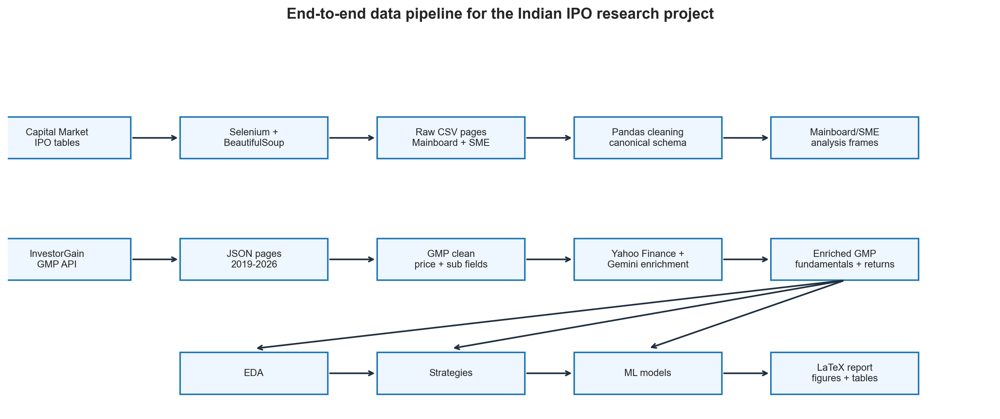
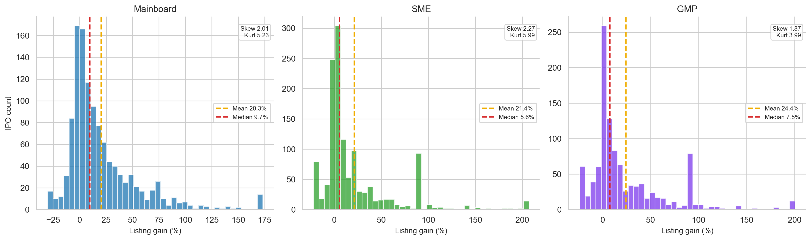
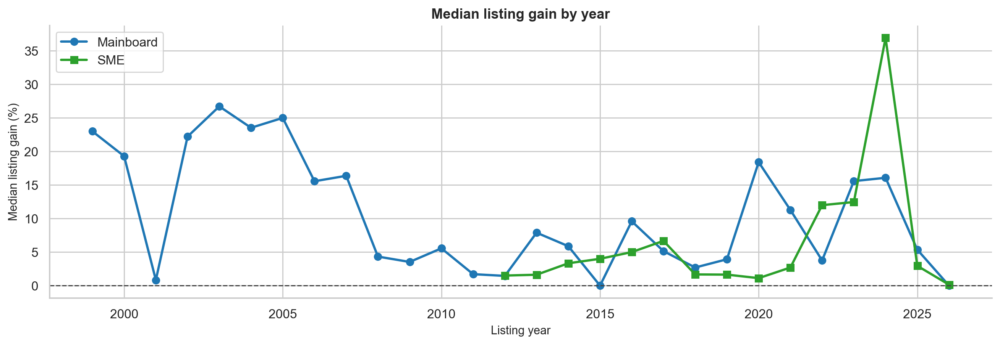
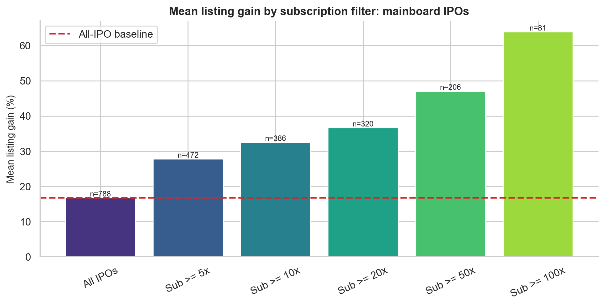
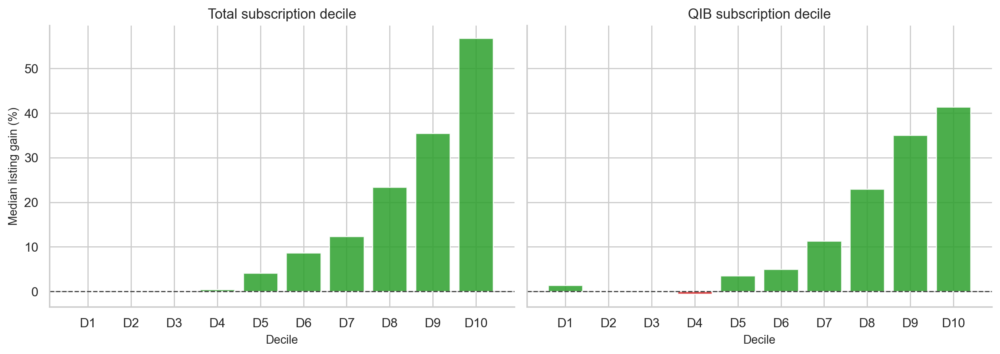
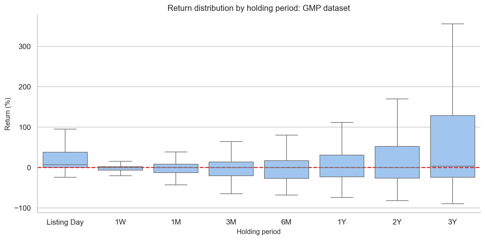
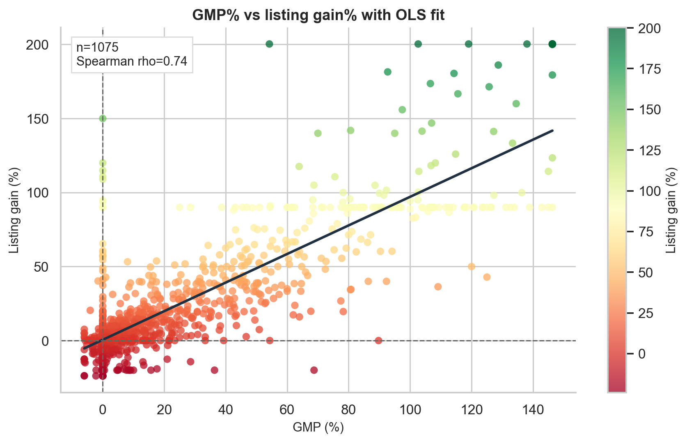
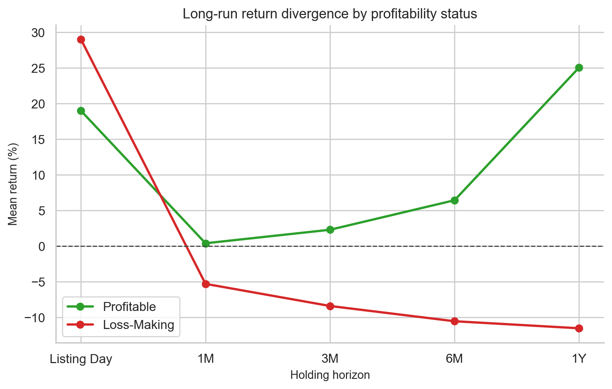
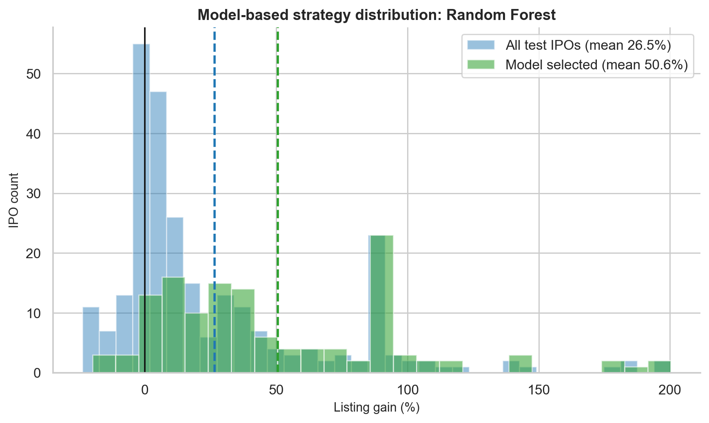

# What the Data Says About Indian IPOs — A Beginner's Guide

*By Aman Singh · Based on the [full research project](https://beyondbooks2116.netlify.app/ipo/)*

---

Every IPO season in India brings the same buzz. WhatsApp groups light up with GMP updates, everyone logs into their Demat accounts, and the big question hangs in the air: *will it list at a premium?*

I decided to stop guessing and start measuring. This blog is a plain-English summary of a data science research project I did on Indian IPO data — covering over 1,000 IPOs, listing-day returns, oversubscription patterns, grey market premiums, and even a machine learning model to screen IPOs.

If you want the numbers without the jargon, you're in the right place. If you later want to go deeper, links to the full report and code are at the bottom.

> **Disclaimer:** This is a research project, not financial advice. Past data does not guarantee future results. IPO investing involves risks including capital lock-up, allotment uncertainty, and market volatility.

---

## 🧭 What This Project Is About

The central question was simple:

> **Is investing in Indian IPOs actually profitable — and which signals help you pick better ones?**

To answer it, I built three datasets from scratch:

| Dataset | IPOs Covered | What It's Used For |
|---|---|---|
| Historical Mainboard | ~1,177 IPOs (1999–2026) | Long-term listing gain patterns |
| SME IPOs | ~82 IPOs (2012–2026) | Comparing SME vs mainboard |
| GMP-era dataset | ~1,075 IPOs (2019–2026) | Grey market premium, ML modelling |

Building the data took longer than any modelling. IPO data in India isn't neatly packaged into one downloadable CSV — it had to be scraped from websites, pulled from APIs, and enriched with financial data from Yahoo Finance.

*Research pipeline from raw IPO data to final analysis.*

---

## 📊 Part 1: The Basics — Do IPOs Actually Make Money?

Let's start with the most naive strategy possible: **apply to every IPO and sell on listing day.**

Here's what the data says across 1,177 mainboard IPOs:

| | Mainboard | SME |
|---|---|---|
| **Mean listing gain** | 25.83% | 31.72% |
| **Median listing gain** | 9.68% | 1.78% |
| **Win rate** | 72.8% | 62.2% |
| **Loss rate** | 21.9% | 20.7% |

The short answer: **yes, IPOs have historically made money on average.**

But here's the thing — the *average* (mean) is misleading. Look at the median numbers. The **typical** mainboard IPO returned only 9.68%, not 25.83%. For SME IPOs, the median is a tiny 1.78%.

**Why the gap?** A handful of blockbuster IPOs — some returning 200%, 500%, even 4,940% — pull the average way up. Most investors don't experience those. They experience the median.

> **The lesson:** In IPO investing, the *mean* is what the dataset earned in total. The *median* is what the typical investor experienced.

*Distribution of IPO listing gains.*

---

## 📅 Part 2: IPO Markets Move in Waves

IPOs don't happen at a steady rate. They cluster in "hot" markets and dry up in weak ones.

From the data:
- **2023 and 2024** were exceptionally strong IPO years, with median listing gains peaking at 30.36% in 2024.
- **2025** saw a flood of new IPOs — but gains compressed as supply outpaced investor appetite.
- **2026** (partial data) has shown a much weaker environment.

The key insight: **more IPOs ≠ better returns.** When too many companies list at once, investor attention and liquidity get stretched thin.

*Year-wise IPO listing gain trend.*

---

## 📈 Part 3: The Power of Oversubscription

When an IPO is subscribed 50x, it means investors applied for 50 times the shares available. This isn't just trivia — it's a powerful signal.

Here's what happens to listing gains when you filter by subscription:

| Filter | IPOs | Mean Gain | Win Rate |
|---|---|---|---|
| All IPOs (with subscription data) | 788 | 16.76% | 69.3% |
| Subscription > median | 393 | 31.99% | 88.5% |
| Subscription > 75th percentile | 197 | 48.06% | 99.0% |
| Subscription > 50x | 206 | 47.04% | 98.5% |
| **Subscription > 100x** | **81** | **63.90%** | **100%** |

The standout result: **every single mainboard IPO in the sample with subscription above 100x produced a positive listing return.** That's not a guarantee for the future, but it's a striking historical pattern.

**Why does this work?** Think of it economically. If an IPO is subscribed 100 times, 99 out of 100 applicants didn't get shares. On listing day, many of those unsuccessful applicants still want to buy — creating a wave of buying demand that pushes the price up.

*Mean listing gain by subscription filter.*

**What about the type of investor subscribing?**

Not all subscription is the same quality:

| Subscriber Type | Spearman Correlation with Gain |
|---|---|
| Total subscription | 0.685 (strongest) |
| NII/HNI subscription | 0.648 |
| QIB (institutional) subscription | 0.616 |
| Retail subscription | 0.583 |

Interestingly, **total subscription is the best predictor**, but all four categories are meaningful. QIB (Qualified Institutional Buyers) participation represents professional due diligence, while retail and HNI demand often reflects sentiment.

*Subscription decile chart.*

---

## 💹 Part 4: Should You Hold or Sell on Listing Day?

This is one of the most practical questions for anyone who gets allotted shares: **sell immediately, or wait for bigger gains?**

Here's what post-listing returns look like:

| When You Sell | Mean Return | Median Return | Win Rate |
|---|---|---|---|
| **Listing day** | 24.97% | 7.55% | 72.1% |
| 1 Week later | -0.72% | 0.00% | 32.5% |
| 1 Month later | 0.03% | 0.00% | 37.1% |
| 3 Months later | 1.58% | 0.00% | 38.8% |
| 6 Months later | 5.19% | 0.00% | 37.1% |
| 1 Year later | 21.73% | 0.00% | 41.8% |

The numbers look strange at first. At 2–3 years, the mean looks huge — but the median is near zero. That means a tiny number of exceptional companies (think Zomato or Nykaa-type stories) pull the average up enormously, while **the typical IPO stock goes almost nowhere** after listing.

A proper statistical test (paired t-test) confirms: **holding for 1 year does NOT significantly outperform selling on listing day.**

**Why?** The listing-day pop captures the IPO-specific demand imbalance — all those unsuccessful applicants rushing to buy. After that, the stock is just another stock, competing on fundamentals, sector trends, and market conditions.

> The exception: truly outstanding companies will outperform over years. But as a *default rule* for every allotted IPO, the data doesn't support holding.

*IPO holding period return comparison.*

---

## 🔮 Part 5: Grey Market Premium (GMP) — The Strongest Signal

GMP might be the single most useful number you can track before an IPO. It's the informal premium at which IPO shares trade in the "grey market" before official listing.

**Example:** If an IPO's issue price is ₹200 and the GMP is ₹40, the GMP% is 20%. This means the informal market expects the stock to list 20% above issue price.

The data shows GMP has an extraordinarily strong relationship with actual listing gains:

- **Pearson correlation: 0.835** (close to 1.0 is near-perfect)
- **R-squared: 0.697** — GMP alone explains ~70% of listing gain variation

In plain English: a GMP of X% predicts a listing gain *close to* X%.

**GMP buckets make this even clearer:**

| GMP Zone | IPOs | Mean Gain | Win Rate |
|---|---|---|---|
| Very negative (< -5%) | 15 | -7.52% | 33.3% |
| Negative (-5% to 0%) | 347 | 2.83% | 50.4% |
| Flat (0–10%) | 223 | 3.07% | 61.4% |
| Moderate (10–20%) | 115 | 13.45% | 82.6% |
| High (20–40%) | 119 | 25.53% | 92.4% |
| **Very high (> 40%)** | **256** | **80.90%** | **98.8%** |

**Important caveat:** GMP is informal and unregulated. It can be thin, sentiment-driven, or occasionally manipulated. Treat it as a *sentiment gauge*, not a guaranteed forecast. The mean absolute error is still ~14.5 percentage points — so a 30% GMP could realistically mean a 15%–45% listing.

*GMP versus actual listing gain scatter plot.*

---

## 🔗 Part 6: Combine GMP + Subscription for Best Results

GMP and subscription measure different things:
- **GMP** = what the informal market *expects*
- **Subscription** = what investors actually *demanded*

When both agree, results are strongest:

| Filter | IPOs | Mean Gain | Win Rate |
|---|---|---|---|
| All IPOs | 1,075 | 24.97% | 72.1% |
| GMP > 10% only | 490 | 51.62% | 93.5% |
| Subscription > median only | 537 | 47.41% | 87.9% |
| **GMP > 10% AND subscription > median** | **442** | **54.89%** | **94.6%** |

The practical rule of thumb: **if the grey market is excited AND actual subscription demand is strong, you have both sentiment and revealed demand working in your favour.**

---

## 📉 Part 7: Does the Market Phase Matter?

The Nifty 50's performance before an IPO also affects listing gains. The data was divided into three phases:

| Market Phase | IPOs | Mean Gain | Win Rate |
|---|---|---|---|
| 🐂 Bull (Nifty up >5% in 3 months) | 445 | 33.88% | 80.2% |
| ↔️ Sideways | 521 | 19.91% | 67.0% |
| 🐻 Bear (Nifty down >5% in 3 months) | 109 | 12.80% | 63.3% |

**Market phase matters — but it's not the dominant factor.** Even in bear markets, IPO win rates were above 60%. This is partly because in weak markets, only the strongest or most conservatively priced IPOs tend to go ahead.

---

## 🏭 Part 8: SME vs Mainboard — Not What It Seems

SME IPOs are often hyped as high-return opportunities. The data tells a more nuanced story:

| | Mainboard | SME |
|---|---|---|
| Mean gain | 25.83% | 31.72% |
| **Median gain** | **9.68%** | **1.78%** |
| Flat listings (0% gain) | 5.3% | **17.1%** |

The SME *mean* looks better, but the *median* is much worse. A significant number of SME IPOs list at exactly zero — a liquidity issue unique to SMEs. The high SME mean is driven by a small number of exceptional winners.

**Statistical note:** The difference between mainboard and SME distributions is not statistically significant (p = 0.44). They're not meaningfully different once you account for the full picture.

> **SME IPOs can produce large wins, but they're riskier for the typical investor** — especially given lower liquidity and higher flat-listing rates.

---

## 💰 Part 9: Profitable vs Loss-Making Companies

Several high-profile modern IPOs (think new-economy startups) have listed while still unprofitable. What happens?

| | Profitable Companies | Loss-Making Companies |
|---|---|---|
| **Listing day mean** | 18.99% | **29.01%** |
| 1-month mean | 0.39% | -5.30% |
| 3-month mean | 2.29% | -8.41% |
| 6-month mean | 6.44% | -10.55% |
| **1-year mean** | **25.05%** | **-11.54%** |

**Counterintuitive result:** Loss-making companies actually pop more on listing day (though the difference isn't statistically significant). The likely reason: bankers price loss-making companies conservatively to ensure demand, creating an artificial gap between issue price and true market value.

**But the long-term reversal is dramatic.** By one year, profitable companies are up 25% on average from listing price, while loss-making companies are down 11.5% — a nearly 37 percentage-point gap.

> **If you're thinking long-term, cash-flow quality matters. Sentiment creates the listing pop; fundamentals determine where the stock goes next.**

*Long-run performance of profitable versus loss-making IPOs.*

---

## 🤖 Part 10: Can a Machine Learning Model Do Better?

The final part of the project builds a machine learning classifier to predict which IPOs will gain at least 10% on listing day — using only information available *before* listing.

**Features used (all pre-listing):**
- GMP %
- Subscription levels (total, QIB, NII, retail)
- GMP × subscription interaction
- Market regime (bull/bear/sideways)
- Recent IPO momentum (rolling 30-day/90-day averages)
- Company fundamentals (P/E, profit margin, etc.)

The model was trained on older data (2019–early 2025) and tested on the most recent period (Sep 2025–May 2026) — a strict chronological split to prevent "future leakage."

**Model results:**

| Model | Accuracy | ROC-AUC |
|---|---|---|
| Logistic Regression | 80.47% | 0.855 |
| **Random Forest** | **86.05%** | **0.863** |
| Gradient Boosting | 85.58% | 0.850 |
| Neural Network | 81.40% | 0.858 |

The Random Forest was best. An AUC of 0.863 (where 0.5 is random guessing and 1.0 is perfect) is a strong result for financial data.

**What the model learned:** The most important factors were GMP, subscription, their interaction (GMP × subscription), and issue size. This matches what the statistical analysis already found — the model isn't discovering hidden magic, it's confirming the same economics in a more systematic way.

---

## 🎯 Part 11: The Backtest — Does It Work in Practice?

The real test: if you had used this model in the out-of-sample period, would it have helped?

The rule was simple: **apply only if the model predicts at least 60% probability of a 10%+ gain.**

| Group | IPOs | Mean Gain | Win Rate |
|---|---|---|---|
| All test-period IPOs | 215 | 6.06% | 55.3% |
| **Model-selected IPOs** | **35** | **31.21%** | **94.3%** |

The model filtered 215 recent IPOs down to 35 high-confidence picks. Mean gain jumped from 6% to 31%, and win rate went from 55% to 94%. The difference is statistically significant (p < 0.0001).

**But don't get too excited yet.** Important caveats:
- This is one 8-month window, not years of rolling validation
- The 60% threshold was chosen after seeing the test results (which introduces bias)
- Allotment probability isn't modelled — the best IPOs are hardest to get into
- Taxes, brokerage, and capital lock-up costs aren't included

> **The model can meaningfully rank IPOs by expected listing success — but it needs much more rigorous real-world testing before anyone should rely on it.**

*Model-selected IPO backtest gain distribution.*

---

## 🏆 The Key Takeaways (Summary Card)

Here's everything distilled into practical lessons:

| # | Lesson | Data Behind It |
|---|---|---|
| 1 | **IPOs have a positive base rate** | 72.8% mainboard win rate, 25.83% mean gain |
| 2 | **The average overstates typical experience** | Median is only 9.68% vs 25.83% mean |
| 3 | **Oversubscription is a powerful filter** | 100x+ subscription → 100% historical win rate |
| 4 | **GMP is the single strongest predictor** | r = 0.835 with listing gain |
| 5 | **GMP + subscription together is best** | 94.6% win rate with both filters |
| 6 | **Sell on listing day by default** | Holding 1 year doesn't statistically beat listing-day selling |
| 7 | **SME IPOs aren't automatically better** | High mean, very low median (1.78%), lots of flat listings |
| 8 | **Profitability matters for long-term holders** | 37 pp gap in 1-year returns between profitable and loss-making companies |
| 9 | **Bull markets help, but aren't everything** | Bear market win rate is still 63% |
| 10 | **ML can improve screening — carefully** | 86% accuracy, 94% win rate on model picks (with caveats) |

---

## 📂 Sector Patterns (Quick Look)

Among sectors in the GMP-era data, technology, energy, and communication services had the strongest listing gains, while utilities and real estate lagged. But note that some sectors (e.g., energy with only 7 IPOs) have small samples, so these averages aren't highly reliable guides on their own.

---

## 🛤️ What the Project Doesn't Cover (Yet)

No research project is complete without acknowledging its limits:

- **Allotment probability** — getting into the best IPOs is hardest. This project measures gains conditional on getting allotted.
- **Taxes and brokerage** — real investor returns are lower than the raw listing gain numbers.
- **GMP manipulation** — the grey market is informal and can be thin or gamed.
- **DRHP analysis** — the IPO prospectus risk factors were not analysed (a natural next step).
- **Promoter selling** — whether founders are cashing out vs raising fresh capital can affect long-term outcomes.

---

## 🚀 Go Deeper

This blog covers the key insights. For the full quantitative detail — every statistical test, every chart, all the modelling methodology — explore these resources:

| Resource | What You'll Find |
|---|---|
| 📝 [**Full Research Blog**](https://beyondbooks2116.netlify.app/ipo/) | Complete walkthrough with all charts and analysis |
| 💻 [**GitHub Repository**](https://github.com/amansingh2116/ipo_analysis) | Full code: scrapers, notebooks, ML models |
| 📄 [**Project Report (PDF)**](https://github.com/amansingh2116/ipo_analysis/blob/main/Project_report/report.pdf) | Formal research report with statistical methodology |

---

## 💬 Final Thought

The Indian IPO market is not random. It's noisy, skewed, and driven by cycles of sentiment — but underneath that noise, there are real and measurable signals.

The simplest answer to the original question:

> **Yes, Indian IPO investing has historically been profitable — but the typical experience is much more modest than the headline numbers suggest.**

The smarter answer:

> **IPO selection improves dramatically when you combine GMP, oversubscription, market phase, and recent IPO momentum.**

And the methodological lesson that applies beyond just IPOs:

> Good research isn't about running fancy models. It's about asking honest questions, building trustworthy data, choosing the right statistical tests, and being clear about what you can and cannot prove.

If this sparked your curiosity, the GitHub repo has the full code — feel free to explore, fork, and build on it.

---

*Written by Aman Singh. Research conducted between 2024–2026.*
*For feedback or questions, feel free to reach out via [GitHub](https://github.com/amansingh2116).*
