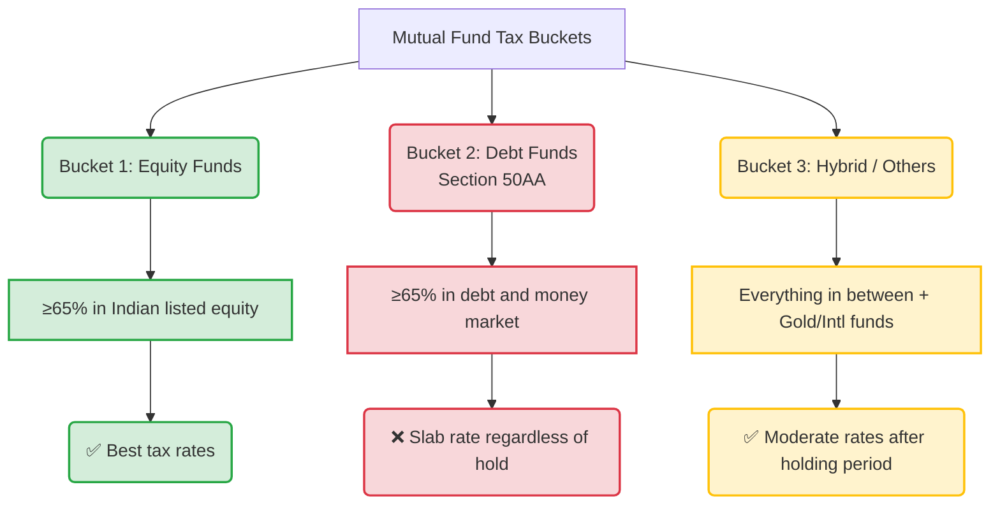
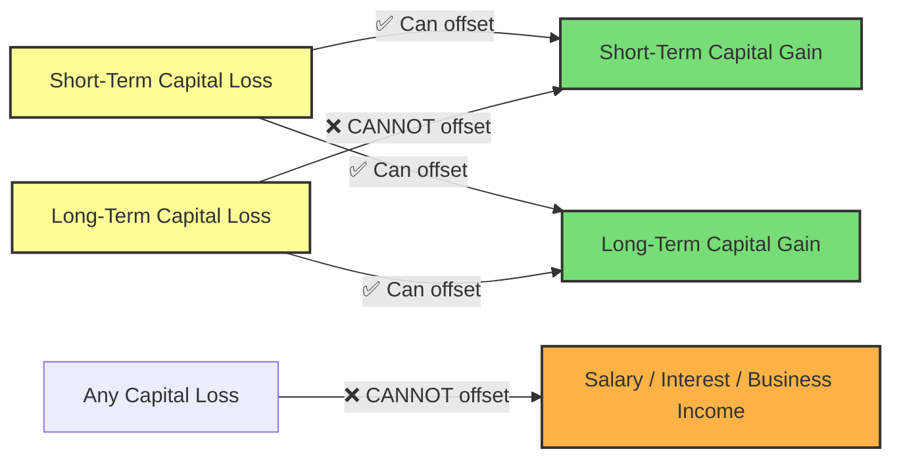

# Mutual Fund Taxation in India: The Complete Beginner's Guide (FY 2025-26)

> **Who this is for:** Anyone who invests — or wants to invest — in mutual funds in India and wants to understand exactly how much tax they'll pay, when they'll pay it, how to reduce it legally, and how to file it correctly. No prior tax knowledge assumed.

---

---

## 1. Why Taxes on Mutual Funds Confuse People

Imagine you planted two mango trees in your garden — one that gives mangoes in summer, and one in winter. A simple rule like "fruit is taxable" applies to both. But if there were different tax rates depending on how long the tree has been in the ground, which variety it is, and whether you ate the fruit or sold it... it gets complicated fast.

That's mutual fund taxation in India. The same basic idea — *profits are taxable* — but the actual rate and timing depend on several factors:

- **What type of fund** you invested in
- **How long** you held the investment before redeeming
- **When** you bought the units (the 2023 and 2024 budget changes created different rules for different vintages of investment)
- **Whether** you received income as dividends or as capital gains

The good news: once you understand the framework, it becomes logical. This guide builds that framework from scratch.

> 💡 **One important clarification upfront:** You do NOT pay tax when your mutual fund NAV goes up while you're still invested. Tax is triggered only when you actually **sell (redeem) your units**, receive a **dividend (IDCW)**, or **switch** from one fund to another. Paper profits sitting in your portfolio are not taxed.

---

## 2. Key Terms You Must Know First

Before diving in, let's nail down the vocabulary. These terms will appear throughout the blog.

**Capital Gain:** The profit you make when you sell something for more than you paid for it.
> *Example: You buy mutual fund units worth ₹50,000. You sell them for ₹70,000. Your capital gain is ₹20,000.*

**Capital Loss:** The opposite — you sell for less than you paid.
> *Example: You bought at ₹50,000 and sold at ₹42,000. Capital loss = ₹8,000.*

**STCG (Short-Term Capital Gain):** Profit made from selling a fund within the short-term holding threshold (12 months for equity funds, 24 months for debt/non-equity funds).

**LTCG (Long-Term Capital Gain):** Profit made after holding beyond the threshold.

**STCL / LTCL:** Same idea but for losses.

**Holding Period:** The time between when you bought the units and when you sold them.

**FIFO (First-In, First-Out):** When you partially redeem units, Indian tax law assumes the oldest units (the ones you bought first) are sold first. This matters for SIP investors — more on this later.

**NAV (Net Asset Value):** The per-unit price of a mutual fund on any given day.

**IDCW (Income Distribution cum Capital Withdrawal):** Previously called "dividend." This is money that the fund periodically pays out to investors. The NAV drops by the amount paid.

**Section 112A / 111A:** Sections of the Income Tax Act that specify the rates for LTCG and STCG on equity investments.

**Section 50AA:** A section that covers "specified mutual funds" (mainly debt-oriented ones) and dictates that all their gains are taxed as short-term, regardless of holding period.

**ELSS:** Equity Linked Savings Scheme — the only mutual fund category offering a tax deduction (under Section 80C) at the time of investment.

---

## 3. The Big Picture: How Mutual Fund Income Is Taxed

There are two types of income you can earn from a mutual fund:

**Type 1: Capital Gains** — earned when you sell/redeem your units at a higher price than you bought them.

**Type 2: Dividends (IDCW)** — earned when the fund distributes money to you periodically.

These two types are taxed completely differently. Capital gains tax depends on the fund type and holding period. Dividends are **always taxed as regular income at your slab rate**, regardless of fund type.

### What Changed in July 2024 (and Why You Must Know This)

The Union Budget 2024 (Finance Act No. 2, 2024) made sweeping changes to capital gains taxes, effective from **23 July 2024**. Here's a before-and-after summary:

| Fund Type | Before 23 July 2024 | After 23 July 2024 |
|---|---|---|
| **Equity STCG** (sold within 12 months) | 15% | **20%** |
| **Equity LTCG** (sold after 12 months) | 10% above ₹1 lakh | **12.5% above ₹1.25 lakh** |
| **Non-equity LTCG** (outside Sec. 50AA) | 20% **with indexation** after 36 months | **12.5% without indexation** after 12/24 months |
| **Debt funds (post-April 2023 units)** | Slab rate (unchanged) | Slab rate (no change) |

Budget 2025 and Budget 2026 did **not** change these rates further. The rules above are in force for FY 2025-26.

---

## 4. The Three Tax Buckets: Which Bucket Does Your Fund Fall In?

Think of every mutual fund being sorted into one of three tax "buckets" at the time you redeem. The bucket is determined by the fund's **actual portfolio composition**, not its name.

### Bucket 1 — Equity-Oriented Funds (≥65% in Indian listed equity):
Large-cap, mid-cap, small-cap, flexi-cap, ELSS, sectoral, thematic, aggressive hybrid, arbitrage funds.

### Bucket 2 — Specified Debt Funds (Section 50AA) (≥65% in debt/money market):
Liquid funds, ultra short duration, short duration, medium duration, corporate bond, gilt, banking & PSU funds, conservative hybrid.

### Bucket 3 — Everything Else:
Gold ETFs, Gold FoFs, international funds, balanced advantage funds, multi-asset funds, fund-of-funds — their tax treatment depends on a few sub-rules explained below.

> ⚠️ **Important:** A fund called "Balanced Hybrid Fund" may actually fall into Bucket 1 OR Bucket 3 depending on how much equity it holds. Always check the fund's latest factsheet for the current equity allocation — don't just trust the name.

---

## 5. Bucket 1: Equity Fund Taxation

### The Rules (FY 2025-26)

| Holding Period | Gain Type | Tax Rate |
|---|---|---|
| ≤12 months | STCG (Section 111A) | **20%** (flat) |
| >12 months | LTCG (Section 112A) | **12.5%** on gains **above ₹1.25 lakh** |

The ₹1.25 lakh LTCG exemption applies **per investor, per financial year**, across all equity mutual funds AND direct stocks. It's not per fund; it's a single combined limit.

### Worked Example 1: Simple Equity Fund Investment

Rahul invested ₹3,00,000 in a large-cap mutual fund in June 2024.

**Scenario A: Sells in December 2024 (6 months later)**
- Gain: ₹30,000 (say NAV grew 10%)
- Holding period: 6 months → **STCG**
- Tax: ₹30,000 × 20% = **₹6,000** (+ cess)

**Scenario B: Sells in August 2026 (26 months later)**
- Gain: ₹1,80,000 (say NAV grew 60%)
- Holding period: 26 months → **LTCG**
- Exempt: ₹1,25,000
- Taxable: ₹1,80,000 − ₹1,25,000 = ₹55,000
- Tax: ₹55,000 × 12.5% = **₹6,875** (+ cess)

Notice how holding longer saved money in two ways: the *rate* dropped from 20% to 12.5%, and ₹1.25 lakh of gains became completely tax-free.

### What About Arbitrage Funds?

Arbitrage funds exploit price differences between the cash and futures markets. Even though they feel like "safe" investments, they are classified as **equity-oriented** for tax purposes (since they maintain ≥65% gross equity exposure through the arbitrage mechanism). So they get the same STCG/LTCG treatment as any equity fund — making them attractive for short-term parking of money compared to a liquid fund, where gains are taxed at your slab rate.

### ELSS: The Double-Benefit Fund

ELSS (Equity Linked Savings Scheme) funds are equity funds with a mandatory 3-year lock-in period. They offer:

1. **Tax deduction at investment:** Up to ₹1.5 lakh deduction under Section 80C (only under the Old Tax Regime)
2. **LTCG treatment at exit:** Since the lock-in is 3 years (>12 months), every redemption is automatically long-term — taxed at 12.5% above the ₹1.25 lakh exemption

Think of ELSS as getting a "tax discount" when you invest AND "tax-efficient treatment" when you withdraw.

> 🚫 Note: The Section 80C deduction is available **only under the Old Tax Regime**. If you've opted for the New Tax Regime, you cannot claim the 80C deduction on ELSS — but the LTCG treatment at exit remains the same regardless.

---

## 6. Bucket 2: Debt Fund Taxation

Debt fund taxation has had significant changes since 2023. The key is the **purchase date**.

### The April 2023 Dividing Line

The Finance Act 2023 introduced Section 50AA, which fundamentally changed how most debt funds are taxed for units purchased on or after **1 April 2023**:

> **For debt fund units bought on or after 1 April 2023:** ALL gains are treated as Short-Term Capital Gains and taxed at your **slab rate**, regardless of how long you hold.

This means a liquid fund held for 10 years gets the exact same tax treatment as one held for 10 days — there's no "long-term" benefit anymore for new investments.

### The Two Scenarios

**Scenario A — Units bought after 1 April 2023 (common case today):**

| Holding Period | Tax Treatment |
|---|---|
| Any duration | **STCG at your slab rate** (5%, 10%, 20%, 30%) |

**Scenario B — Units bought before 1 April 2023 (legacy units):**
These may follow older rules depending on the scheme. Units sold after 23 July 2024 are generally taxed as:
- LTCG at 12.5% (without indexation) if held long-term
- STCG at slab if short-term

### Why This Matters: Debt Funds vs Bank FDs

Before 2023, debt funds were popular partly because long-term gains (after 3 years) got the benefit of **indexation**, effectively reducing your taxable gain by adjusting for inflation. That's gone now.

For someone in the 30% tax bracket, a debt fund is now taxed just like a Fixed Deposit — your gains are added to your income and taxed at 30%. The main reason to pick a debt fund over an FD today is not tax efficiency, but rather factors like liquidity, diversification, and potentially better returns.

### Worked Example 2: Debt Fund Taxation

Priya (30% tax bracket) invested ₹10,00,000 in an HDFC Short Duration Fund in August 2025.

She redeems in February 2026 (6 months later) for ₹10,60,000.
- Gain: ₹60,000
- Purchased after April 2023 → **STCG at slab rate**
- Tax: ₹60,000 × 30% = ₹18,000 + 4% cess = **₹18,720**

For comparison, the same ₹10 lakh in a Bank FD at similar returns would also yield ₹60,000 interest taxed at 30% = the same ₹18,720. The tax advantage debt funds once had is gone for new investors in higher brackets.

> 💡 **Silver lining for low-bracket investors:** If you're in the 5% or 10% tax bracket, debt funds are still very tax-efficient because that's your slab rate.

---

## 7. Bucket 3: Hybrid, Gold, International & FoF Taxation

This is the most complex bucket, but the 2024 Budget actually simplified a few things here (for better).

### Hybrid Funds: It Depends on Equity Exposure

| Hybrid Sub-Type | Typical Equity Exposure | Taxed Like |
|---|---|---|
| Aggressive Hybrid | 65–80% | **Equity (Bucket 1)** |
| Balanced Advantage / Dynamic Asset Allocation | Variable, often ≥65% gross | Usually **Equity** |
| Equity Savings Fund | ~30% net, ≥65% gross via arbitrage | Usually **Equity** |
| Multi-Asset Allocation | Varies (check factsheet) | Equity if ≥65%, else read below |
| Conservative Hybrid | 10–25% | **Non-equity rules** |

For hybrid funds that are **not** equity-oriented and **not** covered by Section 50AA, the rules post-July 2024 are:
- **Listed units:** LTCG at 12.5% if held >12 months
- **Unlisted units:** LTCG at 12.5% if held >24 months
- **STCG:** Slab rate (if sold before the relevant threshold)

### Gold Funds and International Funds: The 2024 Change

Good news here. The 2024 budget **narrowed** the definition of Section 50AA. From FY 2025-26 onwards, only funds with **>65% in debt/money market** are covered by that "slab rate regardless of holding period" rule.

This means **Gold ETFs, Gold FoFs, and most international funds** are now *outside* the slab-rate penalty box and follow the normal non-equity capital gains rules:

| Fund | Listed? | Long-Term Threshold | LTCG Rate |
|---|---|---|---|
| Gold ETF | Yes (traded on exchange) | >12 months | 12.5% |
| Gold FoF | No (regular mutual fund) | >24 months | 12.5% |
| International ETF | Yes | >12 months | 12.5% |
| International FoF | No | >24 months | 12.5% |

> ⚠️ **Important:** The ₹1.25 lakh annual LTCG exemption does **not** apply to gold and international funds. That exemption is exclusively for equity-oriented assets under Section 112A. So ₹1.25 lakh in gold ETF LTCG is taxed at 12.5% in full — there's no free first-₹1.25 lakh.

### Worked Example 3: Gold ETF vs Gold FoF

Deepak invests ₹2,00,000 each in a Gold ETF and a Gold FoF in April 2025. Both grow to ₹2,40,000 by July 2026.

**Gold ETF (listed):**
- Holding period: 15 months → >12 months → **LTCG**
- Gain: ₹40,000
- Tax: ₹40,000 × 12.5% = **₹5,000** (no exemption applies)

**Gold FoF (unlisted):**
- Holding period: 15 months → ≤24 months → **STCG**
- Gain: ₹40,000
- Tax at slab rate (say 30%): **₹12,000**

The Gold ETF is significantly more tax-efficient if sold after 12 months. The Gold FoF investor needs to wait until April 2027 (24+ months) to get the 12.5% LTCG rate.

---

## 8. How SIP Investments Are Taxed

This is one of the most commonly misunderstood areas. Many SIP investors think of their investment as a single lump sum and are surprised by the tax calculation.

### The Core Rule: Each Installment Has Its Own Clock

When you invest through SIP, **every monthly installment is a separate purchase**, with its own purchase date and its own holding period. When you redeem, the tax calculation happens installment by installment — not on the total corpus as one block.

**Redemption follows FIFO (First In, First Out):** When you sell any units, the oldest units (earliest purchased) are treated as sold first. You cannot choose to sell the newer units first.

### Worked Example 4: SIP Taxation

Anjali invests ₹5,000 per month in a flexi-cap fund starting January 2025. She decides to redeem fully in March 2026.

| Installment Month | Purchase Date | By March 2026: Held for | Tax Type |
|---|---|---|---|
| January 2025 | Jan 25 | 14 months | **LTCG (12.5%)** |
| February 2025 | Feb 25 | 13 months | **LTCG (12.5%)** |
| March 2025 | Mar 25 | 12 months | STCG (20%) |
| April 2025 | Apr 25 | 11 months | STCG (20%) |
| ... | ... | ... | ... |
| February 2026 | Feb 26 | 1 month | STCG (20%) |

A single redemption event will generate **both LTCG and STCG** from the same fund. Your AMC's capital gains statement will break this down for you automatically.

### Key Takeaway for SIP Investors

If you plan to redeem a SIP corpus, redeeming it **after all installments cross the 12-month mark** will maximize the portion taxed as LTCG. For a 12-month SIP, you'd need to wait 12 months after the *last* SIP installment was made before redeeming everything at LTCG rates.

---

## 9. How SWP Withdrawals Are Taxed

An SWP (Systematic Withdrawal Plan) is essentially a scheduled partial redemption — you instruct the fund to send you a fixed amount every month or quarter.

**The good news:** Tax is charged only on the **gain portion** of each SWP withdrawal, not the entire amount withdrawn.

**The math:** Each SWP withdrawal consists of two parts:
- **Return of capital** (not taxable)
- **Capital gain** (taxable)

For equity funds, if the units being redeemed through SWP have been held for >12 months, the gain qualifies as LTCG at 12.5%.

### Worked Example 5: SWP from an Equity Fund

Retired investor Rajan built up ₹50 lakh in a large-cap fund through a lump sum in January 2022. He starts an SWP of ₹30,000/month in February 2024.

By February 2024, his units are 25 months old — **all long-term**. FIFO ensures the oldest units are redeemed first through each SWP.

Say his average purchase price was ₹100/unit and NAV in February 2024 is ₹180/unit.
- To pay ₹30,000, the fund sells approximately 167 units (at ₹180)
- Cost of those 167 units: 167 × ₹100 = ₹16,700
- Gain on each withdrawal: ₹30,000 − ₹16,700 = **₹13,300** (LTCG)
- Tax on that withdrawal: ₹13,300 × 12.5% = ₹1,662 (approximately)
- **Effective post-tax cash in hand: ~₹28,338**

Compare this to an IDCW (dividend) option where the full ₹30,000 received would be taxed at his income slab rate. For someone in the 20-30% bracket, SWP from a growth option is almost always more tax-efficient.

> 💡 **No TDS on SWP for resident Indians.** The AMC does not deduct tax at source on capital gains for resident individuals. You pay it yourself when filing your ITR.

---

## 10. Dividends (IDCW): Are They Tax-Free?

Many investors (especially older ones) remember a time when mutual fund dividends were tax-free in the investor's hands. That era ended in April 2020.

**Current rule: ALL dividends (IDCW) from any mutual fund are added to your income and taxed at your applicable slab rate.**

Additionally:
- If total IDCW received from a single AMC exceeds **₹5,000 in a financial year**, the AMC deducts **TDS at 10%** before paying you
- You can adjust this TDS against your total tax liability when filing your ITR

### Growth Option vs IDCW Option: Which is Better?

| Situation | Better Choice | Why |
|---|---|---|
| Long-term investor (30% bracket) | **Growth** | Capital gains tax (12.5% LTCG) < Slab tax (30%) |
| Investor needing cash flow | **Compare Growth+SWP vs IDCW** | SWP from growth often beats IDCW on after-tax basis |
| Low-bracket investor (5-10%) | Case by case | Slab rate is low, so IDCW may be acceptable |

**The hidden cost of IDCW:** When the fund pays you a "dividend," the NAV drops by exactly that amount. It's not extra money — it's your own money being handed back to you, now newly taxable. You're converting tax-deferred capital gains into immediately-taxable income, often at a higher rate.

---

## 11. Fund Switching: The Hidden Taxable Event

This trips up many investors who move between funds without realizing the tax consequences.

**Rule: Any switch from one mutual fund scheme to another is treated as a FULL REDEMPTION followed by a FRESH PURCHASE — even if it's within the same AMC.**

This applies to:
- Switching from Fund A to Fund B (even same AMC)
- Moving from Regular Plan to Direct Plan of the *same fund*
- Moving from Growth Option to IDCW Option of the *same fund*
- Any STP (Systematic Transfer Plan) — each transfer is a partial redemption

### Worked Example 6: The Switch Tax Trap

Vikram invested in a debt fund in June 2023 (₹5,00,000). In March 2026, he switches to an equity fund.

- Gain on the debt fund: ₹75,000
- These units were bought after April 2023 → STCG at slab rate (say 30%)
- Tax triggered: ₹75,000 × 30% = ₹22,500

The switch has created an immediate tax liability of ₹22,500 even though Vikram never took the money "out" — it just moved to another fund. He could have delayed the switch by a month or two to optimize, or restructured differently.

> 💡 **Before switching any fund, always calculate:** How much gain has it made? Is it STCG or LTCG? If you wait a little longer, does the tax go down significantly?

---

## 12. Legal Ways to Save Tax on Mutual Funds

### Strategy 1: Use the ₹1.25 Lakh Annual LTCG Exemption — Every Single Year

Every financial year (April to March), the first ₹1.25 lakh of long-term capital gains from equity funds and stocks combined is completely tax-free. Most investors redeem only when they "need the money" — and by then they have large accumulated gains taxed heavily.

**Smarter approach — Tax Gain Harvesting:** Every March (before the financial year ends), check your equity portfolio for unrealized long-term gains. If those gains are below ₹1.25 lakh, book (sell) them and reinvest immediately. You pay zero tax, but now your cost basis is higher — meaning when you eventually sell, your taxable gain is lower.

Over a decade of consistent ₹1.25 lakh harvesting, this strategy can save you **₹1.5 lakh+ in taxes** on a substantial equity portfolio.

### Strategy 2: Hold Equity >12 Months — Always

The gap between STCG (20%) and LTCG (12.5%) is 7.5 percentage points. On a ₹1 lakh gain, that's ₹7,500 in additional tax if you sell one day early. **There's almost never a good reason to sell equity mutual funds before 12 months** unless your financial situation demands it.

### Strategy 3: Hold Debt Funds >24 Months (For 30% Bracket Investors)

If you're in the 30% bracket and invested in a debt fund, the difference between selling at 23 months (30% slab rate) vs 25 months (12.5% LTCG) is massive. On ₹1 lakh gain, you'd pay ₹30,000 in tax at 23 months vs ₹12,500 at 25 months — a ₹17,500 saving just by waiting.

### Strategy 4: ELSS for the Old Tax Regime

If you're still on the Old Tax Regime, ELSS gives you a unique double benefit: you get Section 80C deduction of up to ₹1.5 lakh when you invest (saving ₹46,800 in tax if you're in the 30% bracket), AND your gains at exit are taxed as equity LTCG (12.5% above ₹1.25 lakh).

### Strategy 5: Choose Growth Over IDCW

For any investor in the 20%+ slab, the Growth option is almost always more tax-efficient than the IDCW option. Dividends are taxed at your full slab rate immediately. Capital gains in the Growth option are deferred until you sell, and may be taxed at the lower capital gains rate.

### Strategy 6: Use Arbitrage Funds for Short-Term Parking

If you have money you need in 6-11 months and you're in the 30% bracket, parking it in an arbitrage fund is more tax-efficient than a liquid fund. Arbitrage funds get equity tax treatment: STCG at 20% (vs 30% slab for liquid funds).

> 🔑 **Example:** ₹10 lakh parked for 9 months, gaining ₹50,000:
> - Liquid fund (slab 30%): Tax = ₹15,000
> - Arbitrage fund (equity STCG 20%): Tax = ₹10,000
> - **Saving: ₹5,000** just by choosing the right instrument

---

## 13. Tax-Loss Harvesting: Turning Losses into Tax Savings

Tax-loss harvesting is the practice of **deliberately selling a fund that is currently at a loss** to "book" that loss, which can then be used to offset taxable gains from other investments — thus reducing your tax bill.

Think of it like this: Losses are like tax vouchers. If you let them expire (without selling), they have no tax value. But if you "harvest" them by selling, you get a tax credit you can use against your profits.

### How It Works: A Simple Example

**Without tax-loss harvesting:**
- Fund A (equity, held 18 months): Gain = ₹3,00,000 (LTCG)
  - Taxable LTCG = ₹3,00,000 − ₹1,25,000 = ₹1,75,000
  - Tax = ₹1,75,000 × 12.5% = **₹21,875**

**With tax-loss harvesting (you also hold Fund B at a loss):**
- Fund B (equity, held 14 months): Loss = ₹1,00,000 (LTCL — it's long-term since held >12 months)
- Step 1: Sell Fund B → crystallize ₹1,00,000 LTCL
- Step 2: Set off LTCL against LTCG: ₹3,00,000 − ₹1,00,000 = ₹2,00,000 net LTCG
  - Taxable: ₹2,00,000 − ₹1,25,000 = ₹75,000
  - Tax = ₹75,000 × 12.5% = **₹9,375**
- **Tax saved: ₹12,500**
- Step 3: Immediately reinvest the Fund B proceeds in the same or similar fund

This is the core of tax-loss harvesting: sell the loser, use the loss to offset gains, and if you believe in the investment, buy right back.

### The Set-Off Rules (Critical)

Not all losses can offset all gains:

**Practical implication:** If you have STCG (taxed at the higher 20% rate) that you want to reduce, you specifically need STCL (short-term losses). LTCL will not help against STCG.

### The Carry-Forward Benefit

If your losses exceed your gains in a given year, the **unused losses can be carried forward for up to 8 assessment years**. You can use them to offset gains in future years.

However, there is **one non-negotiable condition:** You must file your Income Tax Return (ITR) by the due date (typically 31 July) to preserve this carry-forward right. If you file late, you permanently lose the ability to carry forward those losses — even if the losses are real and genuine.

### Things That Reduce the Tax-Loss Harvesting Benefit

1. **Exit Load:** Many equity funds charge 1% exit load if redeemed within 1 year. This eats into your tax saving.
2. **Holding Period Reset:** When you sell and rebuy, the clock resets. Units bought today are short-term for the next 12 months. If you sell a nearly-long-term position just to harvest a loss, and then buy back, you may later face a higher STCG rate when the market recovers.
3. **Small Losses, High Corpus:** Harvesting a ₹5,000 LTCL saves 12.5% × ₹5,000 = ₹625 in tax. If your exit load is ₹2,000, you've made yourself worse off.

### When Tax-Loss Harvesting Makes NO Sense

- Your equity LTCG for the year is below ₹1.25 lakh (it's already tax-free — nothing to offset)
- The loss is long-term but your gains are short-term (LTCL cannot offset STCG)
- Exit loads are high relative to the tax saving
- The "loss" fund is actually a fundamentally strong fund you're just temporarily down in

### The Right Sequence: How to Optimize the Set-Off

1. First, apply the ₹1.25 lakh LTCG exemption (it reduces gross LTCG to taxable LTCG)
2. Then set off LTCL against the remaining taxable LTCG
3. Use STCL to offset STCG first (saves at 20%), then any remaining STCL against LTCG (saves at 12.5%)
4. Don't "waste" LTCL on the exempt ₹1.25 lakh portion — it's already free

---

## 14. Capital Loss Set-Off & Carry-Forward Rules

### The Full Framework

| Loss Type | Can Offset | Cannot Offset |
|---|---|---|
| STCL | Both STCG and LTCG | Salary, rent, interest, business income |
| LTCL | LTCG only | STCG, any non-capital income |
| Either | Carry forward up to 8 AYs if ITR filed on time | Loses carry-forward if ITR filed late |

### Worked Example 7: Loss Set-Off in a Mixed Portfolio

Meera (30% bracket) has the following in FY 2025-26:

| Investment | Type | Amount |
|---|---|---|
| Gain: Large-cap equity fund (20 months held) | Equity LTCG | ₹2,00,000 |
| Gain: Small-cap fund (8 months held) | Equity STCG | ₹80,000 |
| Loss: Sector fund (5 months held) | Equity STCL | ₹60,000 |
| Loss: Debt fund | STCL | ₹30,000 |

**Step 1:** Apply ₹1.25 lakh exemption to equity LTCG: ₹2,00,000 − ₹1,25,000 = ₹75,000 taxable LTCG

**Step 2:** Apply STCL to STCG first (most efficient):
- STCG: ₹80,000
- STCL: ₹60,000 + ₹30,000 = ₹90,000
- Offset ₹80,000 of STCL against ₹80,000 STCG → STCG becomes ₹0
- Remaining STCL: ₹10,000

**Step 3:** Apply remaining STCL to LTCG:
- Taxable LTCG: ₹75,000 − ₹10,000 = ₹65,000

**Step 4:** Calculate tax:
- Tax on ₹65,000 LTCG: ₹65,000 × 12.5% = **₹8,125** + cess

Without any loss set-off, Meera would have paid:
- LTCG tax: ₹75,000 × 12.5% = ₹9,375
- STCG tax: ₹80,000 × 20% = ₹16,000
- Total: ₹25,375

With set-off: only ₹8,125 — **a saving of ₹17,250** just by being strategic about which losses to book.

---

## 15. Surcharge & Cess: The "Extra Charge" on Your Tax

When you read "20% tax on STCG" — that's not the final number. You also pay:

**Health & Education Cess:** 4% on the total tax amount. This applies to everyone.

**Surcharge:** Additional tax for high-income individuals. Applies if your total income exceeds certain thresholds:
- ₹50 lakh to ₹1 crore: 10% surcharge
- ₹1 crore to ₹2 crore: 15% surcharge
- Above ₹2 crore: The surcharge on **capital gains** is capped at 15% (post-Budget 2025)

### Effective Tax Rate Calculation

For most investors (income below ₹50 lakh, no surcharge):

| | Equity STCG | Equity LTCG |
|---|---|---|
| Base rate | 20% | 12.5% |
| + 4% cess on tax | 0.8% | 0.5% |
| **Effective rate** | **20.8%** | **13%** |

So if you have ₹1,00,000 in equity LTCG above the exemption, your total tax bill is ₹12,500 + ₹500 (cess) = ₹13,000.

---

## 16. Step-by-Step Tax Calculation Guide

Here's how to calculate your mutual fund tax from scratch at year-end:

### Step 1: Identify All Redemptions

List every mutual fund transaction where you sold units during the financial year (1 April to 31 March). Your AMC's capital gains statement (from CAMS or KFintech) will have all this.

### Step 2: Classify Each Gain/Loss

For each transaction, determine:
- **Fund type:** Equity (≥65% in domestic equity) or Non-equity
- **Holding period:** From purchase date to sale date
- **Gain/Loss type:** Based on fund type and holding period

### Step 3: Apply the Correct Tax Rate

| Category | Holding | Tax |
|---|---|---|
| Equity fund | ≤12 months | STCG @ 20% |
| Equity fund | >12 months | LTCG @ 12.5% (first ₹1.25L exempt) |
| Debt fund (units post Apr 2023) | Any | STCG @ slab rate |
| Gold ETF / Intl ETF (listed) | ≤12 months | STCG @ slab rate |
| Gold ETF / Intl ETF (listed) | >12 months | LTCG @ 12.5% |
| Gold FoF / Intl FoF (unlisted) | ≤24 months | STCG @ slab rate |
| Gold FoF / Intl FoF (unlisted) | >24 months | LTCG @ 12.5% |

### Step 4: Apply Set-Off Rules

- Net all STCG and STCL first
- Net all LTCG and LTCL next
- Apply remaining STCL (if any) against net LTCG

### Step 5: Apply Exemptions

- Deduct ₹1.25 lakh from net equity LTCG (only equity LTCG — not debt/gold)

### Step 6: Calculate Final Tax

- Remaining equity LTCG × 12.5%
- Net STCG × 20% (for equity) or slab rate (for others)
- Add 4% cess

### Comprehensive Worked Example 8: Full Year Tax Calculation

**Siddharth, 32, salaried at ₹15 lakh/year, 30% bracket, FY 2025-26:**

| Transaction | Fund Type | Bought | Sold | Gain/Loss | Type |
|---|---|---|---|---|---|
| Mirae Large-cap | Equity | May 2024 | Jun 2026 | +₹1,50,000 | LTCG (13 months) |
| Nippon Mid-cap | Equity | Aug 2025 | Mar 2026 | +₹40,000 | STCG (7 months) |
| ICICI Blue Chip | Equity | Oct 2025 | Jan 2026 | −₹25,000 | STCL (3 months) |
| Gold ETF | Non-equity | Jan 2025 | Apr 2026 | +₹20,000 | LTCG (15 months) |
| SBI Liquid Fund | Debt (post Apr '23) | Jul 2025 | Nov 2025 | +₹18,000 | STCG (slab rate) |

**Calculation:**

**Equity LTCG:**
- Gross: ₹1,50,000
- Less ₹1.25 lakh exemption: ₹1,50,000 − ₹1,25,000 = ₹25,000 taxable
- (Note: No losses to set off against LTCG after STCG set-off below)

**Equity STCG:**
- Gross: ₹40,000
- Less STCL: ₹25,000
- Net STCG: ₹15,000

**Non-equity (Gold ETF) LTCG:**
- ₹20,000 (no exemption available for gold)

**Debt STCG (slab rate):**
- ₹18,000 (treated as normal income, added to ₹15 lakh salary)

**Final tax on capital gains:**
- Equity LTCG: ₹25,000 × 12.5% = ₹3,125
- Equity STCG: ₹15,000 × 20% = ₹3,000
- Gold ETF LTCG: ₹20,000 × 12.5% = ₹2,500
- Debt STCG (at 30% slab): ₹18,000 × 30% = ₹5,400
- **Subtotal: ₹14,025**
- Add 4% cess: ₹14,025 × 1.04 = **₹14,586 total capital gains tax**

(The debt gain of ₹18,000 gets added to salary income for slab-rate calculation.)

---

## 17. How to File Your ITR for Mutual Fund Gains

### Step 0: Collect Your Documents First

Before opening the income tax portal, gather:

1. **Capital Gains Statement from CAMS:** Go to [camsonline.com](https://www.camsonline.com) → Investors → Statements → Capital Gain & Loss Statement. Enter your PAN, email, select FY 2025-26, choose Excel format.

2. **Capital Gains Statement from KFintech:** Go to [mfs.kfintech.com](https://mfs.kfintech.com) → Investor → Capital Gains and Loss Account Statement. (Different AMCs use CAMS or KFintech as their registrar — you'll likely need both.)

3. **Annual Information Statement (AIS):** Log into [incometax.gov.in](https://www.incometax.gov.in) → Services → Annual Information Statement. This is the Income Tax Department's own record of all your transactions. Cross-check your capital gains statements against AIS before filing.

4. **Form 26AS:** Tax credit statement showing any TDS deducted (e.g., 10% TDS on IDCW above ₹5,000).

5. **Form 16:** From your employer (if salaried).

### Step 1: Choose the Correct ITR Form

| Your Situation | ITR Form |
|---|---|
| Only equity LTCG ≤₹1.25 lakh, no losses to carry forward | ITR-1 is allowed (new for AY 2026-27) |
| STCG, or LTCG >₹1.25 lakh, or losses to carry forward, no business income | **ITR-2** (most investors) |
| Have business/professional income (including F&O trading) | ITR-3 |

Most mutual fund investors with active portfolios should use **ITR-2**.

### Step 2: Log Into the Tax Portal

Go to [incometax.gov.in](https://www.incometax.gov.in) → Log in with PAN → Navigate to **e-File → Income Tax Returns → File Income Tax Return** → Select Assessment Year **2026-27** → Select **Online mode** → Choose **ITR-2**.

### Step 3: Fill Schedule CG (Capital Gains)

This is where all your mutual fund gains/losses go. In ITR-2, you'll find:

- **Short-term capital gains under Section 111A (equity STCG):** Enter total STCG from equity mutual funds/shares
- **Short-term capital gains at applicable rates:** For debt/other STCG (added to income)
- **Long-term capital gains under Section 112A:** For equity LTCG — *this requires additional details in Schedule 112A*

### Step 4: Fill Schedule 112A (For Equity LTCG)

Schedule 112A requires fund-wise details for long-term equity capital gains:
- Name of the mutual fund/scrip
- ISIN (if applicable)
- Number of units sold
- Sale consideration (total amount received)
- Cost of acquisition
- Calculated gain

For transactions with purchase dates **before 31 January 2018**, there's a "grandfathering" provision (your cost is the higher of actual cost or the fair market value on 31 Jan 2018). For newer purchases, just enter the actual purchase cost.

> 💡 **Shortcut:** Platforms like ClearTax, TaxBuddy, and Zerodha Tax P&L allow you to import your CAMS/KFintech statements directly and they auto-populate Schedule 112A for you.

### Step 5: Report IDCW Under "Other Sources"

If you received any dividend/IDCW from mutual funds, report it under **Income from Other Sources.** Check Form 26AS for TDS deducted by the AMC on IDCW, and claim that TDS credit.

### Step 6: Claim Loss Set-Off and Carry-Forward

In Schedule CYLA (Current Year Loss Adjustment), you can set off current-year losses against gains. In Schedule BFLA (Brought Forward Loss Adjustment), you can set off losses carried forward from previous years.

### Step 7: Review, Pay Any Remaining Tax, and Submit

After filling all schedules, the portal calculates your total tax liability. If any amount is due beyond TDS/advance tax already paid, pay it as **self-assessment tax** (using Challan 280 on the tax portal). Then submit and verify your ITR.

**Verification options:**
- e-Verify using Aadhaar OTP, Net Banking, or Bank ATM (fastest, instant)
- Send signed ITR-V to CPC Bengaluru by post (within 30 days)

### Deadlines

| Situation | Deadline |
|---|---|
| Salaried individual (no audit) | **31 July 2026** (for FY 2025-26) |
| Late filing (with penalty) | Up to 31 December 2026 (but no loss carry-forward) |

> ⚠️ **File by 31 July if you want to carry forward any capital losses.** This is non-negotiable — a day late means your losses are gone forever.

---

## 18. Common Mistakes That Cost Investors Money

### Mistake 1: Thinking SIP Has One Holding Period
Each SIP installment has its own clock. The last installment may be short-term even as the first ones are long-term.

### Mistake 2: Assuming Switching Funds Is Tax-Free
Every switch — even between growth and IDCW plans of the same fund — is a redemption and triggers capital gains tax.

### Mistake 3: Forgetting the ₹1.25 Lakh Exemption Is Shared With Stocks
If you also hold direct stocks, their LTCG eats into the same ₹1.25 lakh exemption. The limit is per-investor, not per-fund and not per-instrument.

### Mistake 4: Assuming All Hybrid Funds Are Taxed the Same
A "conservative hybrid fund" (10-25% equity) is taxed as a debt fund, not an equity fund. Check the equity allocation before assuming favorable LTCG tax treatment.

### Mistake 5: Filing ITR Late When You Have Losses
If your mutual fund portfolio went down and you sold at a loss, you MUST still file ITR by 31 July to carry those losses forward. Many people skip filing because they "didn't make money" — this is expensive.

### Mistake 6: Confusing IDCW NAV Drop for a Real Loss
When a fund pays IDCW, the NAV drops by the same amount. This is not a capital loss. Do not sell after an IDCW payment thinking you've "harvested a loss" — you haven't. Your actual economic position is unchanged.

### Mistake 7: Using LTCL to Offset STCG
Long-term capital losses can only offset long-term capital gains. They are useless against STCG. If your gains are all short-term, only STCL helps you.

### Mistake 8: Not Checking If Your Debt Fund Is a "Specified Fund"
Not all debt-like funds are Section 50AA funds. Check the exact scheme classification. Some conservative hybrid funds or multi-asset funds may not be Section 50AA funds and may have more favorable tax treatment.

---

## 19. Quick Reference Cheat Sheet

### Tax Rates at a Glance (FY 2025-26)

| Fund Category | STCG (Short-Term) | LTCG (Long-Term) | LT Threshold |
|---|---|---|---|
| Equity (≥65% domestic equity) | 20% | 12.5% (₹1.25L exempt) | >12 months |
| ELSS | N/A (3-yr lock-in, so always LT) | 12.5% (₹1.25L exempt) | 3 years minimum |
| Arbitrage | 20% | 12.5% (₹1.25L exempt) | >12 months |
| Debt (post-Apr 2023 units) | Slab rate | **No LTCG benefit** | N/A |
| Aggressive Hybrid (≥65% equity) | 20% | 12.5% (₹1.25L exempt) | >12 months |
| Conservative Hybrid | Slab rate | Slab/12.5% | >24 months (unlisted) |
| Gold ETF (listed) | Slab rate | 12.5% (no exemption) | >12 months |
| Gold FoF (unlisted) | Slab rate | 12.5% (no exemption) | >24 months |
| International ETF (listed) | Slab rate | 12.5% (no exemption) | >12 months |
| International FoF (unlisted) | Slab rate | 12.5% (no exemption) | >24 months |
| IDCW/Dividend (all funds) | **Always slab rate**, TDS 10% if >₹5,000/AMC | — | — |

*All rates exclude 4% Health & Education Cess. Add cess to get effective rate. Surcharge applies for incomes above ₹50 lakh.*

### Key Numbers to Remember

- **₹1.25 lakh** — Annual LTCG exemption for equity (shared across all equity MFs + stocks)
- **12 months** — Long-term threshold for equity funds and listed non-equity units
- **24 months** — Long-term threshold for unlisted non-equity units
- **20%** — STCG rate for equity (as of July 2024)
- **12.5%** — LTCG rate for equity and qualifying non-equity assets
- **1 April 2023** — The date dividing old and new debt fund tax rules
- **31 July** — ITR filing deadline to preserve loss carry-forward rights
- **8 years** — How long you can carry forward capital losses
- **10%** — TDS on IDCW above ₹5,000 per AMC per year (residents)

### Loss Set-Off Quick Reference

| Loss Type | Can Offset STCG | Can Offset LTCG | Can Offset Salary |
|---|:---:|:---:|:---:|
| **STCL** | ✅ Yes | ✅ Yes | ❌ No |
| **LTCL** | ❌ No | ✅ Yes | ❌ No |
| **Non-Capital** | ❌ No | ❌ No | ❌ No |

---

## 20. FAQs

**Q: I just started my SIP and haven't sold anything. Do I owe any tax?**
A: No. You only owe tax when you actually sell (redeem) your units. Paper gains — your NAV going up while you're invested — are not taxed.

**Q: I switched from Regular to Direct plan. Is that a taxable event?**
A: Yes. Switching between the Regular and Direct plans of the same fund is treated as a redemption from the Regular plan and a fresh purchase in the Direct plan. You'll owe tax on any gains made in the Regular plan.

**Q: My total equity LTCG is ₹1,10,000. Do I owe any tax?**
A: No. The ₹1.25 lakh annual exemption covers your entire ₹1,10,000 gain. Tax = ₹0.

**Q: Can I sell a mutual fund at a loss and immediately buy it back?**
A: Yes. India has no "wash sale rule" (unlike the US). You can sell and repurchase the same fund the next day and still claim the loss. However, the new units restart their holding period from the repurchase date.

**Q: I missed filing my ITR this year because I had no tax to pay. But I had losses. What happens?**
A: If you filed late (after 31 July), you unfortunately lose the right to carry forward those capital losses. They cannot be used against future gains. This is a significant and irreversible loss — even one day late costs you those future tax savings.

**Q: How does TDS on IDCW work? Will I get it back?**
A: If your total dividend from a single AMC in a year exceeds ₹5,000, they deduct 10% TDS. This TDS is visible in your Form 26AS. When you file your ITR, you declare your total dividend income and claim credit for the TDS paid. If the TDS exceeds your actual tax liability on dividends, you get a refund.

**Q: My Balanced Advantage Fund has sometimes less than 65% equity. Is it taxed as equity or debt?**
A: Most Balanced Advantage Funds are structured to maintain gross equity exposure ≥65% for tax purposes. Check the fund's monthly factsheet — it will disclose the equity allocation for tax treatment. Most well-known BAFs like HDFC BAF, ICICI Pru BAF, etc., do maintain ≥65% gross equity.

**Q: Do NRIs get taxed the same way?**
A: NRIs follow the same capital gains rates, but there's a key difference: **TDS is deducted at source** on all capital gains when an NRI redeems mutual funds (unlike resident Indians, where no TDS applies on capital gains). NRIs can claim DTAA (Double Taxation Avoidance Agreement) benefits if their country has a treaty with India — but this requires submitting a Tax Residency Certificate (TRC) to the AMC before redemption.

**Q: Does investing in a mutual fund through a demat account change the tax rules?**
A: No. The tax rates are the same whether you hold units in a demat account or a statement of account (SOA). The only practical difference is which statement you download for your capital gains data.

**Q: I'm confused about STP. Is each transfer taxable?**
A: Yes. A Systematic Transfer Plan (STP) works exactly like individual switches. Each monthly transfer is a partial redemption from the source fund (potentially triggering capital gains) and a fresh purchase in the destination fund.

---

## Final Word: Taxes Should Guide, Not Govern

Mutual fund taxation is a tool to help you keep more of your returns — not something to be feared. The most tax-efficient investor is not the one who never sells anything (because an investment that no longer serves your goals is costing you opportunity cost). It's the one who is aware of the tax consequences before acting and times their decisions intelligently.

A few habits summarize everything in this guide:

1. **Hold equity >12 months.** Always.
2. **Use your ₹1.25 lakh LTCG exemption every year** by harvesting gains.
3. **Book losses before March 31** if they can offset gains you've made.
4. **Choose Growth over IDCW** unless you're in a low bracket and need cash flow.
5. **File ITR by 31 July** — every year, even if you think you owe no tax.
6. **Check fund type before assuming** the tax treatment.

And finally — if you have a large portfolio or complex situation (multiple funds, F&O trading, foreign assets), the ₹2,000-5,000 you might spend on a CA who specializes in capital gains can save you multiples of that in tax.

---

*Disclaimer: This blog is for educational purposes only and reflects tax rules as understood for FY 2025-26 (AY 2026-27). Tax laws are subject to change. This is not personalized tax or investment advice. Please consult a SEBI-registered investment adviser or a Chartered Accountant for advice specific to your situation.*
