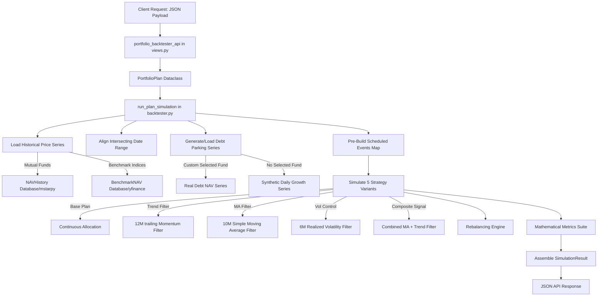

# Mutual Fund Portfolio Backtester: Architectural Analysis & Code Audit

This document provides a comprehensive technical guide and a critical code audit of the **Mutual Fund Portfolio Backtester** implementation. It outlines the core architecture, data flow, mathematical calculations, and maps out critical logic bugs, calendar approximations, and risk-metric contamination discovered during a deep code review of [backtester.py](file:///c:/Users/amans/OneDrive/Documents/GitHub/MutualFundAnalysis/apps/portfolio/services/backtester.py).

---

## 1. System Architecture & Data Flow

The portfolio backtester simulates historical investment plans (including monthly/quarterly SIPs, lumpsums, trailing-stop sells, and trigger-based purchases) across a basket of mutual funds and indices. It also runs four **Tactical Overlay (What-If)** strategies side-by-side with the "Base Plan" to show how active risk management affects returns.

### Core Architecture Diagram



### Flow Sequence
1. **Request Deserialization**: The JSON payload from the front-end is parsed in [views.py](file:///c:/Users/amans/OneDrive/Documents/GitHub/MutualFundAnalysis/apps/portfolio/views.py).
2. **Historical Data Loading**: Daily prices (NAV) are queried from `NAVHistory` (funds) and `BenchmarkNAV` (indices) in [backtester.py:L176](file:///c:/Users/amans/OneDrive/Documents/GitHub/MutualFundAnalysis/apps/portfolio/services/backtester.py#L176). Missing ranges are fetched on-demand.
3. **Overlapping Alignment**: Dates are restricted to the common intersection across all selected equity funds to prevent backtest distortion from mismatched inception dates.
4. **Scheduled Event Map**: Before entering the simulation loop, SIP dates and non-triggered lumpsums are pre-computed and stored in a hash-map keyed by date to prevent date-shifting arithmetic during execution loop.
5. **Simulation Loop**: The engine steps daily through the aligned timeline. At each date:
   - SIP and lumpsum purchases are executed.
   - Sells or trigger-based lumpsums are evaluated.
   - Tactical signals are computed to redirect equity cash flows to the debt parking fund if the signal is **OFF**.
   - Rebalancing (annual or threshold-based) is checked.
6. **Metrics Calculations**: Absolute gains, CAGR, XIRR, rolling 5-year metrics, volatility, Sharpe, Sortino, drawdowns, and calendar returns are calculated.

---

## 2. Component-Level Specifications

### 2.1 Tactical Signals
When a tactical overlay strategy is active, the engine checks whether to buy equity or redirect to debt using daily indicators:
* **Trend Filter (12M Trail)**: If the fund's NAV is greater than its NAV exactly 12 months ago, the signal is **ON**. Otherwise, new SIPs are redirected to the debt parking fund.
* **MA Filter (10M SMA)**: If the current NAV is greater than the average NAV over the trailing 10 months, the signal is **ON**.
* **Volatility Control (6M realized)**: Standard deviation of daily log returns over the trailing 6 months is annualized. If it is less than the user-specified threshold (default 20%), the signal is **ON**.
* **Composite Filter**: Standard arithmetic ensemble. If both MA and Trend agree or average signal strength is $> 0.5$, the signal is **ON**.

### 2.2 Rebalancing Options
* **Annual Rebalance**: Triggers on the user's chosen `anchor_month` (e.g. January) on the first simulated date of that month.
* **Drift Threshold**: Compares the current allocation percentage of each equity fund against its target weight. If the absolute difference exceeds the user-specified threshold (e.g. 5%), rebalancing occurs immediately.

---

## 3. Critical Code Audit: Findings & Issues

A rigorous code audit of the backtesting engine revealed several significant logic errors, mathematical flaws, and calendar approximations. 

### 🔴 Critical Bug: Portfolio Rebalancing Cash Leakage
* **Location**: [_rebalance](file:///c:/Users/amans/OneDrive/Documents/GitHub/MutualFundAnalysis/apps/portfolio/services/backtester.py#L679)
* **Severity**: High (Mathematical & Financial Error)
* **Description**: The rebalancing function calculates the target value of the portfolio and adjusts the units of each equity fund up or down to align with target weights. However:
  1. `debt_units` is passed as a float parameter. In Python, floats are immutable. Any modification (`debt_units += delta`) inside the function is local and has no impact on the caller's state in `_simulate_strategy`.
  2. The code never actually attempts to deduct or add proceeds to `debt_units` when buying or selling equity.
* **Consequence**: Money is created or destroyed out of thin air when rebalancing triggers. When an equity fund is sold down during rebalancing, the proceeds are permanently lost from the portfolio value. When an equity fund is bought up, the required capital is generated without reducing the debt asset balance. This distorts the portfolio valuation over time whenever rebalancing is enabled.

### 🔴 Mathematical Flaw: Metric Contamination by Cash Injections & Outflows
* **Location**: [_annualised_vol](file:///c:/Users/amans/OneDrive/Documents/GitHub/MutualFundAnalysis/apps/portfolio/services/backtester.py#L776), [_sharpe](file:///c:/Users/amans/OneDrive/Documents/GitHub/MutualFundAnalysis/apps/portfolio/services/backtester.py#L797), and [_sortino](file:///c:/Users/amans/OneDrive/Documents/GitHub/MutualFundAnalysis/apps/portfolio/services/backtester.py#L808)
* **Severity**: High (Statistical Distortion)
* **Description**: Standard deviation and risk ratios are computed using the weekly percentage changes of the *absolute portfolio value series*. However, when a systematic SIP or lumpsum is added, or a sell trigger occurs, the absolute portfolio value makes a sudden structural jump:
  * Adding a 10,000 INR SIP to a 100,000 INR portfolio is registered as a **+10% weekly return**, even if the underlying markets were flat or down.
  * Executing a 50% sell rule is registered as a **-50% weekly crash**, even if the underlying market rose.
* **Consequence**: The annualized volatility is severely inflated by routine cash inflows, and Sharpe/Sortino ratios are statistically contaminated. They do not represent the risk-adjusted returns of the underlying asset allocation but rather the shape of the user's cash-flow schedule.

### 🔴 Mathematical Approximation: Mid-Series CAGR Discrepancy
* **Location**: [_series_cagr](file:///c:/Users/amans/OneDrive/Documents/GitHub/MutualFundAnalysis/apps/portfolio/services/backtester.py#L740)
* **Severity**: Medium (Misleading Communication)
* **Description**: The CAGR of the strategy is computed from the first non-zero portfolio value to the final value. For a long-term SIP portfolio, the starting balance is tiny (e.g. 5,000 INR) and the final balance is large (e.g. 20,00,000 INR). The CAGR formula treats this as if the initial 5,000 grew compound to 20,00,000 over 10 years, resulting in an inflated return rate (often > 50% p.a.).
* **Consequence**: The "CAGR" reported in the metrics tab is not a true reflection of the underlying funds' growth rates, but rather the growth of the absolute portfolio size. **XIRR** is the only correct performance indicator for portfolios with cash flows.

### 🟡 Calendar Approximation: Anchor Day Drift
* **Location**: [_sip_dates](file:///c:/Users/amans/OneDrive/Documents/GitHub/MutualFundAnalysis/apps/portfolio/services/backtester.py#L250)
* **Severity**: Low (Schedule Drift)
* **Description**: To schedule monthly or quarterly SIPs, the engine adds months to the current date and caps the day using `min(cur.day, last_day)`.
  If a user starts a SIP on January 31, the next calculated date is capped at February 28. In subsequent iterations, `cur.day` remains permanently set to `28`, meaning the SIP thereafter executes on the 28th of every month (March 28, April 28), rather than returning to the 31st (March 31, April 30).
* **Consequence**: The SIP execution date drifts permanently to an earlier day in the month.

### 🟡 Logic Approximation: Premature Step-Up in Calendar Years
* **Location**: [_amount_on_date](file:///c:/Users/amans/OneDrive/Documents/GitHub/MutualFundAnalysis/apps/portfolio/services/backtester.py#L273)
* **Severity**: Low (Rule Step-Up timing)
* **Description**: SIP step-up calculation is based on `years_elapsed = d.year - sip_start.year`. If a user starts a monthly SIP on December 31, 2025, the engine steps up the investment amount on January 1, 2026—just one day later—because the calendar year changed.
* **Consequence**: Step-ups occur prematurely for plans started near the end of a calendar year.

### 🟢 Modeling Proxy: Synthetic Debt Parking Series
* **Location**: [_make_synthetic_debt_series](file:///c:/Users/amans/OneDrive/Documents/GitHub/MutualFundAnalysis/apps/portfolio/services/backtester.py#L378)
* **Severity**: Low (Modeling Simplification)
* **Description**: If a user does not configure a real debt fund, the system falls back to a synthetic proxy series growing at a compound daily rate (controlled by the **Synthetic Debt Return Rate** slider in the UI).
* **Consequence**: The proxy has mathematically zero volatility, which inflates the Sharpe/Sortino ratios of tactical overlay strategies during periods when they are heavily parked in debt, compared to real-world liquid funds which experience minor NAV volatility.

---

## 4. API Reference & Payload Specifications

### API Endpoint: POST `/portfolio/backtester/api/`

The API receives the full portfolio plan, processes the simulation via the backtesting engine, and returns a detailed dashboard metrics payload.

#### Request Schema
```json
{
  "funds": [
    {
      "label": "Quant Active Fund Direct Growth",
      "source_type": "scheme",
      "source_id": "120847",
      "rules": [
        {
          "rule_type": "sip",
          "amount": 10000,
          "frequency": "monthly",
          "start_date": "2018-01-01",
          "end_date": "2026-01-01",
          "step_up_pct": 10,
          "lumpsum_date": null,
          "sell_pct": 100,
          "trigger": null,
          "trigger_value": null
        }
      ]
    }
  ],
  "rebalance_mode": "annual",
  "rebalance_threshold": 5.0,
  "rebalance_anchor_month": 1,
  "debt_park_source_type": "scheme",
  "debt_park_id": "120503",
  "vol_threshold": 20.0,
  "debt_return_pct": 7.5
}
```

#### Key Query/Payload Parameters
| Field | Type | Description | Default |
| :--- | :--- | :--- | :--- |
| `funds` | Array | List of selected funds and their custom investment/sell rules. | *Required* |
| `rebalance_mode` | String | Rebalancing rule: `"none"`, `"annual"`, or `"threshold"`. | `"none"` |
| `rebalance_threshold`| Float | Drift percentage trigger for threshold rebalancing. | `5.0` |
| `rebalance_anchor_month`| Integer | Month index (1-12) used to anchor annual rebalances. | `1` |
| `debt_park_source_type` | String | Source type for parking debt fund: `"scheme"`, `"index"`, or `""`.| `""` |
| `debt_park_id` | String | Scheme AMFI code or index identifier for parked capital. | `""` |
| `vol_threshold` | Float | Annualized volatility percentage limit for Strategy 3 control. | `20.0` |
| `debt_return_pct` | Float | Configurable p.a. compound rate for synthetic debt proxy. | `7.0` |

---

## 5. Architectural Improvements Checklist

To turn this backtester into an institutional-grade simulation engine, the following fixes are recommended:

- [ ] **Fix Rebalancing Proceeds**: Store `debt_units` in a mutable dictionary or state container passed by reference, and deduct/credit buying and selling values directly to the debt park when rebalancing.
- [ ] **Implement Unit Class Accounting**: Instead of running risk metrics on the absolute portfolio valuation, track the portfolio's net asset value per unit (NAVPU) by dividing total portfolio value by total issued portfolio units. Book all new SIPs/lumpsums as new "unit creations" at the current NAVPU, and sells as "unit redemptions". Calculate standard deviation, Sharpe, and Sortino on the NAVPU daily/weekly percent changes.
- [ ] **Address Date Drift**: Maintain a fixed `anchor_day` integer in the SIP calendar generator to prevent day truncation.
- [ ] **Refine Step-Up Logic**: Calculate step-up intervals based on actual elapsed days ($365$ days) or month count ($12$ months) from the rule start date.
