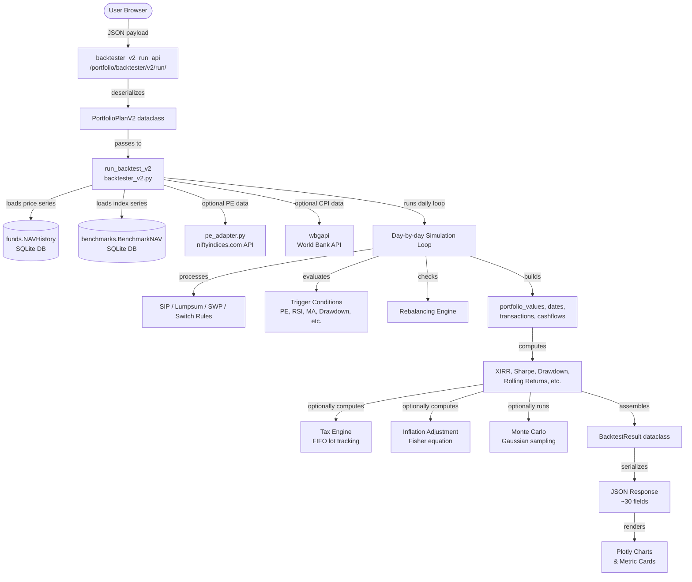

# ⚗️ Strategy Backtester — Complete Guide

> **Version:** V2 (current)  
> **Last updated:** July 2026  
> **Status:** Production (with known pending fixes — see `backtester_pending_fixes.md`)

This document is the authoritative guide to the **Strategy Backtester** feature of the MutualFundAnalysis platform. It covers everything: how to run it, what every option does, how the math works under the hood, and how to test or debug it as a developer.

---

## Table of Contents

1. [What is the Backtester?](#1-what-is-the-backtester)
2. [How to Access and Run the Backtester](#2-how-to-access-and-run-the-backtester)
3. [Step-by-Step User Guide](#3-step-by-step-user-guide)
   - [Step 1: Add Assets](#step-1-add-assets)
   - [Step 2: Investment Rules (per Asset)](#step-2-investment-rules-per-asset)
   - [Step 3: Simulation Settings](#step-3-simulation-settings)
   - [Running the Simulation](#running-the-simulation)
4. [Understanding the Results](#4-understanding-the-results)
5. [Advanced Features](#5-advanced-features)
   - [Trigger System](#trigger-system)
   - [Rebalancing](#rebalancing)
   - [Tax Calculation](#tax-calculation)
   - [Inflation Adjustment](#inflation-adjustment)
   - [Monte Carlo Projection](#monte-carlo-projection)
   - [Exit Load](#exit-load)
6. [Architecture & Data Flow](#6-architecture--data-flow)
7. [Mathematical Reference](#7-mathematical-reference)
8. [API Reference](#8-api-reference)
9. [Developer Guide: Testing & Debugging](#9-developer-guide-testing--debugging)
10. [Known Issues & Pending Fixes](#10-known-issues--pending-fixes)

---

## 1. What is the Backtester?

The backtester lets you test **"what would have happened"** if you had invested in a specific combination of mutual funds and indices using a specific strategy — in the past. 

For example: *"If I had done a ₹5,000/month SIP into Parag Parikh Flexi Cap from 2015 to 2024, and had additionally bought ₹50,000 lumpsum whenever the NIFTY 50 PE ratio fell below 18, what would my portfolio be worth today?"*

**Key capabilities:**
- Mix **mutual funds** and **NSE indices** in a single portfolio
- Simulate **SIP, Step-Up SIP, Lumpsum, SWP (withdrawal), and Switch** investment actions
- Attach **conditional triggers** to any rule (buy more when PE is low, sell when drawdown hits 20%, etc.)
- **Rebalance** the portfolio annually or when allocations drift
- Compare against a **benchmark** (any single index or a custom weighted mix of indices)
- Account for **taxes, inflation, exit loads**
- Run **Monte Carlo projections** to see a probability range of future outcomes
- Save strategies and **compare side-by-side** (coming soon)

---

## 2. How to Access and Run the Backtester

### URL
```
http://localhost:8000/portfolio/backtester/
```

### Prerequisites
1. You must be **logged in** (Django session auth).
2. The **scheme master** must be populated (`python manage.py build_scheme_master`). Without this, the fund search will return no results.
3. **NSE index NAV data** must be ingested (`python manage.py ingest_benchmarks`). Without this, index-based assets and benchmarks will fail.

### Running the Development Server
```bash
# Activate venv
venv\Scripts\activate     # Windows
source venv/bin/activate  # macOS/Linux

# Run server
python manage.py runserver

# Then navigate to:
# http://127.0.0.1:8000/portfolio/backtester/
```

---

## 3. Step-by-Step User Guide

The backtester UI has a **left configuration panel** and a **right results panel**.

---

### Step 1: Add Assets

**Assets** are the mutual funds and/or indices you want to include in your portfolio.

1. **Type a fund or index name** in the search box (e.g., "Parag Parikh" or "Nifty 50")
2. A **dropdown** appears with matching results — click any to add it to your portfolio
3. Repeat to add multiple assets (you can mix funds and indices)

**Tips:**
- Mutual funds search by name/AMC from the local database (~14,000+ schemes)
- Indices available include all major NSE indices (NIFTY 50, NIFTY MIDCAP 150, NIFTY NEXT 50, NIFTY BANK, sectoral indices, etc.)
- You can add up to ~10 assets (no hard limit, but simulation slows with many assets)
- Use **Direct Growth** variants for most accurate backtesting (Regular plans have higher expense ratios)

---

### Step 2: Investment Rules (per Asset)

Each asset can have one or more **investment rules**. Rules define *how* you invest in that asset.

#### Rule Types

| Rule | What it does |
|------|-------------|
| **SIP** | Fixed monthly investment on a recurring date |
| **Step-Up SIP** | SIP that increases annually by a percentage |
| **Lumpsum** | One-time investment on a specific date |
| **SWP** | Systematic Withdrawal Plan — regular redemption |
| **Switch** | Moves money from this asset to another on a trigger |

#### Adding a Rule
1. Click **"+ Add Rule"** below any asset card
2. Select the rule type from the dropdown
3. Fill in the required fields (amount, date range, etc.)

#### Rule Fields Explained

**SIP fields:**
- **Monthly Amount (₹):** How much to invest each month
- **SIP Date:** Day of month (1–28) on which SIP is debited
- **Start Date:** When the SIP begins (leave blank = simulation start)
- **End Date:** When the SIP ends (leave blank = simulation end)
- **Step-Up %/yr:** (Step-Up SIP only) Annual percentage increase

**Lumpsum fields:**
- **Amount (₹):** Investment amount
- **Date:** The date on which to invest (must be within simulation dates)

**SWP fields:**
- **Monthly Amount (₹):** How much to withdraw each month
- **Withdrawal Date:** Day of month
- **Start Date / End Date:** SWP duration

**Switch fields:**
- **Switch To:** Search for the target fund/index to switch money into
- **Switch Target Type:** Choose "Fund / Index" or "Proxy Debt (flat rate)"
  - *Proxy Debt:* Simulates parking money at a fixed annual rate (default 6%) — useful for modeling debt fund parking without choosing an actual debt fund
- **Amount Type:** Amount (₹), Units, or % of holding
- **Value:** The amount/units/percentage

#### Trigger (Optional, on any rule)
Attach a **trigger condition** to make any rule conditional — see [Trigger System](#trigger-system).

---

### Step 3: Simulation Settings

#### Date Range
- **Start Date:** When the simulation begins. Must be after all assets' inception dates.
- **End Date:** When the simulation ends (usually today or a recent date).

> **Auto-date behavior:** If you don't set dates, the simulation will attempt to use the broadest possible date range covered by all selected assets.

#### Benchmark
- **Default:** NIFTY 50 (automatically set)
- **Change:** Type any index name to search and select a different benchmark
- **Custom Weighted Benchmark:** Select "Custom Weighted Benchmark" mode to build a composite benchmark from multiple indices with weights (e.g., 60% NIFTY 50 + 40% NIFTY NEXT 50). The last added index auto-adjusts its weight to ensure total = 100%.

The benchmark is shown as a comparison line on charts and its metrics appear in the analysis tabs.

#### Transaction Cost
Fixed cost per transaction in ₹ (default: 0). Applied on every buy/sell.

#### Optional Features (Toggles)

| Toggle | What it enables |
|--------|----------------|
| 📤 **Exit Load** | Applies exit load charges on fund redemptions |
| 💰 **Tax Calculation** | Computes STCG/LTCG taxes and shows post-tax XIRR |
| 📈 **Inflation Adjustment** | Adjusts returns for inflation; shows real XIRR and real corpus |
| 🎲 **Monte Carlo Projection** | Runs 200–1000 simulated future scenarios |

Each toggle expands to show its configuration options.

---

### Running the Simulation

1. Click **"▶ Run Simulation"** at the bottom of the left panel
2. A loading spinner appears in the right panel
3. Results populate across multiple tabs (typically takes 2–15 seconds depending on date range and number of assets)

---

## 4. Understanding the Results

Results are organized across **tabs** in the right panel.

---

### Tab 1 — Summary

The top-level overview of your portfolio's performance.

| Metric | Meaning |
|--------|---------|
| **Total Invested** | Sum of all cash put into the portfolio over the simulation period |
| **Final Value** | Portfolio value at the end of the simulation |
| **Absolute Gain** | Final Value − Total Invested |
| **XIRR** | Extended Internal Rate of Return — the most accurate return measure for SIPs (accounts for exact timing of cash flows). This is equivalent to an annualized compounded return. |
| **Benchmark XIRR** | XIRR of the selected benchmark over the same period |
| **Alpha** | Portfolio XIRR − Benchmark XIRR — how much the strategy outperformed/underperformed the benchmark |

**Per-Asset Breakdown table:**
- Each asset's total invested, current value, XIRR, and % contribution to total portfolio value

---

### Tab 2 — Risk

Detailed risk analysis of the portfolio.

| Metric | Meaning |
|--------|---------|
| **Max Drawdown** | Largest peak-to-trough decline in portfolio value (%) |
| **Drawdown Start / Trough / Recovery** | Dates marking the worst drawdown period |
| **Drawdown Days** | Days from peak to trough |
| **Recovery Days** | Days for the portfolio to recover to the previous peak |
| **Volatility** | Annualized standard deviation of daily returns — measures how "bumpy" the ride was |
| **Downside Deviation** | Standard deviation of only the negative returns — penalizes downside more than upside |
| **Worst Month / Quarter** | Worst single-month and single-quarter return |
| **VaR (95%)** | Value at Risk — the worst daily return you'd expect 95% of the time |
| **CVaR (95%)** | Conditional VaR — average return on the worst 5% of days |
| **Sharpe Ratio** | Risk-adjusted return: `(XIRR − Risk-free rate) / Volatility`. Higher = better risk-adjusted performance. Risk-free rate = 6.5% p.a. |
| **Sortino Ratio** | Like Sharpe but only penalizes downside volatility (more intuitive for investors) |
| **Calmar Ratio** | CAGR / |Max Drawdown| — reward per unit of drawdown risk |

---

### Tab 3 — Charts

Multiple interactive Plotly charts:

1. **Portfolio Value vs Invested** — Shows how portfolio value grew vs cumulative cash invested. The gap = your gain. Benchmark is shown as a dotted line.
2. **Drawdown Chart** — Depth of portfolio drawdown over time (how far below the peak)
3. **Annual Returns Bar Chart** — Calendar year returns (Time-Weighted, independent of cash flows)
4. **Monthly Heatmap** — Month-by-month return colour grid
5. **Rolling Returns Box Plot** — Distribution of 1Y, 3Y, 5Y rolling returns — shows range of outcomes depending on when you started

---

### Tab 4 — Attribution

Shows which **triggers fired** during the simulation and when (a timeline of trigger events). Helps you understand if and when your conditional rules activated.

**Per-rule attribution:** How much each rule contributed to total performance.

---

### Tab 5 — Adjusted Returns

Only visible when Tax or Inflation toggles are enabled.

| Section | Content |
|---------|---------|
| **Tax Summary** | STCG paid, LTCG paid, total tax drag, post-tax XIRR |
| **Inflation Adjustment** | Inflation rate used (manual or World Bank CPI), real XIRR (nominal minus inflation), real corpus in today's purchasing power |

---

### Tab 6 — Transaction Ledger

A complete record of every transaction that occurred in the simulation: date, asset, rule type, amount, units, NAV, and running balance.

---

### Tab 7 — Monte Carlo

Only visible when Monte Carlo is enabled.

Shows a fan of possible future outcomes based on the portfolio's historical volatility. The fan shows:
- **P10 / P25 / P50 / P75 / P90** percentile paths
- **Probability of doubling** the final corpus
- **Probability of a loss** (final < total invested)

---

## 5. Advanced Features

---

### Trigger System

Any investment rule can have a **trigger** — a conditional signal that must be true for the rule to execute.

**Opening the Trigger Modal:**  
Click the **"⚡ Set Trigger"** button on any rule card. A modal opens with:
- One or more **condition blocks** (up to 3)
- A logic operator: **AND** (all must be true) or **OR** (any must be true)
- An **action mode**: "Execute rule when trigger is ON" or "Execute when trigger is OFF"

#### Available Signal Types

| Signal | What it measures | Typical use |
|--------|-----------------|-------------|
| **Drawdown from ATH** | How far this specific asset is from its all-time high (%) | "Buy more when this fund drops 20% from peak" |
| **NIFTY 50 PE Ratio** | Price-to-Earnings ratio of NIFTY 50 (from NSE data) | "Buy lumpsum when market PE < 18" |
| **NIFTY 50 PB Ratio** | Price-to-Book ratio of NIFTY 50 | "Pause SIP when PB > 4" |
| **NIFTY 50 Dividend Yield** | Dividend yield of NIFTY 50 | "Buy when yield > 1.5%" |
| **Relative Valuation Ratio** | NAV ratio of any two assets (A/B) | "Switch when small-cap has outperformed large-cap by 2x" |
| **200-DMA (Moving Average)** | Whether any fund/index is above or below its 200-day MA | "Pause SIP when below 200-DMA (bearish)" |
| **RSI** | Relative Strength Index of any fund/index (default 14-day period) | "Buy when RSI < 30 (oversold)" |
| **Portfolio Drawdown** | Overall portfolio drawdown from peak | "Sell 10% when portfolio drops 30%" |
| **Calendar Date** | A specific date (one-time or recurring) | "Annual lumpsum every January 1st" |

> **Note:** PE/PB/Dividend Yield data is fetched from NSE via the niftyindices.com API. Data availability depends on network access to NSE servers.

#### Trigger Condition Parameters

Each condition has:
- **Reference asset or index** (where applicable): search any fund or index, not just selected ones
- **Operator:** `<`, `≤`, `>`, `≥`, `=`
- **Threshold value** (the number to compare against)

---

### Rebalancing

Found in **Step 2** of the configuration panel, between the asset list and simulation settings.

Rebalancing ensures your portfolio maintains a target allocation over time, preventing drift.

#### Modes

| Mode | Behavior |
|------|----------|
| **None** | No rebalancing; allocations drift freely as markets move |
| **Annual** | Rebalances on the first trading day of the chosen month each year |
| **Threshold (Drift)** | Rebalances whenever any asset's allocation drifts more than X% from its target |

**Target Weights** are set as percentages per asset (must sum to 100%).

**How rebalancing works:**  
The engine sells units of over-weighted assets and buys units of under-weighted assets to restore the target allocation. All transactions happen at the NAV of the rebalancing date.

---

### Tax Calculation

Enable the **💰 Tax Calculation** toggle in Step 3.

Applies Indian mutual fund tax rules:
- **Equity STCG (Short-Term Capital Gains):** Gains on equity funds held < 1 year — default 20%
- **Equity LTCG (Long-Term Capital Gains):** Gains on equity funds held ≥ 1 year — default 12.5%
- **LTCG Exemption:** First ₹1,25,000 of LTCG per year is tax-free
- **Debt Tax Rate:** Gains on debt funds are taxed at slab rate — default 30%

The simulation uses a **FIFO (first in, first out)** lot tracking approach. Each purchase is tracked separately to determine holding period and applicable tax rate at the time of any sale.

**Results show:** STCG paid, LTCG paid, total tax drag (XIRR reduction due to taxes), and post-tax XIRR.

---

### Inflation Adjustment

Enable the **📈 Inflation Adjustment** toggle in Step 3.

#### Modes

| Mode | Data source |
|------|------------|
| **Manual Rate** | You enter an annual inflation rate (e.g., 5%) |
| **World Bank CPI (India)** | Fetches actual historical India CPI data from the World Bank API (annual %, averaged over the simulation period) |

**Real XIRR** = Nominal XIRR adjusted using the Fisher equation:  
`Real XIRR = ((1 + Nominal XIRR) / (1 + Inflation Rate)) − 1`

**Real Corpus** = Final value discounted for inflation over the simulation years:  
`Real Corpus = Final Value / (1 + Inflation Rate)^years`

---

### Monte Carlo Projection

Enable the **🎲 Monte Carlo Projection** toggle in Step 3.

Monte Carlo simulation projects **future** portfolio performance by randomly sampling from the portfolio's **historical daily return distribution** (mean and standard deviation of daily returns).

**Configuration:**
- **Simulations:** Number of random paths to generate (200 = fast, 1000 = more accurate distribution)
- **Horizon Years:** How many years into the future to project

**What it shows:**
- A band of possible future portfolio trajectories
- The 10th, 25th, 50th, 75th, and 90th percentile outcomes
- Probability that the portfolio doubles in value
- Probability of ending in a loss

> **Note:** Monte Carlo results are probabilistic projections, not predictions. Past volatility may not reflect future market behavior.

---

### Exit Load

Enable the **📤 Exit Load** toggle.

When enabled, you can add exit load rules to each asset (found in the asset card). Exit load is the fee charged by mutual funds when you redeem before a certain period.

**Standard exit load example:** 1% if redeemed within 1 year of purchase.

The simulation tracks each purchase lot's holding period and applies the exit load on any redemption that triggers it.

---

## 6. Architecture & Data Flow



### Key Source Files

| File | Role |
|------|------|
| `templates/portfolio/backtester.html` | Single-file frontend: all HTML, CSS, and JS (~3,150 lines) |
| `apps/portfolio/views.py` | Django views: `backtester_v2_run_api`, `portfolio_fund_search_api`, `backtester_pe_api` |
| `apps/portfolio/services/backtester_v2.py` | Core simulation engine (~2,420 lines) |
| `apps/portfolio/services/pe_adapter.py` | PE/PB/DivYield data fetcher with retry and SQLite cache |
| `apps/portfolio/urls.py` | URL routing |
| `apps/portfolio/models.py` | Django models (SavedStrategy — coming soon) |

### Frontend State Management

The frontend is **stateless between page loads** — all state is held in JavaScript:

```js
// Global state objects (in backtester.html JS block)
let assets = [];           // Array of asset objects with rules[]
let rebalanceRule = null;  // Rebalancing config
let editingTrigger = {};   // Currently open trigger modal context
let triggerConditions = []; // Conditions being edited
```

When "Run Simulation" is clicked, `buildPlan()` serializes all state into a JSON payload and POSTs to `/portfolio/backtester/v2/run/`.

---

## 7. Mathematical Reference

### XIRR (Extended Internal Rate of Return)

XIRR is the annualized rate `r` that solves:

$$\sum_{i=1}^{n} \frac{CF_i}{(1+r)^{t_i}} = 0$$

Where:
- `CF_i` = cash flow at time i (negative for investments, positive for withdrawals and final value)
- `t_i` = time in years from the first cash flow

Solved using Brent's method (`scipy.optimize.brentq`) with bounds `[-99.9%, 10000%]`.

**Why XIRR and not CAGR?**  
CAGR `= (Final/Invested)^(1/years) - 1` is only accurate for a single lumpsum. For SIPs with multiple cash flows over time, CAGR is misleading because it ignores *when* money was invested. XIRR is the correct personal return metric for SIPs.

---

### Sharpe Ratio

$$\text{Sharpe} = \frac{XIRR_{decimal} - R_f}{\sigma_{annual}}$$

Where:
- `XIRR_decimal` = XIRR as a decimal (e.g., 0.127 for 12.7%)
- `R_f` = Risk-free rate = 0.065 (6.5% p.a., approximate Indian T-bill/repo rate)
- `σ_annual` = Annualized standard deviation of daily portfolio returns `= σ_daily × √252`

**Interpretation:** Sharpe > 1 = good, > 2 = excellent, < 0 = underperforming risk-free.

---

### Sortino Ratio

$$\text{Sortino} = \frac{XIRR_{decimal} - R_f}{\sigma_{downside}}$$

Same as Sharpe but `σ_downside` uses only the standard deviation of *negative* daily returns. More conservative measure that doesn't penalize upside volatility.

---

### Max Drawdown

At each date `t`, drawdown is:

$$DD_t = \frac{V_t - \max_{s \leq t}(V_s)}{\max_{s \leq t}(V_s)}$$

Max Drawdown = `min(DD_t)` over all dates. Expressed as a negative percentage.

---

### Rolling Returns

For each window (1Y, 3Y, 5Y, 7Y), the engine computes the annualized CAGR for every possible start date:

$$\text{Rolling CAGR}_{start} = \left(\frac{V_{start+window}}{V_{start}}\right)^{1/window} - 1$$

Results are shown as box plots revealing the distribution of outcomes depending on when you started.

---

### Real (Inflation-Adjusted) XIRR

Fisher equation:

$$\text{Real XIRR} = \frac{1 + \text{Nominal XIRR}}{1 + \text{Inflation Rate}} - 1$$

---

### Tax Calculation (FIFO Lot Tracking)

Each purchase creates a **tax lot**: `{date, units, nav, amount}`.

On redemption, lots are consumed FIFO (oldest first):
- If `holding_period < 1 year`: STCG tax applied at configured STCG rate
- If `holding_period ≥ 1 year`: LTCG tax applied at configured LTCG rate, minus ₹1,25,000 annual exemption

Post-tax XIRR adds tax outflows as additional negative cash flows and re-computes XIRR.

---

## 8. API Reference

### Fund Search API

```
GET /portfolio/backtester/fund-search/?q=<query>&type=<all|scheme|index>&limit=10
```

**Parameters:**
| Param | Type | Description |
|-------|------|-------------|
| `q` | string | Search query (min 2 chars) |
| `type` | string | `all` = funds + indices, `scheme` = funds only, `index` = indices only |
| `limit` | int | Max results (default 10) |

**Response:**
```json
[
  {
    "id": "119533",
    "name": "Parag Parikh Flexi Cap Fund - Direct Growth",
    "type": "scheme",
    "amc": "PPFAS",
    "nav_date": "2024-12-31"
  },
  {
    "id": "NIFTY 50",
    "name": "NIFTY 50",
    "type": "index"
  }
]
```

---

### Run Backtest API

```
POST /portfolio/backtester/v2/run/
Content-Type: application/json
```

**Request Payload:**
```json
{
  "assets": [
    {
      "label": "Parag Parikh Flexi Cap",
      "source_type": "scheme",
      "source_id": "119533",
      "rules": [
        {
          "rule_type": "sip",
          "amount": 5000,
          "sip_date": 5,
          "start_date": "2015-01-05",
          "end_date": "2024-12-05",
          "step_up_pct": 0,
          "trigger": null
        }
      ],
      "exit_load": null
    }
  ],
  "settings": {
    "start_date": "2015-01-01",
    "end_date": "2024-12-31",
    "benchmark_type": "index",
    "benchmark_id": "NIFTY 50",
    "transaction_cost": 0,
    "exit_load_enabled": false,
    "tax_enabled": false,
    "tax_equity_stcg": 20.0,
    "tax_equity_ltcg": 12.5,
    "tax_ltcg_exemption": 125000.0,
    "tax_debt_rate": 30.0,
    "inflation_enabled": false,
    "inflation_mode": "manual",
    "inflation_rate": 5.0,
    "mc_enabled": false,
    "mc_simulations": 500,
    "mc_horizon_years": 10
  },
  "rebalance": null
}
```

**Trigger object (optional, on any rule):**
```json
{
  "conditions": [
    {
      "signal_type": "pe_ratio",
      "params": { "index_name": "NIFTY 50" },
      "operator": "lt",
      "value": 18
    }
  ],
  "logic": "AND",
  "action_mode": "on"
}
```

**Signal types and their `params`:**

| signal_type | params fields |
|-------------|--------------|
| `drawdown_ath` | `reference_id` (source_id of an asset) |
| `pe_ratio` | `index_name` = `"NIFTY 50"` (hardcoded) |
| `pb_ratio` | `index_name` = `"NIFTY 50"` (hardcoded) |
| `div_yield` | `index_name` = `"NIFTY 50"` (hardcoded) |
| `relative_val` | `asset_a`, `asset_b` (source_ids of any fund or index) |
| `ma_200` | `reference_id` (any fund or index source_id), `position` (`"above"` or `"below"`) |
| `rsi` | `reference_id` (any fund or index source_id), `period` (int, default 14) |
| `portfolio_drawdown` | *(no params)* |
| `calendar_date` | `target_date` (YYYY-MM-DD), `recur_type` (`""`, `"annual"`, `"monthly"`) |

**Rebalance object:**
```json
{
  "rebalance_mode": "annual",
  "anchor_month": 1,
  "drift_threshold": 5.0,
  "drift_type": "absolute",
  "targets": { "119533": 60.0, "NIFTY 50": 40.0 }
}
```

**Response (success):**
```json
{
  "status": "success",
  "total_invested": 600000.0,
  "total_redeemed": 0.0,
  "final_value": 1250000.0,
  "absolute_gain": 650000.0,
  "xirr": 18.7,
  "benchmark_cagr": 14.2,
  "per_asset": [...],
  "max_drawdown": -23.5,
  "volatility": 16.2,
  "sharpe": 0.74,
  "sortino": 1.12,
  "dates": ["2015-01-05", ...],
  "portfolio_values": [5012.0, ...],
  "benchmark_values": [5000.0, ...],
  "drawdown_series": [-0.0, ...],
  "calendar_returns": {"2015": 3.2, "2016": 8.4, ...},
  "rolling_1y": [14.2, 18.0, ...],
  "data_warnings": [],
  "start_date": "2015-01-05",
  "end_date": "2024-12-31"
}
```

**Response (error):**
```json
{ "error": "No NAV data found for scheme 999999 between 2010-01-01 and 2024-12-31" }
```

---

### PE Data API

```
GET /portfolio/backtester/pe-data/?index=NIFTY+50&from=2015-01-01&to=2024-12-31
```

Returns the historical PE ratio series for NIFTY 50. Used by the header widget and trigger evaluation.

**Response:**
```json
{
  "status": "ok",
  "index": "NIFTY 50",
  "data": [
    { "date": "2015-01-02", "pe": 21.45 },
    ...
  ]
}
```

---

## 9. Developer Guide: Testing & Debugging

### Running a Quick Test

```bash
# Start the server
python manage.py runserver

# In another terminal, send a minimal backtest request:
curl -X POST http://localhost:8000/portfolio/backtester/v2/run/ \
  -H "Content-Type: application/json" \
  -H "X-CSRFToken: YOUR_CSRF_TOKEN" \
  -d '{
    "assets": [{
      "label": "NIFTY 50 Test",
      "source_type": "index",
      "source_id": "NIFTY 50",
      "rules": [{"rule_type": "sip", "amount": 5000, "sip_date": 1,
                 "start_date": "2018-01-01", "end_date": "2023-12-31", "step_up_pct": 0}],
      "exit_load": null
    }],
    "settings": {
      "start_date": "2018-01-01", "end_date": "2023-12-31",
      "benchmark_type": "index", "benchmark_id": "NIFTY 50"
    },
    "rebalance": null
  }'
```

> **CSRF:** For local testing use browser DevTools → find `csrftoken` cookie → pass as `X-CSRFToken` header. Or use `@csrf_exempt` temporarily in `views.py` (dev only).

### Checking Logs

Django logs are emitted to stdout. The backtester uses the `mfanalysis` logger:

```python
import logging
logger = logging.getLogger("mfanalysis")
```

Logging level config is in `config/settings/`. Set `LOGGING['loggers']['mfanalysis']['level'] = 'DEBUG'` to see detailed per-day simulation logs.

### Testing Individual Components

```python
# In Django shell (venv\Scripts\python manage.py shell):
from datetime import date
from apps.portfolio.services.backtester_v2 import (
    run_backtest_v2, PortfolioPlanV2, AssetV2, SimSettingsV2, InvestmentRuleV2
)

rule = InvestmentRuleV2(rule_type='sip', amount=5000, sip_date=1,
                        start_date=date(2020,1,1), end_date=date(2023,12,31))
asset = AssetV2(label='NIFTY 50', source_type='index', source_id='NIFTY 50', rules=[rule])
settings = SimSettingsV2(start_date=date(2020,1,1), end_date=date(2023,12,31),
                         benchmark_id='NIFTY 50', benchmark_type='index')
plan = PortfolioPlanV2(assets=[asset], settings=settings)
result = run_backtest_v2(plan)
print(f"XIRR: {result.xirr}%, Final: ₹{result.final_value:,.0f}")
```

### Testing PE Data Fetch

```python
# venv\Scripts\python -c "..."
from apps.portfolio.services.pe_adapter import get_pe_series
from datetime import date

try:
    series = get_pe_series('NIFTY 50', date(2020, 1, 1), date(2023, 12, 31))
    print(f"PE series: {len(series)} data points, last PE: {series.iloc[-1]:.2f}")
except Exception as e:
    print(f"Error: {e}")
```

### Testing wbgapi CPI

```python
# venv\Scripts\python -c "..."
import wbgapi as wb
df = wb.data.DataFrame('FP.CPI.TOTL.ZG', 'IND')
# Columns are 'YR1960', 'YR1961', ..., 'YR2024'
# Index is ['IND']
print(df[['YR2020', 'YR2021', 'YR2022', 'YR2023']].T)
```

### Common Debugging Scenarios

**"No results in fund search"**
→ Run `python manage.py build_scheme_master` to populate the scheme registry.

**"JSONDecodeError in PE fetch"**
→ Known issue with niftyindices.com API date format or session requirements. See `backtester_pending_fixes.md` Issue 7.

**"wbgapi not installed" warning**
→ wbgapi IS installed in the venv. Ensure you're using `venv/Scripts/python` not system Python.

**"Sharpe is 0"**
→ Portfolio series has leading zeros (before first SIP). The fix (trim leading zeros) is documented in `backtester_pending_fixes.md` Issue 12.

**"Contribution % chart empty"**
→ NAV lookup for end date failing. Check if `apps.benchmarks.BenchmarkNAV` has data up to the simulation end date. Run `python manage.py ingest_benchmarks`.

---

## 10. Known Issues & Pending Fixes

See **`documentation/backtester_pending_fixes.md`** for the complete, detailed list of all known bugs and their planned fixes.

**Summary of major pending issues:**

| # | Issue | Severity |
|---|-------|----------|
| 1 | MC toggle button doesn't visually show "on" state | Medium |
| 2 | Live PE widget in header is broken | Low |
| 3 | Benchmark search shows mutual funds (should be indices only); no default; not shown in all tabs | High |
| 4 | Investment dates not validated against simulation dates | High |
| 5 | RSI/MA/RelVal trigger only shows selected assets (should search any) | Medium |
| 6 | PE trigger shows all indices (only NIFTY 50 has data); PB/DivYield not implemented | Medium |
| 7 | nsepython PE fetch fails (date format + session cookie issue) | High |
| 8 | wbgapi inflation uses wrong API call pattern | Medium |
| 9 | Switch rule target only shows selected assets (should search any fund/index) | Medium |
| 10 | Proxy debt + remove synthetic debt rate field | Medium |
| 11 | Remove CAGR; keep XIRR only | Low |
| 12 | Sharpe = 0 (leading zeros in portfolio series) | High |
| 13 | Fund contribution % chart empty | High |
| 14 | Save strategies feature not yet implemented | High |

---

*This document is maintained alongside the backtester source code. When making significant changes to `backtester_v2.py` or `backtester.html`, please update this document accordingly.*
