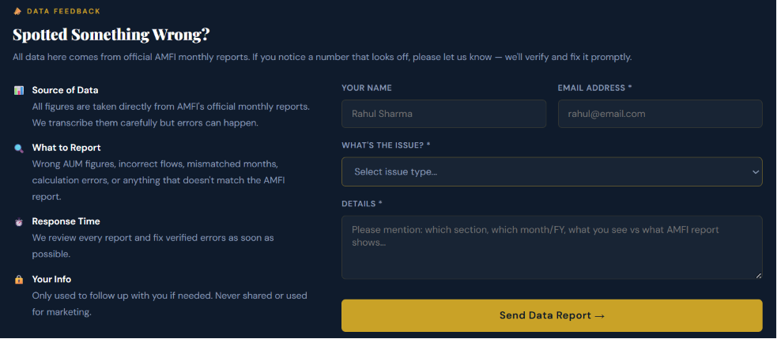
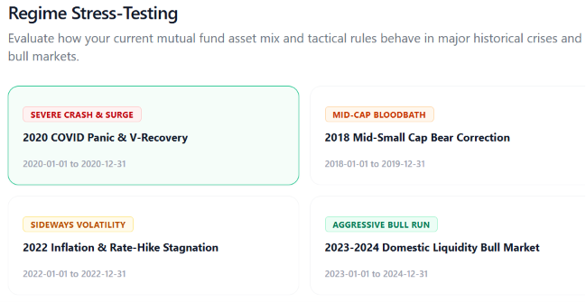

# Future Ideas and To-Be-Implemented Features

This document serves as a centralized repository of ideas, future features, and AI integrations extracted from project archives and documentation that are planned for future implementation.

## 1. Comprehensive AI Integration

The platform aims to integrate AI deeply across various modules to provide personalized and quantitative analysis without compromising data integrity.

### 1.1 Robust Execution & Edge-Case Handling
- **Structured Outputs**: Utilize strict JSON schemas (via Pydantic and function calling) to ensure LLMs output deterministic financial summaries. This is critical so AI outputs do not break the PDF generation pipeline or UI components.
- **Semantic Caching**: Implement caching for AI queries to significantly reduce API costs and latency, especially for frequently searched tickers and common queries.
- **Hallucination Prevention**: Enforce strict grounding rules. The AI should only be allowed to comment on the quantitative data provided by the analytics engine, effectively preventing it from inventing financial figures.

### 1.2 API Rate Limiting & Authentication
- **Bring Your Own Key (BYOK)**: Introduce a system where users authenticate with their credentials and submit their own API keys (e.g., OpenAI/Anthropic). This enables personalized rate limits and avoids exhausting shared platform API quotas.
- **Selective AI Invocation**: Add dedicated buttons in the Django UI for each AI-powered task (e.g., risk analysis, portfolio analysis, investor recommendation). Users can selectively run AI only on specific components, while the platform still produces a baseline quantitative summary without AI when desired.
- **Caching & Rate-limit Guardrails**: Implement semantic caching of AI responses and a request-throttling layer that monitors usage per user API key, automatically backing off or queueing requests when limits are approached.

### 1.3 AI-Powered Page Integrations
- **Individual Fund Analysis Pages**: AI to summarize the fund's historical performance, expense ratio impact, and risk profile (Sharpe, Sortino, Alpha, Beta) into a human-readable "Fund Health Check" paragraph.
- **Natural Language Screener**: An AI-based screener where users can type queries like "Show me flexi-cap funds with expense ratio under 1% and 5-year CAGR over 15%" and the system translates it into backend filter parameters.
- **AI-Based Fund Recommendation**: Improve the risk-profiling questionnaire to allow free-text input ("I am saving for a house in 5 years and can't take much risk"), parsed by AI to generate customized Equity/Debt/Gold allocations.

---

## 2. Mutual Fund Portfolio: AI Quantitative and Qualitative Analysis

A major planned feature is a dedicated AI analysis module for user portfolios that goes beyond standard XIRR.

### 2.1 Quantitative AI Analysis
- **Market Timing Efficiency**: AI analysis of the user's Systematic Investment Plan (SIP) patterns and lumpsum injections to evaluate market timing efficiency (did the user buy during dips or peaks?).
- **Diversification Insights**: AI-generated commentary on diversification metrics, correlating daily movements of the last 1 year to identify under/over-diversification across asset classes and sectors.

### 2.2 Psychological & Behavioral Analysis
- **Investor Archetype Identification**: Identify the user's investor archetype based on their transaction history, risk tolerance, and investment horizon.
- **Behavioral Pattern Detection**: Detect cognitive biases in the user's portfolio, such as:
  - *Overconfidence*
  - *Loss Aversion* (e.g., selling winning funds too early, holding losing funds too long)
  - *Framing Effects*
- **Risk Evolution Tracking**: Analyze how the user's portfolio risk has evolved over time.
- **Consistency Scoring**: Score the consistency of the investor's decisions against their stated investment philosophy.

### 2.3 Comparative Analysis & Actionable Insights
- **Missed Gains Identification**: XIRR analysis comparing the user's portfolio against category averages and benchmarks to identify missed gains (alpha generated vs category average).
- **Actionable Rebalancing Suggestions**: AI-driven suggestions (what to buy/sell, how much, and when) based on macro-economic conditions, personal risk profile, and tax-loss harvesting opportunities.

### 2.4 Advanced Portfolio Management & Tracking
- **Seamless Portfolio Import:** Support for CAS, broker statements, PDF uploads, email parsing, or manual entry.
- **Unified Household Tracking:** Consolidate portfolios across multiple family members into a single household view.
- **Goal Mapping & Asset Allocation:** Assign specific funds to goals and visualize asset allocation across equity, debt, hybrid, gold, cash, and international.
- **Diagnostic Health Check:** Generate a detailed report assessing concentration risk, portfolio overlap, style drift, sector biases, debt quality risk, inconsistent categories, and an excess number of funds.
- **Consolidated Performance & Transparency:** Track XIRR, absolute return, time-weighted return, cash flows, and realized vs. unrealized gains. Deep-dive into aggregated top holdings, sector weights, market-cap splits, and duration/credit quality.

### 2.5 Smart Alerts & Custom Watchlists
- **Drift & Underperformance Alerts:** Notify users when their portfolio drifts away from the target allocation or when funds persistently lag behind their category (ignoring temporary dips).
- **Fund Change Alerts:** Trigger warnings for critical events such as manager changes, mandate updates, AUM shocks, expense ratio hikes, large un-invested cash positions, or style drift.
- **Rule-Based Watchlists:** Allow users to set customized rules (e.g., "alert me if tracking error worsens" or "alert me if expense ratio rises").

---

## 3. Platform & Architectural Enhancements

### 3.1 Backtesting Enhancements
- **Custom Weighted Benchmark**: Allow users to construct a custom weighted benchmark inside the backtester (separate from the existing portfolio dashboard benchmark) to better simulate complex custom strategies.
- **Advanced Rebalancing Signals**:
  - Implement moving average filters (e.g., if index price > 10-month moving average → stay in equity; else → shift to debt).
  - Volatility-based rebalancing (if 6-month realized volatility exceeds a threshold → shift from equity to debt).

### 3.2 Dynamic Fund Ranking Model
- **Personalized Ranking Scorecard**: Move beyond static performance ranks. Build a dynamic return, recency, and stability score model normalized against the investor's personal details.
  - *Stability*: Capital protection during downturns.
  - *Consistency*: How consistent returns have been over time.
  - *Recency*: Performance in the last 2 years.
- **Rank Trend**: Display the historical trend of a fund's ranking (absolute, relative, and within category) to see if a fund is improving or declining.

### 3.3 DevOps & Production Hardening
- **Docker Containerization**: Prepare Dockerfiles and docker-compose setups for easier local deployment and scaling.
- **PostgreSQL Production Validation**: Fully validate all Pandas/ORM queries against PostgreSQL to ensure no dialect-specific SQLite logic is breaking production.
- **Unit Test Expansion**: Expand test coverage, particularly for the backtesting engine and new tax calculator components.

---

## 4. Market Analysis Metrics & Market Strip
*(Sourced from `documentation/ideas/mf_market_metrics_reference.html`)*

To provide investors with a comprehensive view of the macro environment, the platform will implement a dynamic Market Strip and Market Analysis section. This will include:
- **Sentiment Indicators:** India VIX, Put/Call Ratio (PCR), FII/DII Net Activity, Advance/Decline Ratio, and SIP Inflow Trends.
- **Technical Market Indicators:** Nifty RSI, MACD, Bollinger Bands, 50/200 DMA Crossovers, and Sector Relative Strength.
- **Valuation Metrics:** Nifty 50 PE/PB Ratios, Dividend Yield, Buffett Indicator (Market Cap to GDP), and Earnings Yield vs G-Sec Gap.
- **Macro & Global Factors:** RBI Repo Rate, 10-Year G-Sec Yield, CPI Inflation, USD/INR Exchange Rate, US VIX, DXY, Brent Crude, and Gold Prices.
These metrics will contextualize mutual fund performance within broader economic cycles, helping users identify structural bull/bear phases and rebalance accordingly.

---

## 5. Advanced Fund Analysis Tabs
*(Sourced from `documentation/ideas/MutualFund_Platform_Blueprint.md`)*

The individual fund analysis pages will be significantly upgraded with specialized tabs for institutional-grade evaluation:

### 5.1 Technical Analysis Engine
- **Moving Averages & Momentum:** SMA/EMA cross-overs (Golden/Death cross), RSI divergence, and MACD signals.
- **Volatility & Trend:** Bollinger Bands, Average True Range (ATR), and ADX.
- **Volume Proxies:** Since mutual funds lack trading volume, AUM changes and Net SIP inflows will be used as volume/demand proxies.

### 5.2 Risk Analysis Module
- **Core Risk Metrics:** Alpha, Beta, Sharpe, Sortino, Treynor, R-Squared, and Information Ratios.
- **Drawdown Analysis:** Maximum Drawdown, Current Drawdown duration, Recovery Factor, and Underwater charts.
- **Value at Risk (VaR):** Historical and Parametric VaR, plus Conditional VaR (Expected Shortfall).
- **Good Fund Scorecard:** A composite Risk Score (0-100) identifying funds as Conservative, Moderate, or Aggressive based on benchmark-relative thresholds.

### 5.3 Time-Series Forecasting Suite
- **Classical Models:** Implementation of ARIMA, SARIMA, ETS (Exponential Smoothing), and Facebook Prophet to generate short-to-medium term (7-day to 1-year) NAV forecasts.
- **Forecast Output:** Point estimates along with 80% and 95% confidence intervals, evaluated using MAPE (Mean Absolute Percentage Error) through walk-forward backtesting.

### 5.4 Machine Learning Forecasting & Classification
- **Tree-Based Models:** Random Forest, XGBoost, and LightGBM for direct NAV prediction and fund quality classification (predicting Top/Mid/Poor future performance).
- **Deep Learning (Premium):** LSTM, Bidirectional LSTM, GRU, and Attention-based Transformers for capturing non-linear NAV dynamics and long-range dependencies.
- **Ensemble & Stacking:** A weighted ensemble model averaging predictions to minimize error.
- **TruthLens:** A prediction accuracy tracker that creates a tamper-evident ledger of past ML predictions and compares them against actual NAV realizations for radical transparency.

## 6. Advanced Platform Capabilities

### 6.1 Market & Category Intelligence
- **Enhanced Category Analysis:** Deep-dive metrics and trends for mutual fund categories, visualizing intra-category performance, asset flows, and historical risk profiles.
- **Category Comparison Tool:** Head-to-head evaluation of different categories (e.g., Large Cap vs Flexi Cap) across multiple market cycles, helping users understand macro asset allocation strategies.
- **AMC Explorer:** A comprehensive dashboard to evaluate entire fund houses. Features include historical launch analysis, style drift consistency, scheme range overlap, and overall AMC-level AUM growth.

### 6.2 Portfolio Analytics & Recommendations
- **Historical Score Tracking:** Save and track the historical evolution of a fund's internal holdings and quantitative model score over time to detect early signs of degradation or improvement.
- **Explainable Recommendations:** Provide short, transparent, natural-language explanations (e.g., "Why this fund?") instead of a black-box ranking, tailored directly to the user's risk and time horizon questionnaire responses.
- **Macro Stress Testing:** Simulate portfolio and fund performance under historical and hypothetical extreme scenarios (e.g., 2008 Financial Crisis, COVID-19 crash, interest rate shocks, inflation spikes, and sector concentration shocks).
- **Market-Regime Analysis:** Evaluate portfolio and fund performance across different economic cycles, including bull markets, bear markets, sideways markets, high-inflation periods, and rate-cut cycles.

### 6.3 Future Engineering Roadmap & Enhancements
- **Backtester & Application Testing:** Comprehensive end-to-end testing suite for backtest strategies and core application workflows.
- **Recommendation & Portfolio Analysis Engine:** Enhancements to risk scoring algorithms, recommendation logic, and multi-asset portfolio diagnostics.
- **UI & UX Modernization:** Responsive UI enhancements, dynamic charts, glassmorphic layout updates, and interactive data visualization. (Inspiration: https://mfanalyser.com/try.html)
- **Third-Party Data Integrations & Tools:** Implementation of external reference tools, automated scraper pipelines, and API integrations.
- **Production Hardening & Deployment:** Security auditing, user authentication hardening, performance profiling, and seamless automated deployment pipelines.
- **Deep AI Integration:** Incorporating LLM powered conversational analytics, natural language screeners, and automated portfolio health summaries.

---

## 7. Industry Data, AMC Analytics & Extended Feature Ideas

### 7.1 Asset Management Company (AMC) Analytics
- **AMC Top Stock Holdings:** Track top stock choices, major holdings, and overall equity allocation patterns across different AMCs ().
- **Fund & AMC AUM Trends:** Monitor historical AUM changes, growth trajectory, and net asset fluctuations over time for individual funds and fund houses (  ).
- **AMC Trade Disinvestments & Exits:** Track stock reduction trends, complete sell-offs, and portfolio adjustment actions taken by AMCs ("AMC mistakes / sells") ().
- **AMC Sector Allocations:** Analyze sector-wise concentration, favorite sectors, and thematic sector biases per AMC ().

### 7.2 Stock-Level & Mutual Fund Holdings Intelligence
- **Stock-Level Mutual Fund Holding Changes:** Deep dive into stock-specific mutual fund holding variations over time, tracking institutional accumulation and distribution (inspired by [RAEN Analytics Stock Details](https://raenanalytics.com/stocks/INE040A16IU7)) ( ).
- **Top & Bottom Stocks by MF Ownership:** Identify stocks with the highest and lowest overall mutual fund holding percentages and ownership changes ( ).
- **"Which Funds Hold Your Stock?":** Interactive reverse-lookup tool displaying all mutual fund schemes holding a specific stock along with scheme weights and holding values (   ).

### 7.3 Industry Inflows, Sector Flows & Portfolio Disclosures
- **Cap-Wise Portfolio Breakdown:** Track allocation shifts across Large-Cap, Mid-Cap, and Small-Cap stocks over time within fund portfolios.
- **Monthly Portfolio Disclosures Database:** Save historical monthly portfolio disclosures (stocks, sectors, weights) into DB to enable point-in-time portfolio evolution tracking ( ).
- **Sector-Wise Top Stock Breakdown:** Identify top stock holdings grouped by specific industry sectors across mutual fund portfolios ().
- **Mutual Fund Industry Overall Inflows & Outflows:** Monitor macro-level net capital inflows and outflows across the mutual fund industry ().
- **Sector-Wise Capital Flows:** Granular tracking of net buying and selling capital flows across specific market sectors ().

### 7.4 Technical Signals, Breakout Tracking & Reports
- **Comprehensive Data Report Generator:** Generate and export publication-ready data reports summarizing fund analytics, portfolio health, and market trends ().
- **Multi-Platform One-Click Social Sharing:** Native sharing integrations for WhatsApp, LinkedIn, Instagram, and direct copy-to-clipboard shareable links.
- **Mutual Fund 52-Week High / Low Tracker:** Monitor funds trading at or near their 52-week high and 52-week low bounds ().
- **Mutual Fund All-Time High / Low Tracker:** Historical tracking of schemes hitting all-time high (ATH) or all-time low NAV levels ().
- **Category-Wise Technical Breakout Engine:** Screen and detect technical price breakouts aggregated by mutual fund categories ().

### 7.5 Advanced Backtester, Stress Testing & Risk Analytics
- **Market Regime & Crisis Testing:** Evaluate portfolio and backtest strategy resilience across distinct economic regimes () and historical crisis events (e.g., 2008 Financial Crisis, COVID-19 Crash) ().
- **Periodic Rebalancing Study:** Comparative backtest analysis evaluating Yearly vs. Half-Yearly vs. Quarterly rebalancing against a Buy-and-Hold strategy ().
- **Monthly Return Distribution Analytics:** Analyze return dispersion, monthly return histograms, and volatility distributions within the backtester ().

### 7.6 Portfolio Import Tools & CAS Statement Parser
- **Consolidated Account Statement (CAS) Parser:** Integration of automated CAS statement parsing for CAMS, Karvy, and KFintech statements via [casparser](https://github.com/codereverser/casparser).

### 7.7 Industry Research Sources, Regulatory References & Knowledge Base
- **Primary Data Sources & Portals:**
  - [AMFI India Research & Information](https://www.amfiindia.com/research-information)
  - [Nifty Indices Official Portal](https://niftyindices.com/)
  - [AMFI Monthly Portfolio Disclosure Center](https://www.amfiindia.com/online-center/portfolio-disclosure)
  - [RAEN Analytics - Stock & MF Holdings](https://raenanalytics.com/)
  - [RightAdvise Financial Analytics](https://rightadvise.com/)
- **Regulatory History & Market Insights (Blogs & Educational Resources):**
  - Blog: [SEBI Stock Category Changes India — Complete Story from 2018 to January-June 2026](https://rightadvise.com/sebi-india-market-cap-story.php)
  - Blog: [SEBI Market Cap Category Changes — January-June 2026 Update](https://rightadvise.com/sebi-market-cap-update.php)
  - Knowledge Base: [History of Mutual Funds in India (AMFI)](https://www.amfiindia.com/investor/knowledge-center-info?zoneName=HistoryOfMutualFundsInIndia)