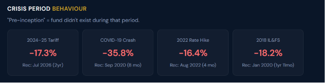
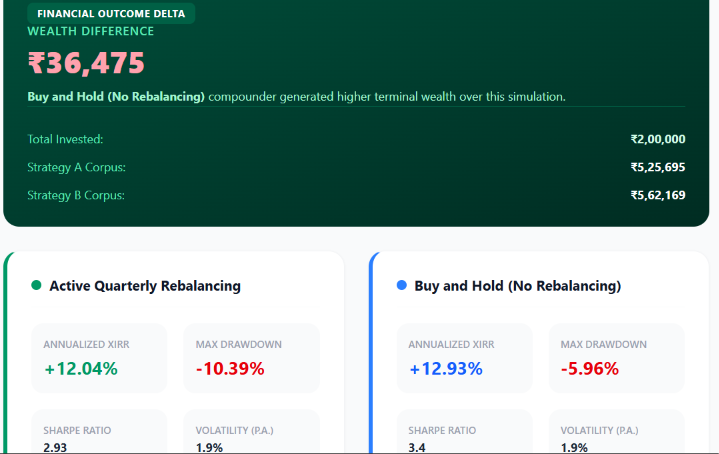

# Future Ideas and To-Be-Implemented Features

This document serves as a centralized repository of ideas, future features, and AI integrations extracted from project archives and documentation that are planned for future implementation.

> **Legend:** ✅ = Implemented | ⬜ = Pending / Not yet implemented

---

## 0. Implemented Platform Foundation
*(Features shipped and live on the platform)*

- ✅ **Open-Ended Direct Growth Funds & ETFs Only** — Data pipeline restricted to open-ended direct growth schemes and ETFs; no closed-ended or interval fund data in DB.
- ✅ **Market Strip** — Scrollable live ticker bar (NIFTY 50, SENSEX, NIFTY 200, NIFTY MIDCAP 150, NIFTY SMLCAP 250, USD/INR) across all pages. Settings button fixed/sticky so it's always accessible without scrolling.
- ✅ **Fund Screener** — Advanced multi-filter screener with search, sort, and configurable columns.
- ✅ **Fund Detail Page** — Full individual fund analysis page with multiple tabs (Overview, Performance, Portfolio, Fund Info, Fund Managers, Ratios, Peer Comparison).
- ✅ **Rolling Returns Calculator** — Rolling return periods (1Y, 3Y, 5Y, 7Y, 10Y) with interactive charts.
- ✅ **SIP Calculator** — Step SIP, SWP, STP, Lumpsum, Goal, Net Worth, Retirement, Child Education calculators implemented.
- ✅ **Portfolio Module** — Upload CSV / manual entry; portfolio dashboard with XIRR, Benchmark comparison, Overlap analysis, Rebalance view.
- ✅ **Backtester v2** — Multi-fund backtester with 5 rebalancing strategies (Trend, MA filter, Volatility, PE valuation, Combined), SIP analysis, CAGR, rolling returns, saved strategies, strategy comparison.
- ✅ **Category Analysis** — Category list, category detail with deep-dive metrics, category comparison, category return meter.
- ✅ **AMC Analysis** — AMC list, AMC detail (overview, funds, performance, portfolio, ratios — Fund Manager tab removed), AMC comparison.
- ✅ **Quartile Rankings** — Interactive quartile ranking table by category.
- ✅ **Benchmark Monitor** — Live benchmark watchlist with user-configurable indices.
- ✅ **Learn Section** — PDF Guides, Blogs (markdown-powered), Community Feed.
- ✅ **Blog: Open vs Closed vs Interval Funds** — Published blog explaining platform philosophy of open-ended direct growth only (with cover image).
- ✅ **Recommendations Engine** — Questionnaire -> fund recommendations with backtest preview.
- ✅ **Tax Calculator** — Comprehensive tax calculation for mutual fund gains.
- ✅ **PDF Report Export** — Institutional-grade fund analysis PDF with charts and metrics.
- ✅ **Peer Comparison Calculator** — Side-by-side fund comparison tool.
- ✅ **Fund Comparison Calculator** — Multi-fund head-to-head comparison (/calculators/compare/).
- ✅ **Research Report** — Research report generator.
- ✅ **User Dashboard & Settings** — User account dashboard and settings page.
- ✅ **About / Terms / Privacy / Contact** pages.
- ✅ **Dark mode** — Platform-wide dark theme as default.
- ✅ **Glassmorphism UI** — Premium card-based UI with animations, micro-interactions.
- ✅ **Blog Cards Layout** — Blog listing page with cover-image cards in responsive grid.
- ✅ **README & Docs Updated** — README, DATA_PIPELINE_AND_COMMANDS, PROJECT_CONTEXT, CALCULATORS, SCREENER, SCORING_MODEL docs updated after major changes.
- ✅ **Data Pipeline: Open-Ended Only Filter** — populate_funds and update_nav management commands filter to open-ended direct growth / ETF schemes only.
- ✅ **Settings Button Always Accessible** — Market strip settings button is fixed/sticky, accessible from any page without scrolling.

---

## 1. Comprehensive AI Integration

The platform aims to integrate AI deeply across various modules to provide personalized and quantitative analysis without compromising data integrity.

### 1.1 Robust Execution & Edge-Case Handling
- ⬜ **Structured Outputs**: Utilize strict JSON schemas (via Pydantic and function calling) to ensure LLMs output deterministic financial summaries. This is critical so AI outputs do not break the PDF generation pipeline or UI components.
- ⬜ **Semantic Caching**: Implement caching for AI queries to significantly reduce API costs and latency, especially for frequently searched tickers and common queries.
- ⬜ **Hallucination Prevention**: Enforce strict grounding rules. The AI should only be allowed to comment on the quantitative data provided by the analytics engine, effectively preventing it from inventing financial figures.

### 1.2 API Rate Limiting & Authentication
- ⬜ **Bring Your Own Key (BYOK)**: Introduce a system where users authenticate with their credentials and submit their own API keys (e.g., OpenAI/Anthropic). This enables personalized rate limits and avoids exhausting shared platform API quotas.
- ⬜ **Selective AI Invocation**: Add dedicated buttons in the Django UI for each AI-powered task (e.g., risk analysis, portfolio analysis, investor recommendation). Users can selectively run AI only on specific components, while the platform still produces a baseline quantitative summary without AI when desired.
- ⬜ **Caching & Rate-limit Guardrails**: Implement semantic caching of AI responses and a request-throttling layer that monitors usage per user API key, automatically backing off or queueing requests when limits are approached.

### 1.3 AI-Powered Page Integrations
- ⬜ **Individual Fund Analysis Pages**: AI to summarize the fund's historical performance, expense ratio impact, and risk profile (Sharpe, Sortino, Alpha, Beta) into a human-readable "Fund Health Check" paragraph.
- ⬜ **Natural Language Screener**: An AI-based screener where users can type queries like "Show me flexi-cap funds with expense ratio under 1% and 5-year CAGR over 15%" and the system translates it into backend filter parameters.
- ⬜ **AI-Based Fund Recommendation**: Improve the risk-profiling questionnaire to allow free-text input ("I am saving for a house in 5 years and can't take much risk"), parsed by AI to generate customized Equity/Debt/Gold allocations.

---

## 2. Mutual Fund Portfolio: AI Quantitative and Qualitative Analysis

A major planned feature is a dedicated AI analysis module for user portfolios that goes beyond standard XIRR.

### 2.1 Quantitative AI Analysis
- ⬜ **Market Timing Efficiency**: AI analysis of the user's Systematic Investment Plan (SIP) patterns and lumpsum injections to evaluate market timing efficiency (did the user buy during dips or peaks?).
- ⬜ **Diversification Insights**: AI-generated commentary on diversification metrics, correlating daily movements of the last 1 year to identify under/over-diversification across asset classes and sectors.

### 2.2 Psychological & Behavioral Analysis
- ⬜ **Investor Archetype Identification**: Identify the user's investor archetype based on their transaction history, risk tolerance, and investment horizon.
- ⬜ **Behavioral Pattern Detection**: Detect cognitive biases in the user's portfolio, such as:
  - *Overconfidence*
  - *Loss Aversion* (e.g., selling winning funds too early, holding losing funds too long)
  - *Framing Effects*
- ⬜ **Risk Evolution Tracking**: Analyze how the user's portfolio risk has evolved over time.
- ⬜ **Consistency Scoring**: Score the consistency of the investor's decisions against their stated investment philosophy.

### 2.3 Comparative Analysis & Actionable Insights
- ⬜ **Missed Gains Identification**: XIRR analysis comparing the user's portfolio against category averages and benchmarks to identify missed gains (alpha generated vs category average).
- ⬜ **Actionable Rebalancing Suggestions**: AI-driven suggestions (what to buy/sell, how much, and when) based on macro-economic conditions, personal risk profile, and tax-loss harvesting opportunities.

### 2.4 Advanced Portfolio Management & Tracking
- ✅ **Seamless Portfolio Import:** CSV upload and manual entry supported.
- ⬜ **CAS Statement Parser:** Integration of automated CAS statement parsing for CAMS, Karvy, and KFintech statements via [casparser](https://github.com/codereverser/casparser).
- ⬜ **Unified Household Tracking:** Consolidate portfolios across multiple family members into a single household view.
- ⬜ **Goal Mapping & Asset Allocation:** Assign specific funds to goals and visualize asset allocation across equity, debt, hybrid, gold, cash, and international.
- ⬜ **Diagnostic Health Check:** Generate a detailed report assessing concentration risk, portfolio overlap, style drift, sector biases, debt quality risk, inconsistent categories, and an excess number of funds.
- ✅ **Consolidated Performance & Transparency:** XIRR, absolute return, time-weighted return, cash flows tracked. Portfolio overlap analysis exists.

### 2.5 Smart Alerts & Custom Watchlists
- ⬜ **Drift & Underperformance Alerts:** Notify users when their portfolio drifts away from the target allocation or when funds persistently lag behind their category (ignoring temporary dips).
- ⬜ **Fund Change Alerts:** Trigger warnings for critical events such as manager changes, mandate updates, AUM shocks, expense ratio hikes, large un-invested cash positions, or style drift.
- ⬜ **Rule-Based Watchlists:** Allow users to set customized rules (e.g., "alert me if tracking error worsens" or "alert me if expense ratio rises").

---

## 3. Platform & Architectural Enhancements

### 3.1 Backtesting Enhancements
- ✅ **Custom Weighted Benchmark**: Users can construct a custom portfolio in the backtester with arbitrary fund weightage.
- ✅ **Advanced Rebalancing Signals**: 5 rebalancing strategies implemented (Trend, MA filter, Volatility, PE valuation, Combined).
- ⬜ **Moving Average Filters (extended)**: More granular MA configurations (e.g., user-configurable MA window length).
- ⬜ **Volatility-Based Rebalancing (extended)**: User-configurable volatility threshold input in the backtester UI.

### 3.2 Dynamic Fund Ranking Model
- ✅ **Fund Scoring Engine**: Internal scoring model exists (Return, Recency, Stability composite score) used in recommendations and fund analysis.
- ⬜ **Personalized Ranking Scorecard**: Fully expose the scoring model in the fund detail page UI with a visual breakdown card (Stability / Consistency / Recency / Cost breakdown).
- ⬜ **Rank Trend**: Display the historical trend of a fund's ranking (absolute, relative, and within category) over time on the fund detail page.

### 3.3 DevOps & Production Hardening
- ✅ **Render Deployment**: render.yaml and Procfile configured; app deployed on Render.
- ⬜ **Docker Containerization**: Prepare Dockerfiles and docker-compose setups for easier local deployment and scaling.
- ✅ **PostgreSQL Production**: App uses PostgreSQL in production via Render.
- ⬜ **PostgreSQL Production Validation**: Fully validate all Pandas/ORM queries against PostgreSQL to ensure no dialect-specific SQLite logic is breaking production.
- ⬜ **Unit Test Expansion**: Expand test coverage, particularly for the backtesting engine and new tax calculator components.

---

## 4. Market Analysis Metrics & Market Strip
*(Sourced from `documentation/ideas/mf_market_metrics_reference.html`)*

To provide investors with a comprehensive view of the macro environment, the platform will implement a dynamic Market Strip and Market Analysis section. This will include:

- ✅ **Market Strip (Basic):** Live NIFTY 50, SENSEX, NIFTY 200, NIFTY MIDCAP 150, NIFTY SMLCAP 250, USD/INR ticker strip across all pages with configurable indices.
- ⬜ **Sentiment Indicators:** India VIX, Put/Call Ratio (PCR), FII/DII Net Activity, Advance/Decline Ratio, and SIP Inflow Trends.
- ⬜ **Technical Market Indicators:** Nifty RSI, MACD, Bollinger Bands, 50/200 DMA Crossovers, and Sector Relative Strength.
- ⬜ **Valuation Metrics:** Nifty 50 PE/PB Ratios, Dividend Yield, Buffett Indicator (Market Cap to GDP), and Earnings Yield vs G-Sec Gap.
- ⬜ **Macro & Global Factors:** RBI Repo Rate, 10-Year G-Sec Yield, CPI Inflation, USD/INR Exchange Rate, US VIX, DXY, Brent Crude, and Gold Prices.

These metrics will contextualize mutual fund performance within broader economic cycles, helping users identify structural bull/bear phases and rebalance accordingly.

---

## 5. Advanced Fund Analysis Tabs
*(Sourced from `documentation/ideas/MutualFund_Platform_Blueprint.md`)*

The individual fund analysis pages will be significantly upgraded with specialized tabs for institutional-grade evaluation:

### 5.1 Technical Analysis Engine
- ⬜ **Moving Averages & Momentum:** SMA/EMA cross-overs (Golden/Death cross), RSI divergence, and MACD signals.
- ⬜ **Volatility & Trend:** Bollinger Bands, Average True Range (ATR), and ADX.
- ⬜ **Volume Proxies:** Since mutual funds lack trading volume, AUM changes and Net SIP inflows will be used as volume/demand proxies.

### 5.2 Risk Analysis Module
- ✅ **Core Risk Metrics:** Alpha, Beta, Sharpe, Sortino, Treynor, R-Squared shown on fund detail page Ratios tab.
- ✅ **Drawdown Analysis:** Maximum Drawdown shown on fund detail page.
- ⬜ **Value at Risk (VaR):** Historical and Parametric VaR, plus Conditional VaR (Expected Shortfall).
- ⬜ **Good Fund Scorecard UI:** A visual composite Risk Score card (0-100) identifying funds as Conservative, Moderate, or Aggressive based on benchmark-relative thresholds.

### 5.3 Time-Series Forecasting Suite
- ⬜ **Classical Models:** Implementation of ARIMA, SARIMA, ETS (Exponential Smoothing), and Facebook Prophet to generate short-to-medium term (7-day to 1-year) NAV forecasts.
- ⬜ **Forecast Output:** Point estimates along with 80% and 95% confidence intervals, evaluated using MAPE (Mean Absolute Percentage Error) through walk-forward backtesting.

### 5.4 Machine Learning Forecasting & Classification
- ⬜ **Tree-Based Models:** Random Forest, XGBoost, and LightGBM for direct NAV prediction and fund quality classification.
- ⬜ **Deep Learning (Premium):** LSTM, Bidirectional LSTM, GRU, and Attention-based Transformers for capturing non-linear NAV dynamics.
- ⬜ **Ensemble & Stacking:** A weighted ensemble model averaging predictions to minimize error.
- ⬜ **TruthLens:** A prediction accuracy tracker that creates a tamper-evident ledger of past ML predictions and compares them against actual NAV realizations for radical transparency.

## 6. Advanced Platform Capabilities

### 6.1 Market & Category Intelligence
- ✅ **Enhanced Category Analysis:** Deep-dive metrics and trends for mutual fund categories, fund list, quartile ranking, intra-category performance.
- ✅ **Category Comparison Tool:** Head-to-head evaluation of different categories across multiple market cycles.
- ✅ **AMC Explorer:** Comprehensive dashboard to evaluate fund houses — overview, fund list, performance, portfolio tab, ratios. (Fund Manager tab removed per philosophy.)
- ⬜ **Category Return Meter (full data):** Category return meter currently has some missing entries for certain periods/categories that need data population.

### 6.2 Portfolio Analytics & Recommendations
- ⬜ **Historical Score Tracking:** Save and track the historical evolution of a fund's internal holdings and quantitative model score over time to detect early signs of degradation or improvement.
- ⬜ **Explainable Recommendations:** Provide short, transparent, natural-language explanations (e.g., "Why this fund?") instead of a black-box ranking, tailored directly to the user's risk and time horizon questionnaire responses.
- ⬜ **Macro Stress Testing:** Simulate portfolio and fund performance under historical and hypothetical extreme scenarios (e.g., 2008 Financial Crisis, COVID-19 crash, interest rate shocks, inflation spikes, and sector concentration shocks).
- ⬜ **Market-Regime Analysis:** Evaluate portfolio and fund performance across different economic cycles, including bull markets, bear markets, sideways markets, high-inflation periods, and rate-cut cycles.

### 6.3 Future Engineering Roadmap & Enhancements
- ✅ **UI & UX Modernization:** Responsive glassmorphic UI, dynamic charts, interactive data visualization.
- ⬜ **Backtester & Application Testing:** Comprehensive end-to-end testing suite for backtest strategies and core application workflows.
- ⬜ **Third-Party Data Integrations:** External reference tools, automated scraper pipelines, and API integrations for holdings data.
- ✅ **Production Hardening & Deployment:** App deployed on Render with PostgreSQL in production.
- ⬜ **Deep AI Integration:** LLM powered conversational analytics, natural language screeners, and automated portfolio health summaries.

---

## 7. Industry Data, AMC Analytics & Extended Feature Ideas

### 7.1 Asset Management Company (AMC) Analytics
- ✅ **AMC Analysis Dashboard:** AMC overview, fund list, performance comparison, portfolio breakdown, and ratio analysis implemented.
- ⬜ **AMC Top Stock Holdings:** Track top stock choices, major holdings, and overall equity allocation patterns across different AMCs ().
- ⬜ **Fund & AMC AUM Trends:** Monitor historical AUM changes, growth trajectory, and net asset fluctuations over time for individual funds and fund houses (  ).
- ⬜ **AMC Trade Disinvestments & Exits:** Track stock reduction trends, complete sell-offs, and portfolio adjustment actions taken by AMCs ().
- ⬜ **AMC Sector Allocations:** Analyze sector-wise concentration, favorite sectors, and thematic sector biases per AMC ().

### 7.2 Stock-Level & Mutual Fund Holdings Intelligence
- ⬜ **Stock-Level Mutual Fund Holding Changes:** Deep dive into stock-specific mutual fund holding variations over time, tracking institutional accumulation and distribution (inspired by [RAEN Analytics Stock Details](https://raenanalytics.com/stocks/INE040A16IU7)) ( ).
- ⬜ **Top & Bottom Stocks by MF Ownership:** Identify stocks with the highest and lowest overall mutual fund holding percentages and ownership changes ( ).
- ⬜ **"Which Funds Hold Your Stock?":** Interactive reverse-lookup tool displaying all mutual fund schemes holding a specific stock along with scheme weights and holding values (   ).

### 7.3 Industry Inflows, Sector Flows & Portfolio Disclosures
- ⬜ **Cap-Wise Portfolio Breakdown:** Track allocation shifts across Large-Cap, Mid-Cap, and Small-Cap stocks over time within fund portfolios.
- ⬜ **Monthly Portfolio Disclosures Database:** Save historical monthly portfolio disclosures (stocks, sectors, weights) into DB to enable point-in-time portfolio evolution tracking ( ).
- ⬜ **Sector-Wise Top Stock Breakdown:** Identify top stock holdings grouped by specific industry sectors across mutual fund portfolios ().
- ⬜ **Mutual Fund Industry Overall Inflows & Outflows:** Monitor macro-level net capital inflows and outflows across the mutual fund industry ().
- ⬜ **Sector-Wise Capital Flows:** Granular tracking of net buying and selling capital flows across specific market sectors ().

### 7.4 Technical Signals, Breakout Tracking & Reports
- ✅ **Comprehensive Data Report Generator:** PDF export of fund analysis report implemented (/funds/<code>/report/).
- ⬜ **Multi-Platform One-Click Social Sharing:** Native sharing integrations for WhatsApp, LinkedIn, Instagram, and direct copy-to-clipboard shareable links.
- ⬜ **Mutual Fund 52-Week High / Low Tracker:** Monitor funds trading at or near their 52-week high and 52-week low bounds ().
- ⬜ **Mutual Fund All-Time High / Low Tracker:** Historical tracking of schemes hitting all-time high (ATH) or all-time low NAV levels ().
- ⬜ **Category-Wise Technical Breakout Engine:** Screen and detect technical price breakouts aggregated by mutual fund categories ().

### 7.5 Advanced Backtester, Stress Testing & Risk Analytics
- ✅ **Market Regime Testing:** Backtester evaluates strategy performance across time periods including bull/bear market cycles.
- ⬜ **Crisis Period Behavior:** Evaluate portfolio and backtest strategy resilience across historical crisis events (e.g., 2008 Financial Crisis, COVID-19 Crash) ().
- ✅ **Periodic Rebalancing Study:** Comparative backtest analysis evaluating multiple rebalancing strategies vs. Buy-and-Hold ().
- ⬜ **Monthly Return Distribution Analytics:** Analyze return dispersion, monthly return histograms, and volatility distributions within the backtester ().

### 7.6 Portfolio Import Tools & CAS Statement Parser
- ✅ **CSV Upload:** Portfolio upload via CSV transaction file.
- ✅ **Manual Entry:** Manual portfolio entry form.
- ⬜ **Consolidated Account Statement (CAS) Parser:** Integration of automated CAS statement parsing for CAMS, Karvy, and KFintech statements via [casparser](https://github.com/codereverser/casparser).

### 7.7 Industry Research Sources, Regulatory References & Knowledge Base
- **Primary Data Sources & Portals:**
  - [AMFI India Research & Information](https://www.amfiindia.com/research-information)
  - [Nifty Indices Official Portal](https://niftyindices.com/)
  - [AMFI Monthly Portfolio Disclosure Center](https://www.amfiindia.com/online-center/portfolio-disclosure)
  - [RAEN Analytics - Stock & MF Holdings](https://raenanalytics.com/)
  - [RightAdvise Financial Analytics](https://rightadvise.com/)
- **Regulatory History & Market Insights (Blogs & Educational Resources):**
  - Blog: [SEBI Stock Category Changes India — Complete Story from 2018 to January-June 2026](https://rightadvise.com/sebi-india-market-cap-story.php)
  - Blog: [SEBI Market Cap Category Changes — January-June 2026 Update](https://rightadvise.com/sebi-market-cap-update.php)
  - Knowledge Base: [History of Mutual Funds in India (AMFI)](https://www.amfiindia.com/investor/knowledge-center-info?zoneName=HistoryOfMutualFundsInIndia)

---

## 8. Workflow Feature Status (from `documentation/archive/workflow.md`)

### 8.1 Mutual Fund Analysis (Fund Detail Page)
- ✅ Fund Name, Type, Category
- ✅ Performance — Trailing returns (1Y, 3Y, 5Y, 7Y, 10Y, Since Inception), Rolling returns (1Y, 3Y, 5Y, 7Y, 10Y — max/min/mean) with charts
- ✅ Portfolio — Equity/Debt/Cash breakdown, cap-wise (Large/Mid/Small), sector distribution, holdings list
- ✅ Peer Comparison — Ratios, returns, scheme info vs peers
- ✅ Fund Information — NAV, AUM, Expense Ratio, Exit Load, Stamp Duty, Lock-in, Min SIP/Lumpsum, Benchmark, Inception Date, Tax Implications, Fund Objective
- ✅ Fund Managers — Name, date joined, other funds managed
- ✅ Ratios — PE, PB, Alpha, Beta, Sharpe, Sortino, Std Dev, R-Squared, Max Drawdown vs category and benchmark
- ⬜ Ranking & Rank Trend — Full scorecard UI with stability/consistency/recency breakdown and rank history chart
- ⬜ Overview "In Form / On Track / Off Track / Out of Form" rating badge
- ⬜ Returns Calculator tab inside fund detail (SIP vs Lumpsum, before/after tax, XIRR vs benchmark/peers)

### 8.2 Common Tools & Calculators
- ✅ SIP Return Calculator
- ✅ Step SIP Return Calculator
- ✅ SWP Calculator
- ✅ STP Calculator
- ✅ Lumpsum Calculator
- ✅ Goal Calculator
- ✅ Child Education Calculator
- ✅ Retirement Calculator
- ✅ Net Worth Calculator
- ✅ Tax Calculator (STCG/LTCG)
- ✅ ELSS / Tax-Saving Calculator
- ✅ Rolling Returns Calculator
- ✅ Peer Comparison Calculator
- ✅ Fund Comparison (multi-fund head-to-head)
- ✅ Portfolio Overlap Calculator
- ⬜ PPF vs ELSS Calculator
- ⬜ Market Capture Ratio Calculator
- ⬜ Benchmark Return Calculator
- ⬜ Dividend-related calculators (Highest Dividend, Consistent Dividend, Category-wise Dividends, Historical Dividends)
- ⬜ Mutual Fund Latest NAV lookup tool

### 8.3 Mutual Fund Screener
- ✅ Basic filters — Asset class, AUM, Exit load, Expense ratio, Fund type, Nature (Growth/IDCW)
- ✅ Return filters — 1M, 3M, 6M, 1Y, 3Y, 5Y returns
- ✅ Risk filters — Volatility, Beta, Sharpe, Sortino, Max Drawdown
- ✅ Configurable columns — Add/hide columns
- ⬜ AI / Natural Language Screener

### 8.4 Fund Comparison Tool
- ✅ Multi-fund comparison (returns, risk metrics, scheme info)
- ⬜ Fund Manager performance comparison
- ⬜ Fund Management Skills (Index Alpha, Sector & Stock Skills, Bull's Eye)
- ⬜ Holdings & Concentration comparison

### 8.5 Personalized Recommendations
- ✅ Questionnaire (investing experience, risk profile, return expectations)
- ✅ Algorithm-based portfolio recommendation (Defensive, Moderate, Aggressive)
- ✅ Backtest of recommended portfolio
- ⬜ Free-text AI input for questionnaire
- ⬜ 10-year simulation with SIP vs Lumpsum and tax analysis for recommended portfolio

### 8.6 Custom Portfolio Analysis
- ✅ CSV upload / manual entry
- ✅ XIRR calculation
- ✅ Portfolio vs market (benchmark comparison)
- ✅ Portfolio overlap analysis
- ✅ Rebalance view
- ⬜ Missed gains identification vs benchmark/category
- ⬜ Portfolio fund overlap (stock-level overlap)
- ⬜ Diversification score and commentary
- ⬜ Red flag analysis (ASM/GSM list, pledged promoter holdings, default probability)
- ⬜ News and Events for portfolio
- ⬜ Portfolio forecasting (next 1, 3, 6, 12 months)
- ⬜ Comprehensive portfolio review with actionable insights (rebalancing, exit, add fund suggestions)

### 8.7 Mutual Fund Portfolio Backtester
- ✅ Multi-fund input with weightage, investment type, frequency
- ✅ CAGR, trailing returns, rolling returns, std deviation
- ✅ SIP XIRR analysis
- ✅ 5 rebalancing strategies
- ✅ Saved strategies and strategy comparison
- ⬜ Monthly return distribution analytics in backtester UI
- ⬜ Crisis period overlay on backtester chart

---

## 9. New / Missing Features Identified in August 2026 Audit

The following items were identified during the August 2026 audit as missing or not yet addressed in any planning document:

- ⬜ **Fund Detail: "Overview" Status Badge** — A clear "In Form / On Track / Off Track / Out of Form" badge on the fund overview tab, driven by the scoring model.
- ⬜ **Fund Detail: Integrated Returns Calculator** — A built-in SIP/Lumpsum/XIRR calculator inside the fund detail page (so users don't have to leave the page).
- ⬜ **Fund Detail: Rank Trend Chart** — Historical chart showing how the fund's internal rank has changed month-over-month.
- ⬜ **Screener: Save/Export Results** — Allow users to save screener results as a watchlist or export to CSV.
- ⬜ **Benchmark Monitor: Alerts** — Allow users to set price/return alerts on specific benchmarks.
- ⬜ **Category Meter: Data Completeness** — Some category x period combinations still show missing entries in the category return meter; data pipeline needs to ensure full coverage.
- ⬜ **52-Week High/Low Tracker** — A dedicated page/section listing funds at or near 52-week high/low NAVs.
- ⬜ **All-Time High/Low Tracker** — A dedicated page/section listing funds at or near all-time high/low NAVs.
- ⬜ **Social Sharing** — One-click sharing of fund analysis, portfolio snapshots, and backtester results to WhatsApp/LinkedIn/Instagram.
- ⬜ **Mobile Responsiveness Audit** — Full review of all pages for mobile breakpoints (especially fund detail, backtester, category detail).
- ⬜ **Community Feed: Real Posts** — Community feed currently appears as a template; needs backend for actual user posts/discussion threads.
- ⬜ **News & Events Feed** — A live news/events section on the home page and portfolio page, sourced from NSE/SEBI/AMFI.
- ⬜ **Market Mood Index / Sentiment Gauge** — A visual "market mood" indicator on the home page dashboard.
- ⬜ **Investment Ideas / Portfolio Buckets** — Curated fund buckets (e.g., "Wealth Builder", "Tax Saver", "All Weather") on the home page for quick exploration.
- ⬜ **XIRR Calculator (standalone)** — Standalone XIRR calculator (template exists at calculators/xirr.html but needs URL wiring and verification).
- ⬜ **Fund Factsheet / Offer Document Links** — Link to official AMFI factsheet/offer document from fund detail page.
- ⬜ **Regulatory Disclosures Page** — Display relevant SEBI/AMFI disclaimers and regulatory information.