# Platform Capabilities, Future Ideas & Feature Roadmap

This document serves as the centralized roadmap of implemented capabilities, pending feature proposals, AI integrations, and industry data tools for the India-focused Mutual Fund Analysis Platform.

> **Legend:** ✅ = Shipped & Implemented | ⬜ = Planned / Pending Implementation | ❌ = Excluded / Discarded with Rationale

---

## 1. Platform Foundation (Shipped Capabilities)

The core architecture, quantitative analytics, and reporting modules are fully operational:

- ✅ **Universe Focus:** Open-Ended Direct Growth Schemes and ETFs only (~2,300 active funds). Close-ended, interval, regular, and dividend plans are excluded platform-wide.
- ✅ **Institutional PDF Research Engine:** Automated Chrome-headless report generator with analyst narratives, verdict cards, metric explainers, and rolling return distribution charts.
- ✅ **Live Market Strip (33 Core Metrics):** Scrollable live ticker bar (Broad Indices, India VIX, Nifty PCR, FII/DII Net Activity, Valuation, FRED Macro Indicators, Global Benchmarks) with fixed settings modal.
- ✅ **Fund Screener & Peer Comparison:** Multi-filter screener with dynamic column selection, multi-fund head-to-head comparison, and peer matching algorithms.
- ✅ **Financial Research & Planning Suite (18 Calculators):** SIP, Step-Up SIP, SWP, STP, Lumpsum, XIRR, Rolling Returns (1Y–10Y), Goal Planner, Retirement Planner (25x FIRE / 4% SWR), Child Education, Capital Gains Tax Calculator (FY 2025–26 rules), ELSS, Net Worth Tracker, and Overlap Checker.
- ✅ **Portfolio Analytics & Overlap Engine:** CSV/manual entry, portfolio XIRR, benchmark tracking, stock-level overlap matrix, and sector HHI concentration metrics.
- ✅ **Strategy Backtester V2:** Multi-fund portfolio builder with 5 rebalancing strategies (Trend, MA filter, Volatility, PE valuation, Combined), SIP XIRR, drawdown curves, and strategy comparison.
- ✅ **Macro Stress Testing & Market Regimes:** Evaluates scheme behavior across 6 major crash events (2024–25 Tariff Shock, COVID-19, 2022 Rate Hikes, 2018 IL&FS, 2015 China Slowdown, 2008 GFC) and 5 economic cycles.
- ✅ **Category & AMC Explorer:** Category list, deep-dive category metrics, category comparison matrix, Category Return Meter, AMC profiles, and AMC comparisons.
- ✅ **Interactive Quartile Rankings:** Sub-category quartile rank tables computed dynamically.
- ✅ **DevOps & Production Infrastructure:** Deployed on Render, PostgreSQL/CockroachDB ORM-compatible, Docker Compose environment, automated weekly GitHub Actions data pipeline, and automated Sunday Kaggle dataset publishing (`push_to_kaggle`).

---

## 2. Quantitative Analysis, Forecasting & StrategyLab

The fund detail page (`#tab-advanced` and `#tab-analysis`) features an institutional quantitative analytics suite:

### 2.1 Technical Analysis Engine & Real-Time Scanner (`#adv-technical`)
- ✅ **Moving Averages & Momentum:** 10 SMAs/EMAs (10D–200D), active Golden Cross / Death Cross with days-active counter and price levels, RSI(14) regular bullish/bearish divergence scanner, and MACD(12,26,9) momentum states.
- ✅ **Volatility & Trend Strength:** Bollinger Bands ($2\sigma$), Average True Range (ATR), and ADX (14D) directional movement index with live Market Regime classification.
- ✅ **Pivot Systems:** 5 classic pivot matrix models (Classic, Fibonacci, Camarilla, Woodie, DeMark).
- ✅ **All-Time & Multi-Year Range Barometer:** Dynamic ATH, ATL, 52-Week, 3-Year, and 5-Year price channel tracker with visual range progress bars, drawdown from peak, channel percentile metrics, and regime categorization (Near ATH, Secular Expansion, Shallow Pullback, Moderate Correction, Deep Drawdown).
- ❌ **Category / Fund Breakout Screeners (Excluded):** Evaluated and discarded during architecture review. Mutual fund NAVs represent underlying portfolio book value rather than order-book supply/demand resistance; fund-level technical breakouts are driven by market beta and category mandates rather than actionable chart patterns (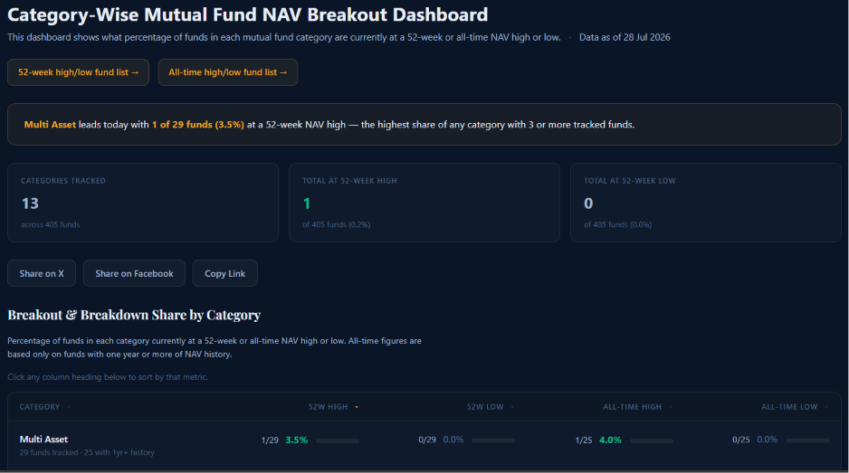).

### 2.2 Risk Analytics & Period-Wise VaR/CVaR Matrix (`#adv-risk`)
- ✅ **Core Risk Metrics:** Alpha, Beta, Sharpe, Sortino, Treynor, Calmar, R-Squared, and Maximum Drawdown.
- ✅ **Parametric vs. Empirical VaR & CVaR:** 1-Day, 1-Week (5D), 1-Month (21D), and 1-Year (252D) rolling periods comparing Empirical Historical VaR/CVaR against Gaussian Parametric Normal VaR/CVaR.
- ✅ **Fat-Tail Kurtosis Risk Gap %:** Measures crash severity and tail risk beyond normal distribution assumptions ($|\text{Hist CVaR}| - |\text{Param CVaR}|$).
- ✅ **500-Path Monte Carlo Engine:** Resampling simulation across 1Y, 3Y, 5Y horizons with 95th, 75th, 50th, 25th, and 5th percentile fan bands.

### 2.3 16-Model Statistical, ML & Deep Learning Forecasting Suite (`#adv-forecast`)
- ✅ **Classical Time-Series:** ARIMA($p,d,q$), SARIMA (Seasonal $(1,1,1)\times(1,1,0)_{21}$), Facebook Prophet (Fourier harmonics), ETS (Exponential Smoothing), Linear Trend, Momentum (21D), Naïve Random Walk, MA (20D), and ARIMAX.
- ✅ **Machine Learning Regressors:** XGBoost ML and LightGBM Regressor on lag-return features.
- ✅ **Deep Learning Sequence Networks:** LSTM Sequence Net, Bi-LSTM (Bidirectional), GRU Sequence Net, and Multi-Head Self-Attention Transformer.
- ✅ **🏆 Inverse-MAPE Weighted Ensemble:** Blends all active models using inverse-MAPE weighting for minimized out-of-sample error across 7D to 365D (1 Year) horizons.
- ✅ **Walk-Forward Out-of-Sample Backtesting:** Model leaderboard evaluating MAPE (%), RMSE (₹), and Directional Hit Rate (%) over out-of-sample windows.

### 2.4 🧪 StrategyLab™ Strategy Backtester Engine (`#adv-strategylab`)
- ✅ **10 Simulated Algorithmic Strategies:** Simulates Buy & Hold Baseline, SMA Golden/Death Cross, RSI Mean-Reversion, MACD Momentum, Bollinger Bands Dip Buying, XGBoost ML Timing, LSTM Neural Trend, Multi-Model Ensemble Stacking, and Systematic Monthly SIP Accumulation directly on historical NAV.
- ✅ **Strategy Leaderboard & Equity Chart:** Evaluates simulated corpus (₹), CAGR (%), total return (%), trade win rate (%), max drawdown (%), Sharpe ratio, alpha over Buy & Hold (%), and StrategyLab Score (0–100) with top strategy hero recommendation and multi-strategy Plotly equity curve.
- ✅ **Monthly Return Distribution Analytics:** Return dispersion analysis, monthly return distribution histograms, daily/monthly volatility statistics, and monthly return heatmaps fully integrated in the portfolio backtester and strategy comparison suite (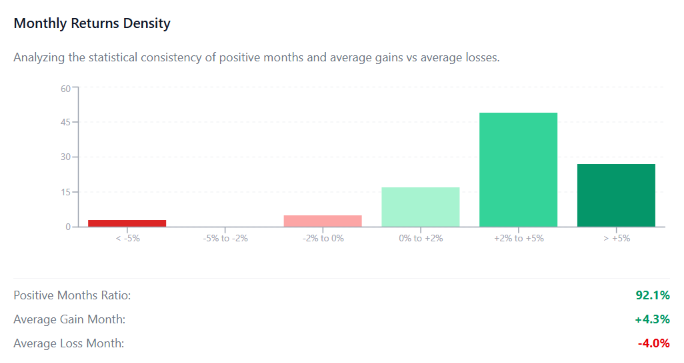).

### 2.5 Multi-Factor Scoring & Personalized Ranking (`#tab-analysis`)
- ✅ **6-Pillar Fund Scoring Model (0–100):** Evaluates Performance (30%), Risk & Stability (25%), Cost Efficiency (15%), Portfolio Composition (15%), Manager Quality (15%), and Debt Quality (10%).
- ✅ **Personalized Ranking Scorecard:** Interactive investor archetype presets (Balanced, Capital Preservation, Compounder, Momentum, Cost Optimizer), dynamic weight sliders (auto-normalized to 100%), 4-factor breakdown cards, Plotly radar comparison vs. SEBI category norms, and live arithmetic substitution formulas.
- ✅ **Rank Trend History:** `FundScoreTrend` model captures weekly model score + category rank snapshots via `ingest_score_trend`. Shown as a dual-axis Score vs. Rank % chart on the Fund Detail Fund Score tab (`#tab-analysis`). `weekly_pipeline.yml` runs `ingest_score_trend` every pipeline invocation (idempotent by `as_of_week`).

---

## 3. Stock-Level & Mutual Fund Holdings Intelligence

Deep-dive intelligence exploring stock-to-fund linkages, AMC portfolio adjustments, and institutional capital flows:

### 3.1 Stock-Level Intelligence (Out of Scope)
- ❌ **Stock-Specific Holding Variation Tracker (Excluded):** Evaluated and discarded. Useful primarily for direct equity stock traders piggybacking on institutional flows; out of scope for a dedicated mutual fund analysis platform (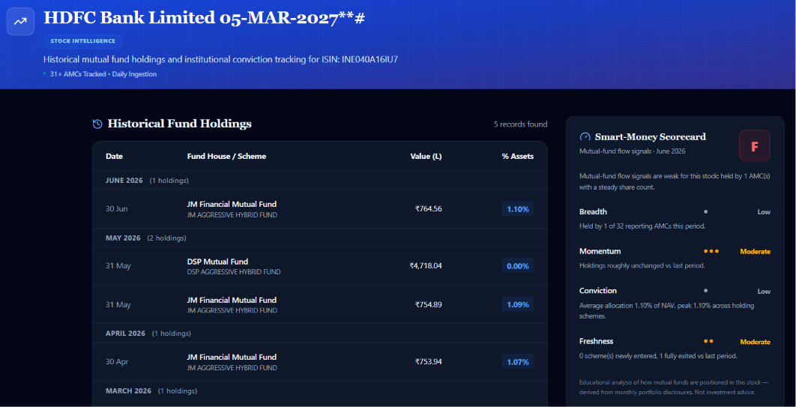 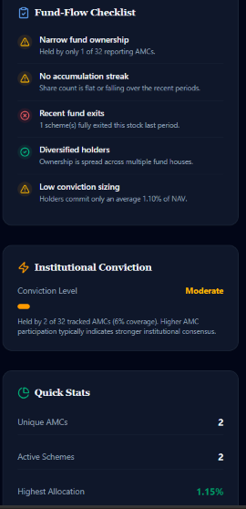).
- ❌ **Top & Bottom Stocks by MF Ownership (Excluded):** Evaluated and discarded. Direct equity screening metric that does not provide actionable signal for selecting or evaluating mutual fund schemes (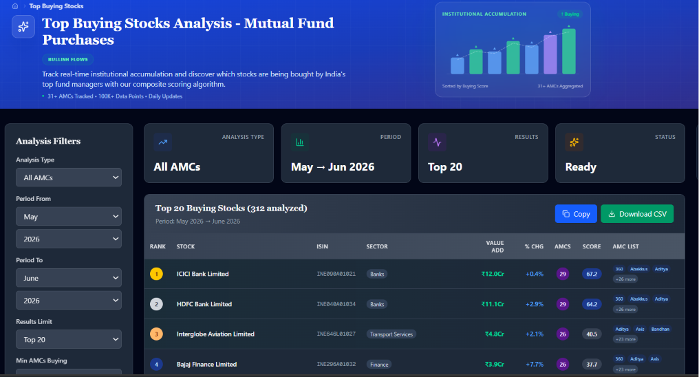 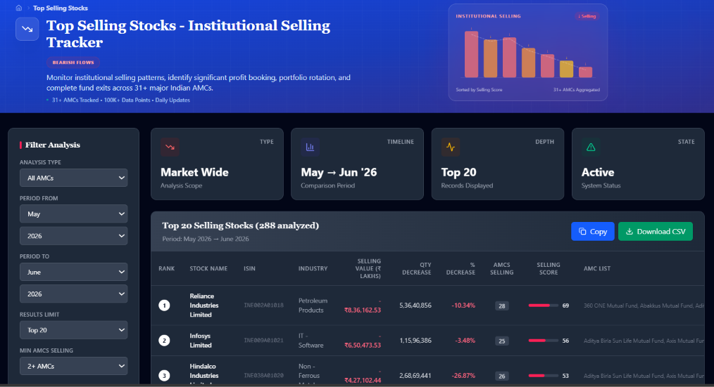).
- ❌ **Reverse Stock-to-Fund Lookup / "Which Funds Hold Your Stock?" (Excluded):** Evaluated and discarded. Direct stock investors invest in stocks directly; mutual fund investors select schemes based on mandate, rolling returns, and manager risk management rather than searching for individual stock concentrations (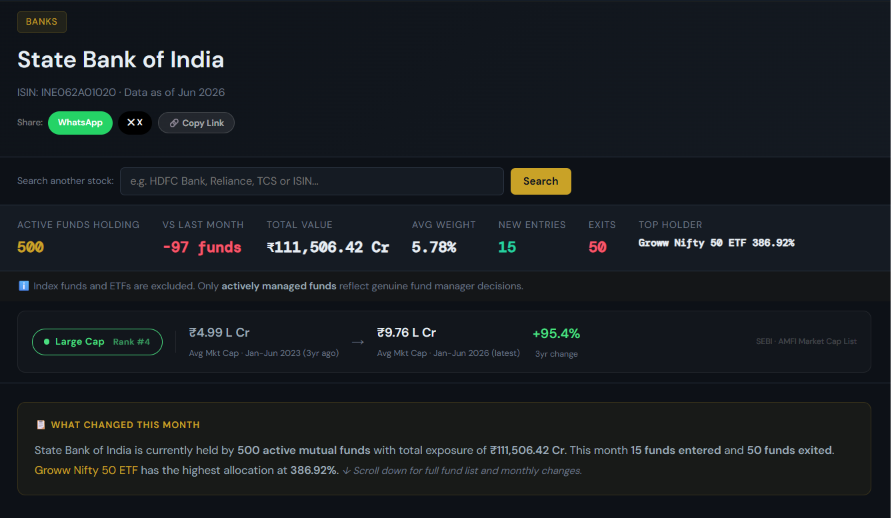 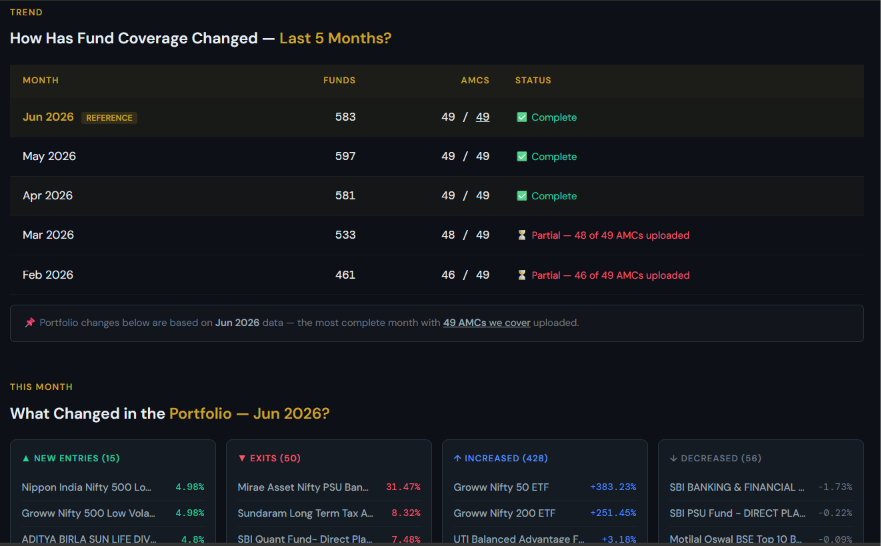 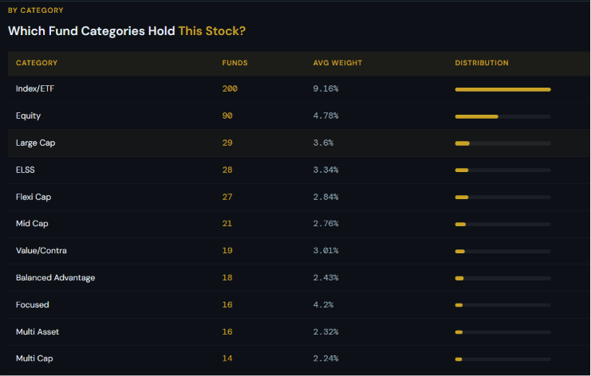 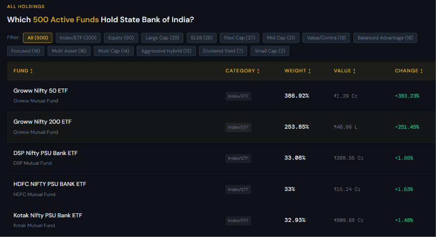).

### 3.2 Asset Management Company (AMC) Analytics
- ✅ **AMC Top Stock Holdings:** AMC Portfolio Insights tab now shows top 20 AUM-weighted equity holdings, sector allocation pie, and cap blend (large/mid/small) aggregated across the AMC's direct-growth schemes. Populated by `ingest_holdings`. (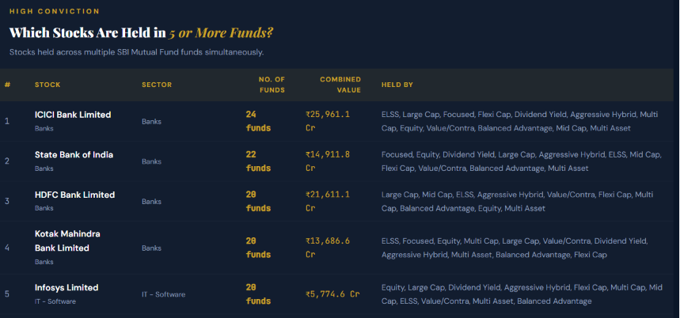)
- ✅ **Fund & AMC AUM Trends:** Monthly AUM snapshots stored in `SchemeAumSnapshot`. Shown as line charts in both the AMC Portfolio tab and Fund Detail page. AMC tab aggregates across all schemes. (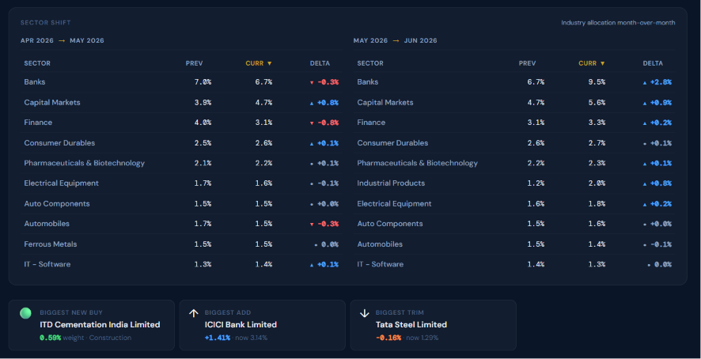 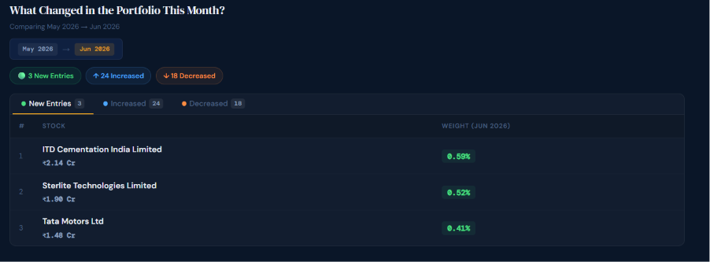 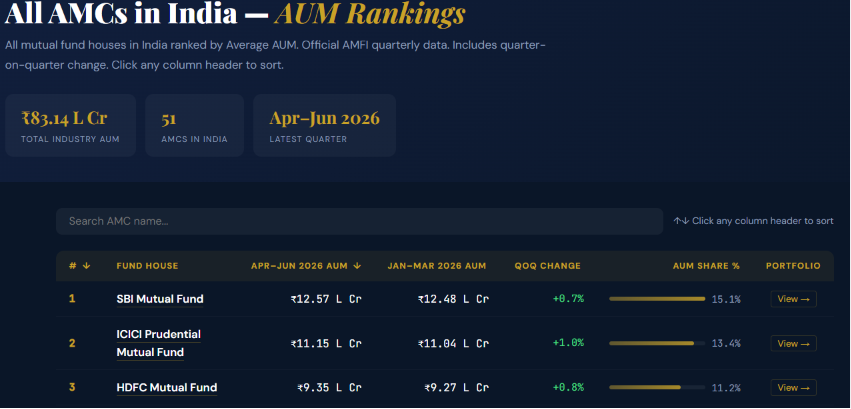)
- ✅ **AMC Trade Disinvestments & Exits:** AMC Portfolio tab shows stocks present in prior month but absent in the latest month — indicating full exits or significant reductions by the fund house. (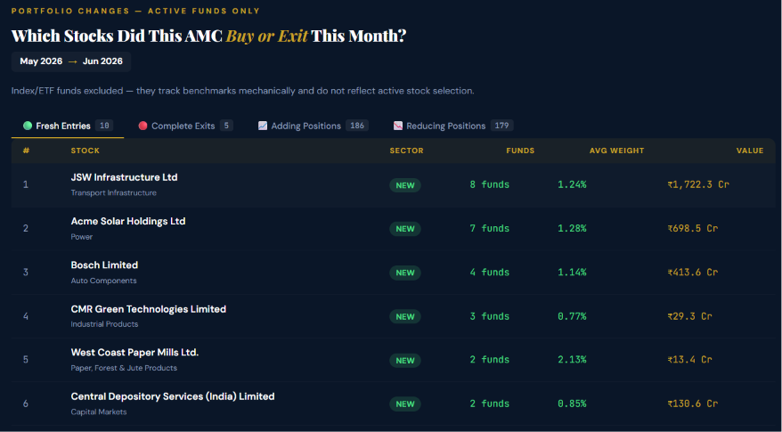)
- ✅ **AMC Sector Allocations:** AMC Portfolio tab shows AUM-weighted sector concentration and bias across the fund house's equity portfolios. (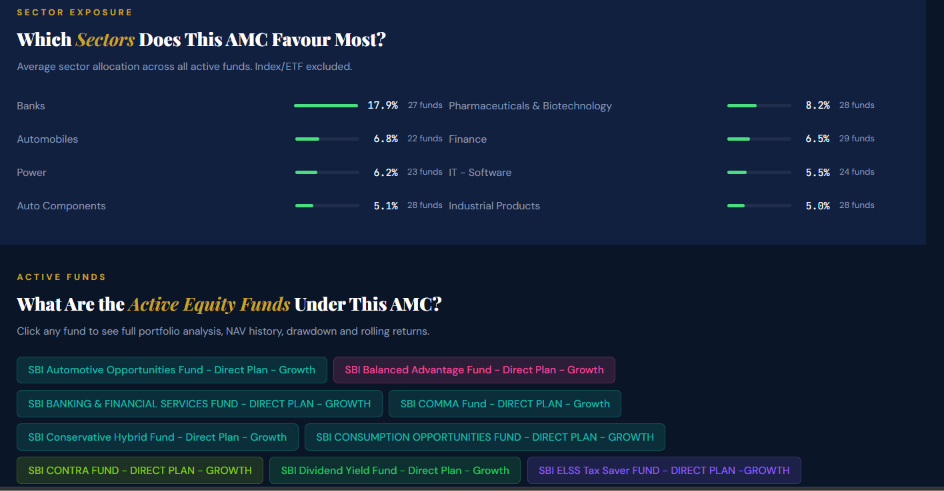)

### 3.3 Industry Capital Inflows & Portfolio Disclosures
- ✅ **Monthly Portfolio Disclosures Database:** `Holding`, `SectorAllocation`, and `MarketCapAllocation` models now persist monthly portfolio disclosures. `ingest_holdings` (mstarpy-first + yahooquery fallback) populates them with `--resume` support and batch writes. Retains last 3 months of data. (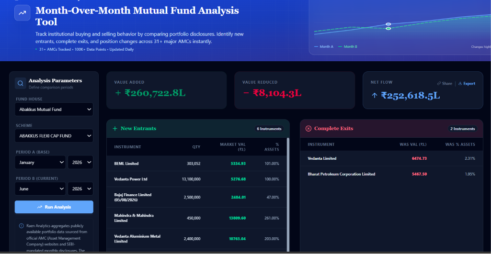 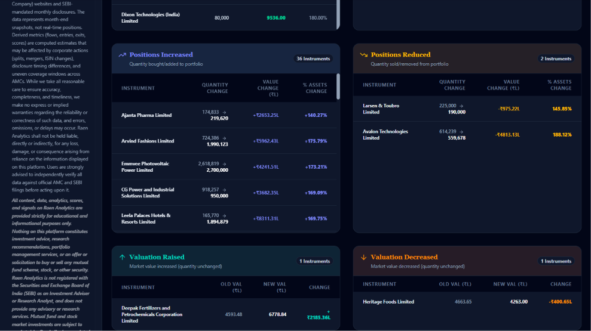)
- ✅ **Cap-Wise Portfolio Breakdown:** `CapClassifier` utility (`apps/holdings/cap_classifier.py`) maps equity holding names to SEBI large/mid/small using `rapidfuzz` fuzzy matching against `data/nifty_caplist.json` (Nifty 50 + Next 50 = Large, Nifty Midcap 150 = Mid, rest = Small). `MarketCapAllocation` stores the breakdown per scheme per month with `cap_method` traceability.
- ❌ **Sector-Wise Top Stock Breakdown:** Identify top stock holdings grouped by industry sectors across mutual fund portfolios (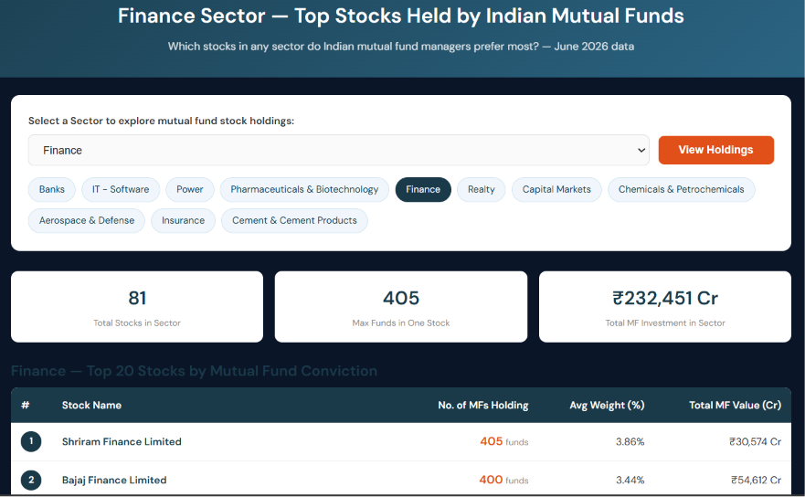).
- ✅ **Industry Inflows & Outflows:** `IndustryInflow` model and `ingest_industry_inflows` management command capture AMFI monthly gross purchase, redemption, and net inflow by category group (Equity, Debt, Hybrid, ETF, etc.). Home page widget served by `home_industry_inflows_api`. (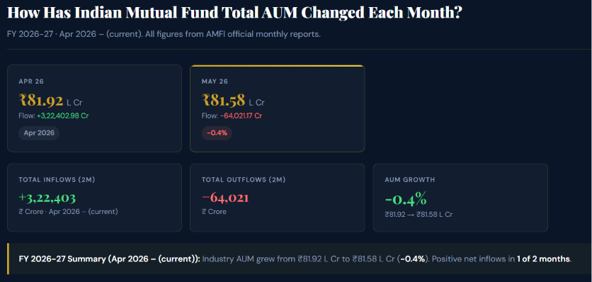)
- ⬜ **Sector-Wise Capital Flows:** Granular tracking of net buying and selling capital flows across specific market sectors (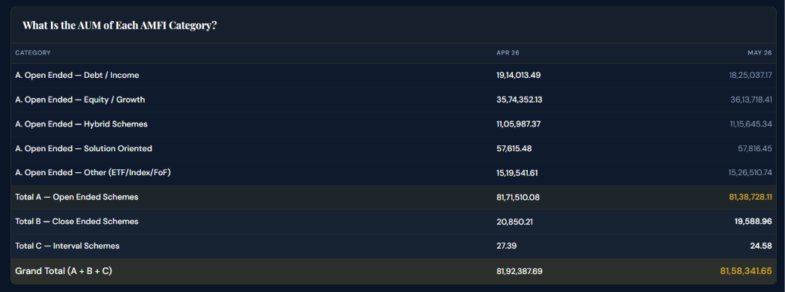). *Note: Requires AMFI sector-level disclosure data — not yet available from current sources.*

---

## 4. Advanced Portfolio Intelligence & Risk Tracking

Expanding user portfolio diagnostic tools beyond basic XIRR:

### 4.1 Portfolio Diagnostics & CAS Ingestion
- ⬜ **Automated CAS Statement Parser:** Integration of automated Consolidated Account Statement (CAS) parsing for CAMS, Karvy, and KFintech PDF statements via [casparser](https://github.com/codereverser/casparser).
- ⬜ **Unified Household Tracking:** Consolidate portfolios across multiple family members into a single household view.
- ⬜ **Goal Mapping & Asset Allocation:** Assign specific funds to financial goals and visualize asset allocation across equity, debt, hybrid, gold, cash, and international assets.
- ⬜ **Diagnostic Health Check:** Detailed diagnostic report assessing concentration risk, style drift, sector biases, debt quality, and excessive fund counts.
- ⬜ **Missed Gains & Opportunity Cost:** XIRR analysis comparing portfolio returns against benchmark indices and category averages to quantify alpha generated.
- ⬜ **Red Flag Warnings:** Flag portfolio holdings subject to ASM/GSM surveillance, high promoter pledges, or credit downgrade risks.

### 4.2 Psychological & Behavioral Analytics
- ⬜ **Market Timing Efficiency:** Evaluate SIP and lumpsum transaction timing against historical peak/trough levels.
- ⬜ **Investor Archetype & Bias Detection:** Identify behavioral biases (loss aversion, overconfidence, disposition effect) and track portfolio risk evolution over time.
- ⬜ **Consistency Scoring:** Score the consistency of investment actions against stated risk profiles.

### 4.3 Smart Alerts & Watchlists
- ⬜ **Drift & Underperformance Alerts:** Notify users when portfolio allocations drift beyond target thresholds or when funds persistently lag category benchmarks.
- ⬜ **Critical Fund Event Alerts:** Real-time triggers for manager changes, mandate updates, sudden AUM shocks, expense ratio hikes, or style drifts.
- ⬜ **Benchmark Monitor Alerts:** Price/return threshold alerts on specific benchmark indices.

---

## 5. Comprehensive AI & Machine Learning Integrations

Integrating AI capabilities into research workflows while preserving strict data grounding:

### 5.1 Architecture & Guardrails
- ⬜ **Deterministic Structured Outputs:** Enforce strict JSON schemas (via Pydantic and function calling) for financial summaries to guarantee rendering compatibility with PDF and UI pipelines.
- ⬜ **Semantic Caching & Grounding:** Semantic caching to reduce API latency and cost, with grounding rules that restrict LLMs to verified quantitative data from the engine.
- ⬜ **Bring Your Own Key (BYOK):** Allow users to store personal encrypted API keys (OpenAI / Anthropic / Gemini) for higher individual rate limits.
- ⬜ **Selective AI Invocation:** Dedicated UI trigger buttons for on-demand AI analyses rather than mandatory background execution.

### 5.2 AI-Powered User Experiences
- ⬜ **AI Fund Health Check:** Automated natural-language summary synthesizing performance, expense ratio, and risk metrics on fund detail pages.
- ⬜ **Natural Language Screener:** Conversational search translating text queries (e.g., *"Show flexi-cap funds with TER under 1% and 5Y CAGR above 15%"*) into backend database filters.
- ⬜ **Conversational Risk Profiling:** Free-text questionnaire parsing (e.g., *"Saving for child education in 7 years, moderate risk tolerance"*) into optimal asset allocations.
- ⬜ **Explainable Recommendations:** Transparent, plain-English rationales explaining why specific funds were recommended.

---

## 6. Platform, Community & Discovery Tools

- ✅ **52-Week & Multi-Year Range Barometer (Fund Detail):** Integrated directly into the fund detail page Advanced Quant Suite with 52W/3Y/5Y visual channel indicators and behavioral guidance (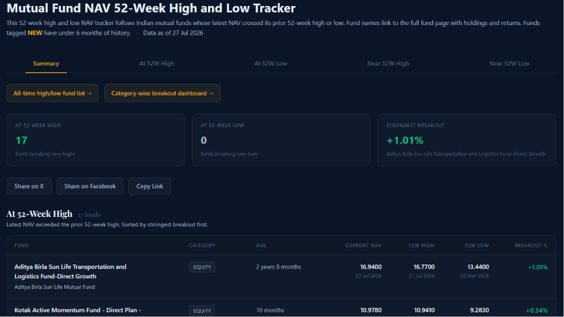).
- ✅ **All-Time High / Low Tracker & Drawdown Matrix (Fund Detail):** Integrated directly into the fund detail page Advanced Quant Suite tracking ATH peak dates, days since peak, recovery multiples, and secular expansion status (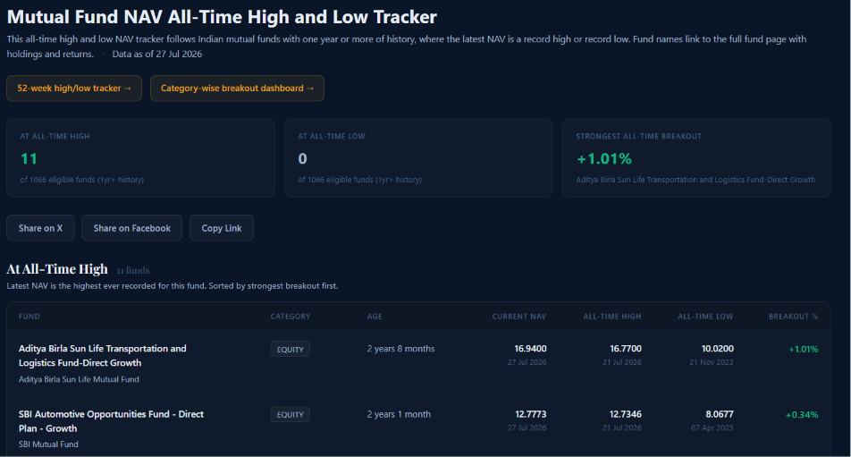).
- ⬜ **Multi-Platform One-Click Social Sharing:** Native sharing integrations for WhatsApp, LinkedIn, Instagram, and direct copy-to-clipboard summary links.
- ⬜ **Community Discussion Feed:** Backend integration enabling real user discussion threads, question posting, and research sharing.
- ⬜ **Mobile Breakpoint Optimization:** Continued UI polishing for mobile responsive layouts across complex tables and Plotly charts.

---

## 7. Industry Research Sources & Knowledge Base

### Primary Data Sources & Portals
- [AMFI India Research & Information](https://www.amfiindia.com/research-information)
- [Nifty Indices Official Portal](https://niftyindices.com/)
- [AMFI Monthly Portfolio Disclosure Center](https://www.amfiindia.com/online-center/portfolio-disclosure)
- [RAEN Analytics - Stock & MF Holdings](https://raenanalytics.com/)
- [RightAdvise Financial Analytics](https://rightadvise.com/)

### Regulatory History & Market Insights
- [SEBI Stock Category Changes India — Complete Story from 2018 to 2026](https://rightadvise.com/sebi-india-market-cap-story.php)
- [SEBI Market Cap Category Changes — 2026 Update](https://rightadvise.com/sebi-market-cap-update.php)
- [History of Mutual Funds in India (AMFI Knowledge Center)](https://www.amfiindia.com/investor/knowledge-center-info?zoneName=HistoryOfMutualFundsInIndia)