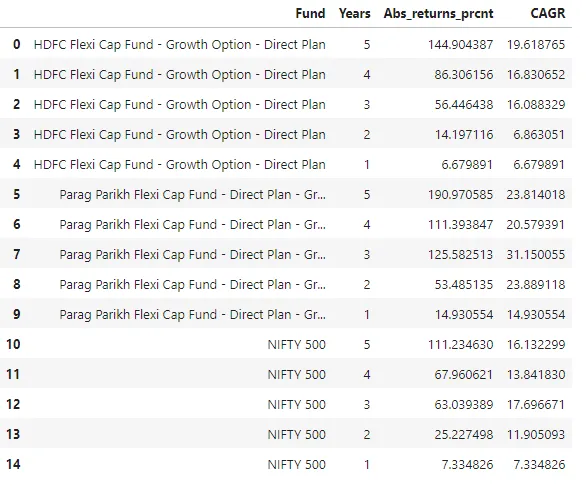
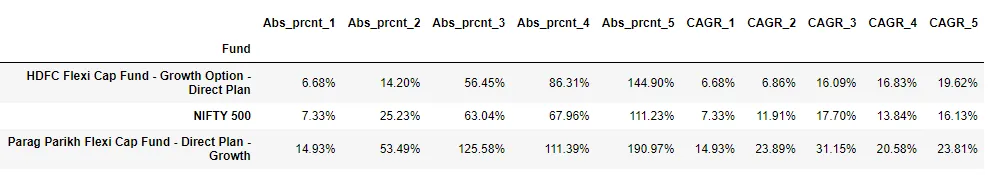
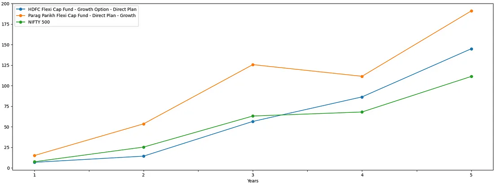
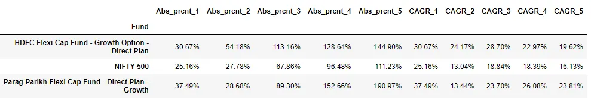
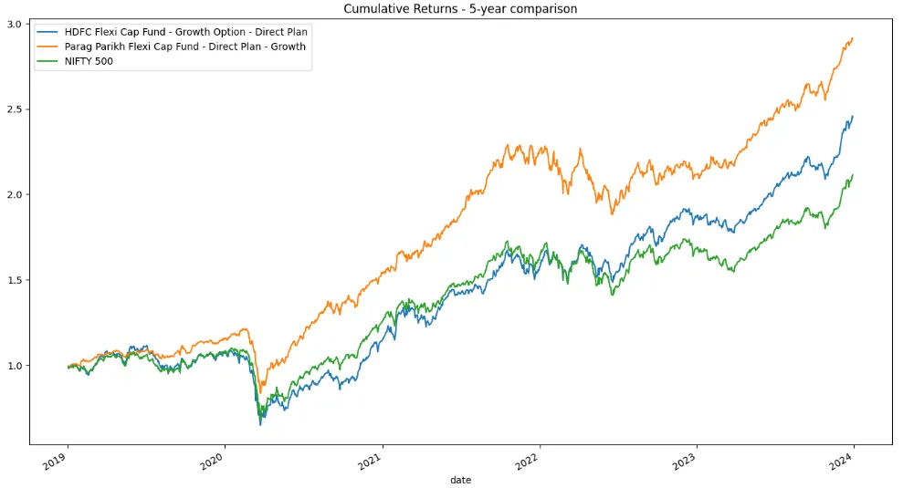
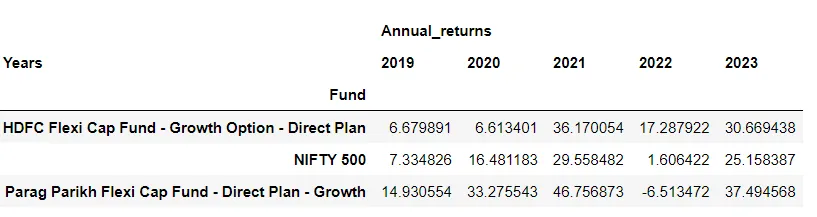
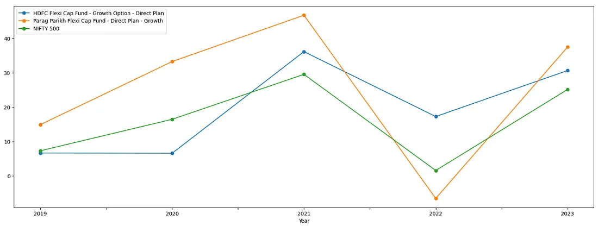
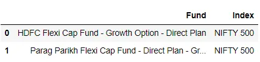
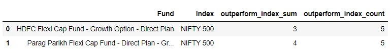
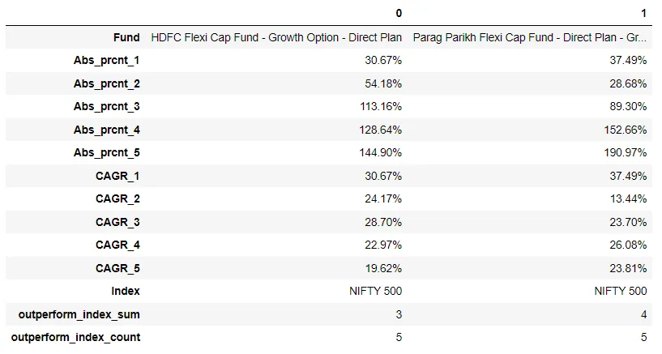

# Part 2: Analyzing Mutual Funds Performance

This article continues from Part 1: Getting and Analyzing Mutual Funds in Python, where we explored fetching mutual fund data using Python libraries. Here, we dive into key performance metrics to compare mutual funds with their benchmarks and among themselves, aiding your investment decisions. The focus is on Flexi Cap Funds, which allow fund managers to invest across market capitalizations without restrictions.
While this analysis uses Indian mutual fund data, the methodology is applicable globally to mutual funds, index funds, or stocks. According to the Association of Mutual Funds in India (AMFI), the Indian mutual fund industry's Assets Under Management (AUM) grew from ₹9.03 trillion (January 31, 2014) to ₹52.74 trillion (January 31, 2024).
Disclaimer: This content is for informational purposes only and should not be construed as legal, tax, investment, or other advice.
Analysis Overview
We will evaluate performance at two levels:

Aggregated Level: Cumulative Returns and Compound Annual Growth Rate (CAGR).
Individual Year Level: Annual returns to assess yearly performance.

We compare two top-performing flexi-cap funds—HDFC Flexi Cap Fund and Parag Parikh Flexi Cap Fund—against the NIFTY 500 benchmark.

## Data Retrieval

Below is the Python code to fetch and preprocess data for the funds and the benchmark index (NIFTY 500) from January 1, 2019, to December 31, 2023.

```py
from mftool import Mftool
import pandas as pd
import numpy as np
import matplotlib.pyplot as plt
from yahooquery import Ticker
import datetime
from dateutil.relativedelta import relativedelta
from jugaad_data.nse import index_raw

%matplotlib inline

def fetch_index_data(index, start_date='1-1-2019', end_date='31-12-2023'):
    def convert_to_date(date_str):
        date_obj = datetime.datetime.strptime(date_str, '%d %b %Y')
        return date_obj

    from_date = datetime.datetime.strptime(start_date, '%d-%m-%Y').date()
    to_date = datetime.datetime.strptime(end_date, '%d-%m-%Y').date()
    
    raw_index_data = index_raw(symbol=index, from_date=from_date, to_date=to_date)
    df = (pd.DataFrame(raw_index_data)
            .assign(HistoricalDate=lambda x: x['HistoricalDate'].apply(convert_to_date),
                    CLOSE=lambda x: x['CLOSE'].astype(float),
                    INDEX_NAME=lambda x: x['INDEX_NAME'].str.upper())
            .sort_values('HistoricalDate')
            .drop_duplicates()
            .loc[lambda x: x['INDEX_NAME'] == index]
            .reset_index(drop=True)
            .rename(columns={'HistoricalDate':'date'})
         )
    df = df.loc[~df.duplicated(subset=['date'], keep='first')]
    return df

def fetch_mutual_fund_data(mutual_fund_code):
    mf = Mftool()
    df = (mf.get_scheme_historical_nav(mutual_fund_code, as_Dataframe=True).reset_index()
          .assign(nav=lambda x: x['nav'].astype(float),
                  date=lambda x: pd.to_datetime(x['date'], format='%d-%m-%Y'))
          .sort_values('date')
          .reset_index(drop=True)
         )
    return df

def get_cumulative_returns(df, nav_col='CLOSE', date_col='date', starting_date='1-1-2019', ending_date='31-12-2023'):
    start_date = pd.to_datetime(starting_date, format='%d-%m-%Y')
    end_date = pd.to_datetime(ending_date, format='%d-%m-%Y')

    df = (df
          .sort_values(date_col)
          .query(f"{date_col} >= @start_date and {date_col} <= @end_date")
          .assign(daily_returns=lambda x: x[nav_col].pct_change(),
                  cumulative_daily_returns=lambda x: (x['daily_returns'] + 1).cumprod())
          .reset_index(drop=True)
         )
    return df

def calculate_funds_returns(time_periods, funds_metadata, funds_historical_data):
    results = []
    cumulative_returns_dataframes = {time_period: dict() for time_period in time_periods}

    for fund_desc, metadata in funds_metadata.items(): 
        print(fund_desc)
        for time_period, (starting_date, ending_date) in time_periods.items():
            n_years = time_period
            fund_data = funds_historical_data[fund_desc].copy(deep=True)
            nav_col, date_col = metadata['nav_col'], metadata['date_col']

            fund_cumulative_returns = get_cumulative_returns(fund_data, 
                                                            nav_col=nav_col, 
                                                            date_col=date_col,
                                                            starting_date=starting_date, 
                                                            ending_date=ending_date)

            absolute_returns_prcnt = (fund_cumulative_returns['cumulative_daily_returns'].values[-1] - 1) * 100
            cagr = ((fund_cumulative_returns[nav_col].iloc[-1]/fund_cumulative_returns[nav_col].iloc[0]) ** (1/n_years) - 1) * 100

            cumulative_returns_dataframes[time_period][fund_desc] = fund_cumulative_returns
            results += [(fund_desc, time_period, absolute_returns_prcnt, cagr)]

    return results, cumulative_returns_dataframes

nifty_indices = ["NIFTY 500"]
nifty_indices_df_dict = {index: fetch_index_data(index) for index in nifty_indices}

mutual_funds = {
    '118955': 'HDFC Flexi Cap Fund - Growth Option - Direct Plan',
    '122639': 'Parag Parikh Flexi Cap Fund - Direct Plan - Growth',
}

mf_data_dict = dict()
for mutual_fund_code, mutual_fund_desc in mutual_funds.items():
    print(mutual_fund_desc)
    mf_data_dict[mutual_fund_desc] = fetch_mutual_fund_data(mutual_fund_code)
```

## 1. Aggregated Performance: Cumulative Returns & CAGR

We analyze fund performance across 1, 2, 3, 4, and 5-year horizons from two perspectives:

Investment Journey: Tracks the growth of an investment from a starting point.
Screener Style: Evaluates returns backward from a recent date, as seen in mutual fund screeners.

### 1.1 Investment Journey Perspective

This perspective tracks an investment made on January 1, 2019. For example, 3-year returns cover January 2019 to December 2021. This is ideal for evaluating existing investments.

```py
time_periods = {
    5: ('1-1-2019', '31-12-2023'),
    4: ('1-1-2019', '31-12-2022'),
    3: ('1-1-2019', '31-12-2021'),
    2: ('1-1-2019', '31-12-2020'),
    1: ('1-1-2019', '31-12-2019'),
}

funds_metadata = {
    'HDFC Flexi Cap Fund - Growth Option - Direct Plan': dict(nav_col='nav', date_col='date'),
    'Parag Parikh Flexi Cap Fund - Direct Plan - Growth': dict(nav_col='nav', date_col='date'),
    'NIFTY 500': dict(nav_col='CLOSE', date_col='date')
}

funds_historical_data = {**nifty_indices_df_dict,**mf_data_dict}

results, time_period_dataframes = calculate_funds_returns(time_periods, funds_metadata, funds_historical_data)

results_long = pd.DataFrame(results, columns=['Fund', 'Years', 'Abs_returns_prcnt', 'CAGR'])
```



```py
result_df = pd.DataFrame(results, columns=['Fund', 'Years', 'Abs_prcnt', 'CAGR']).pivot(
    index='Fund', columns='Years', values=['Abs_prcnt', 'CAGR']
)
result_df.columns = [f'{x}_{y}' for x, y in result_df.columns]
result_df = result_df.applymap(lambda x: f"{x:.2f}%")
```



```py
plt.rcParams["figure.figsize"] = [20,7]

def df_process(df):
    df = df.sort_values('Years')
    df['Years'] = df['Years'].astype(str)
    return df

for idx, fund in enumerate(results_long['Fund'].unique()):
    fund_df = results_long.loc[results_long['Fund'] == fund]
    fund_df = df_process(fund_df)
    if idx == 0:
        ax = fund_df.plot(y='Abs_returns_prcnt', x='Years', label=fund, marker='o')
    else:
        fund_df.plot(ax=ax, y='Abs_returns_prcnt', x='Years', label=fund, marker='o')

plt.legend(loc='upper left')
plt.savefig('investment_journey.png')
```



**Observations:**

Both funds outperformed the NIFTY 500 benchmark across all periods.
Parag Parikh Flexi Cap Fund showed superior returns but experienced a dip in 2022 (4-year returns < 3-year returns), recovering strongly in 2023.

### 1.2 Screener Style Perspective

This perspective calculates returns backward from December 29, 2023. For example, 3-year returns cover January 2021 to December 2023. This is useful for evaluating new investment options.

```py
time_periods = {
    5: ('1-1-2019', '31-12-2023'),
    4: ('1-1-2020', '31-12-2023'),
    3: ('1-1-2021', '31-12-2023'),
    2: ('1-1-2022', '31-12-2023'),
    1: ('1-1-2023', '31-12-2023'),
}

results, time_period_dataframes = calculate_funds_returns(time_periods, funds_metadata, funds_historical_data)
result_df = pd.DataFrame(results, columns=['Fund', 'Years', 'Abs_prcnt', 'CAGR']).pivot(
    index='Fund', columns='Years', values=['Abs_prcnt', 'CAGR']
)
result_df.columns = [f'{x}_{y}' for x, y in result_df.columns]
result_df = result_df.applymap(lambda x: f"{x:.2f}%")
```



```py
plt.rcParams["figure.figsize"] = [16,9]
time_period = 5

for idx, (instrument_desc, instrument_data) in enumerate(time_period_dataframes[time_period].items()):
    if idx == 0:
        ax = instrument_data.plot(y='cumulative_daily_returns', x='date', label=instrument_desc)
    else:
        instrument_data.plot(ax=ax, y='cumulative_daily_returns', x='date', label=instrument_desc)

plt.title(f"Cumulative Returns - {time_period}-year comparison")
ax.legend(loc='upper left')
plt.savefig('screener_style.png')
```



**Observations:**

Returns differ significantly from the investment journey perspective, except for the 5-year horizon.
HDFC Flexi Cap Fund showed outstanding performance in the 3-year period.

## 2. Annual Performance: Year-on-Year Returns

We now analyze annual returns from 2019 to 2023 to answer:

How did each fund perform yearly?
Did the funds consistently outperform the benchmark?

### 2.1 Yearly Performance

This analysis calculates year-on-year (YoY) growth to assess consistency and market trends.

```py
time_periods = {
    2023: ('1-1-2023', '31-12-2023'),
    2022: ('1-1-2022', '31-12-2022'),
    2021: ('1-1-2021', '31-12-2021'),
    2020: ('1-1-2020', '31-12-2020'),
    2019: ('1-1-2019', '31-12-2019'),
}

funds_metadata = {
    'HDFC Flexi Cap Fund - Growth Option - Direct Plan': dict(nav_col='nav', date_col='date'),
    'Parag Parikh Flexi Cap Fund - Direct Plan - Growth': dict(nav_col='nav', date_col='date'),
}

index_metadata = {
    'NIFTY 500': dict(nav_col='CLOSE', date_col='date')
}

mf_results, time_period_dataframes = calculate_funds_returns(time_periods, funds_metadata, mf_data_dict)
nifty_indices_results, time_period_nifty_dataframes = calculate_funds_returns(time_periods, index_metadata, nifty_indices_df_dict)

results_year_lvl_long = pd.DataFrame(mf_results + nifty_indices_results, columns=['Fund', 'Year', 'Returns', 'CAGR']).drop(['CAGR'], axis=1)
```



```py
plt.rcParams["figure.figsize"] = [20,7]

def df_process(df):
    df = df.sort_values('Year')
    df['Year'] = df['Year'].astype(str)
    return df

for idx, fund in enumerate(results_year_lvl_long['Fund'].unique()):
    fund_df = results_year_lvl_long.loc[results_year_lvl_long['Fund'] == fund]
    fund_df = df_process(fund_df)
    if idx == 0:
        ax = fund_df.plot(y='Returns', x='Year', label=fund, marker='o')
    else:
        fund_df.plot(ax=ax, y='Returns', x='Year', label=fund, marker='o')

plt.legend(loc='upper left')
plt.savefig('annual_returns.png')
```



**Observations:**

Both funds and the NIFTY 500 experienced a dip in 2022 but recovered strongly in 2023.

### 2.2 Benchmark Consistency

We check if the funds consistently outperformed the NIFTY 500 each year.

```py
nifty_results_long = pd.DataFrame(nifty_indices_results, columns=['Index', 'Years', 'Abs_returns_prcnt', 'drop_col']).drop('drop_col', axis=1)
funds_results_long = pd.DataFrame(mf_results, columns=['Fund', 'Years', 'Abs_returns_prcnt', 'drop_col']).drop('drop_col', axis=1)

funds_benchmark_mapping = {
    'HDFC Flexi Cap Fund - Growth Option - Direct Plan': "NIFTY 500",
    'Parag Parikh Flexi Cap Fund - Direct Plan - Growth': "NIFTY 500",
}

mapping_df = pd.DataFrame(list(funds_benchmark_mapping.items()), columns=['Fund', 'Index'])
```



```py
fund_benchmark_yr_lvl = funds_results_long.merge(mapping_df, on='Fund').merge(
    nifty_results_long, on=['Index', 'Years'], suffixes=['_fund', '_index']
)
fund_benchmark_yr_lvl['outperform_index'] = np.where(
    fund_benchmark_yr_lvl['Abs_returns_prcnt_fund'] >= fund_benchmark_yr_lvl['Abs_returns_prcnt_index'], 1, 0
)
fund_benchmarking = fund_benchmark_yr_lvl.groupby(['Fund', 'Index']).agg({'outperform_index': ['sum', 'count']})
fund_benchmarking.columns = [f'{x}_{y}' for x, y in fund_benchmarking.columns]
fund_benchmarking = fund_benchmarking.reset_index()
```



**Observations:**

Funds outperforming the benchmark in most years indicate strong performance.

## 3. Combining Metrics

For new investors, combine screener-style analysis (1.2) with benchmark consistency (2.2) to evaluate recent performance and reliability. For existing investors, use the investment journey perspective (1.1) with benchmark
consistency (2.2) to track portfolio growth.



## Conclusion

This framework provides a robust starting point for mutual fund analysis but isn’t exhaustive. Consider additional factors like fund allocation (large/mid/small cap), turnover ratio, expense ratio, AUM, and volatility. Extending the time horizon to 10 years or including category averages and metrics like XIRR (for multiple cash flows or SIPs) can enhance the analysis.
Thank you for reading! This analysis leverages Python’s powerful libraries to empower your investment decisions.
